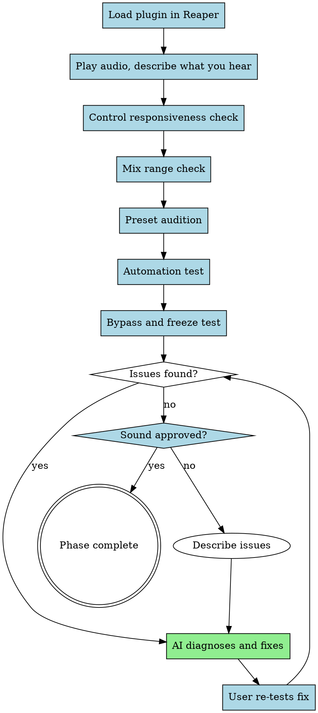

# JUCE DAW Testing (Phase 9)

**human_only** — The human loads the plugin in Reaper and LISTENS. This is where real bugs surface and YOU approve the sound.

**Playbook Reference:** `~/.agents/juce-agent/playbooks/vst-plugin-playbook-v7-unified.json` Phase 9

## Critical Insight

**EM-13, EM-14, EM-15 were caught by USER in DAW testing, not by any automated review.**

Two-stage code review catches implementation bugs but CANNOT catch:
- Perceptual issues (sound quality, responsiveness)
- UX issues (control feel, parameter ranges)
- Dead parameters (SmoothedValue not advancing)
- Uneven response (linear vs equal-power mixing)

**DAW testing by the human is irreplaceable.**

## Process Flow



**Legend:** Blue = human_only, Green = AI assists

## Human Testing Checklist (owner: human_only)

### 1. Load in Reaper and Play Audio (human_only)

- Open Reaper, create track, load plugin
- Play audio through the plugin
- **Describe what you hear:**
  - Does it load without crash?
  - Is there obvious distortion or noise?
  - Does the effect sound like what you expected?
  - Are there any clicks, pops, or dropouts?

**KB Quality Reference (NEW):**
When evaluating sound quality, query the Bridge KB for expected sonic characteristics:
```
Read ~/.claude/skills/kb-route/SKILL.md Resolution Procedure
Parameters: bridge_descriptor="<sound_quality>", kb="vst-product-lifecycle"
```
If results found, compare heard sound against expected parameter ranges.

### 2. Control Responsiveness Check (human_only)

- Move EVERY knob while audio plays
- **For each knob:**
  - Does moving it produce an audible change?
  - Is the change immediate or delayed?
  - Does the knob feel responsive?

**Report dead or delayed controls immediately.** EM-13 was a dead DRIVE knob — SmoothedValue never advanced — silent bug, no crash.

### 3. Mix Range Check (human_only)

- Sweep the mix/dry-wet knob from 0 to 1
- **Ask:**
  - Is the change evenly distributed across the range?
  - Does the effect seem to happen all at one end?
  - Does 50% mix sound like 50%?

**EM-14:** Linear mix blend concentrated change in first 30% of range. Equal-power cosine mixing fixes this.

### 4. Preset Audition (human_only)

- Load EVERY preset
- **For each preset:**
  - Does it sound good?
  - Does it showcase the plugin's range?
  - Is it usable in a mix?
  - Mark any needing tuning

**Note:** Preset values are AI-generated but must be auditioned by human.

### 5. Automation Test (human)

- Record automation on 2-3 parameters
- Play back the automation
- **Check:**
  - No clicks or zippers during automation
  - Smooth transitions
  - Automation plays back correctly

### 6. Bypass and Freeze Test (human)

- Toggle bypass — is the transition clean?
- Toggle freeze (if applicable) — does it hold indefinitely without explosion?
- Freeze + high drift + high feedback — does the safety limiter work?

## Sound Quality Criteria (from Sound Design KB)

Use this checklist during DAW testing to evaluate sound quality:

### Frequency Balance
- [ ] Balanced across spectrum (no holes or peaks)
- [ ] No harsh resonances (check 2-5kHz range)
- [ ] Low end is tight, not muddy
- [ ] High end present but not harsh

**If frequency balance issues:**
- Too bright → decrease filter_cutoff by ~0.15
- Too muddy → increase filter_cutoff or add highpass
- Harsh resonance → decrease filter_resonance

### Dynamic Range
- [ ] Appropriate compression (not over-compressed)
- [ ] Transient punches through
- [ ] Sustain is even, not pumping

**If dynamic issues:**
- Over-compressed → decrease compression_ratio
- Weak transient → decrease attack_time
- Pumping → increase release_time

### Stereo Image
- [ ] Width appropriate for sound type
- [ ] Mono compatible (check fold-down)
- [ ] Low end centered (not wide)

**If stereo issues:**
- Too narrow → increase stereo_width, add chorus
- Too wide → decrease stereo_width
- Low end not centered → highpass before widening

### Harmonic Content
- [ ] Distortion level appropriate
- [ ] Harmonics are musical, not harsh
- [ ] Not over-processed

**If harmonic issues:**
- Too distorted → decrease drive
- Harsh harmonics → filter after distortion, use softer saturation
- Too clean → add saturation, increase drive

### Movement
- [ ] LFO rate appropriate for sound type
- [ ] Envelope shapes are correct
- [ ] Not over-modulated

**If movement issues:**
- Too slow → increase LFO_rate
- Too fast → decrease LFO_rate
- Not enough movement → increase LFO_depth, add filter envelope

## UI Quality Criteria (from UI Knowledge Base)

Use this checklist during DAW testing to evaluate user interface quality:

### Visual Hierarchy
- [ ] Primary controls are largest and most prominent
- [ ] Secondary controls are appropriately sized
- [ ] Visual grouping is clear (related controls together)
- [ ] Spacing is consistent (8px grid recommended)

**If visual hierarchy issues:**
- Controls feel cramped → increase spacing, use tabs or panels
- Important controls hard to find → increase size, use accent color
- Confusing layout → regroup related controls

### Readability
- [ ] Text contrast meets WCAG AA (4.5:1 ratio minimum)
- [ ] Font sizes are readable (minimum 9-10px)
- [ ] Labels are clear and unambiguous
- [ ] Value displays are visible

**If readability issues:**
- Text too small → increase font size (11-14px for labels)
- Low contrast → use higher contrast colors
- Unclear labels → rewrite with clearer terms, add tooltips

### Control Usability
- [ ] Controls are appropriately sized (minimum 32px, primary 48-64px)
- [ ] All controls respond to mouse input
- [ ] Double-click resets to default value
- [ ] Fine control available (Shift+drag or Ctrl+drag)
- [ ] Keyboard navigation works (Tab order, Enter to edit)

**If control usability issues:**
- Controls too small → increase size to minimum 32px
- No fine control → implement velocity-sensitive drag
- No reset → add double-click handler for default value

### Accessibility
- [ ] Tab order is logical
- [ ] Focus indicators are visible
- [ ] Screen reader compatible (AccessibilityHandler implemented)
- [ ] Color-blind friendly (not relying on color alone)
- [ ] High contrast mode works if available

**If accessibility issues:**
- Tab order wrong → use setExplicitFocusOrder()
- No screen reader support → implement AccessibilityHandler
- Color-only indicators → add icons or patterns

### Window Behavior
- [ ] Window is resizable
- [ ] Minimum size prevents unusable state
- [ ] Scaling works at 1x, 1.5x, 2x (hiDPI)
- [ ] No visual artifacts when resizing

**If window behavior issues:**
- Fixed size → add setResizable(true, true) with constrainer
- Scaling broken → test at multiple scale factors
- Resize artifacts → check paint() methods for proper bounds

### Visual Feedback
- [ ] Hover states indicate interactive controls
- [ ] Pressed states show feedback
- [ ] Active states show current selection
- [ ] Parameter changes animate smoothly (no jumps)

**If visual feedback issues:**
- No hover state → implement mouseEnter/exit callbacks
- Jumpy parameters → add SmoothedValue (20-50ms)
- No animation → consider ComponentAnimator for transitions

## Common DAW-Found Bugs

| ID | Symptom | Cause | Fix |
|---|---|---|---|
| EM-13 | Knob is dead, no change | SmoothedValue never advances | Call getNextValue() per sample |
| EM-14 | Mix knob only works at low end | Linear mixing instead of equal-power | Use cosine mixing: cos(mix * π/2) |
| EM-15 | Controls seem delayed | Default decay too long (4s+) | Set default decay <= 2s |
| FM-09 | Zipper noise on automation | getCurrentValue() instead of getNextValue() | Call getNextValue() per sample |
| FM-11 | Click on bypass toggle | Hard switch instead of crossfade | Smooth over ~42ms |

## AI Debugging Assistance

When human reports an issue, AI assists with:

### Dead Control (no audible change)

```cpp
// Checklist for AI to run:
// 1. Find the parameter in APVTS
// 2. Trace to where it's used in processBlock
// 3. Check: Is SmoothedValue involved?
//    - Is reset() called in prepareToPlay?
//    - Is setTargetValue() called per block?
//    - Is getNextValue() called PER SAMPLE?
//    - Is the returned value actually used?
// 4. Check: Is the parameter connected to GUI?
//    - Is SliderAttachment created?
//    - Does parameter ID match?
```

### Uneven Mix Range

```cpp
// AI should check for linear vs equal-power mixing:
// WRONG: output = dry * (1 - mix) + wet * mix;  // Linear
// CORRECT:
float dryGain = std::cos(mix * juce::MathConstants<float>::halfPi);
float wetGain = std::sin(mix * juce::MathConstants<float>::halfPi);
output = dry * dryGain + wet * wetGain;
```

### Click on Bypass/Mode Toggle

```cpp
// AI should check for hard switching:
// WRONG: if (bypass) { output = input; }  // Hard switch
// CORRECT: Smooth bypass over ~42ms
// In prepareToPlay:
bypassSmoothed.reset(sampleRate, 0.042);  // 42ms
// In processBlock:
bypassSmoothed.setTargetValue(bypass ? 0.0f : 1.0f);
for (int s = 0; s < numSamples; ++s) {
    float wet = wetBuffer.getSample(ch, s);
    float dry = dryBuffer.getSample(ch, s);
    float b = bypassSmoothed.getNextValue();
    output = dry * (1 - b) + wet * b;
}
```

### Controls Seem Delayed

```cpp
// AI should check:
// 1. Default parameter values - is decay/feedback > 2s?
// 2. Are there multiple layers of smoothing stacking up?
// 3. Is there gain staging that masks changes?
```

## Feedback Translation Reference (from Sound Design KB)

When user provides feedback during testing, translate to parameters:

| User Feedback | Primary Adjustment | Secondary Adjustment |
|--------------|-------------------|---------------------|
| "Too bright" | filter_cutoff -0.15 | filter_resonance -0.1 |
| "Too thin" | stereo_width +0.2 | detune +0.1 |
| "Too harsh" | filter_resonance -0.2 | drive -0.15 |
| "Not enough movement" | LFO_depth +0.2 | filter_envelope +0.15 |
| "Too muddy" | filter_cutoff +0.15 | highpass +0.1 |
| "Weak transient" | attack_time -0.1 | filter_envelope +0.15 |

**Ask clarifying questions when needed:**
- "Is the brightness from harmonics or filter?"
- "Do you want stereo width or harmonic richness?"
- "What kind of movement? LFO, envelope, or both?"

## Phase Gate (human_only approval)

Before proceeding to Phase 10 (Release), the human must confirm:

- [ ] Plugin loads in Reaper without crashing
- [ ] EVERY control produces audible/visible change when moved
- [ ] Mix knob effective across full range (not bunched at one end)
- [ ] Parameter changes audible within ~2 seconds
- [ ] ALL presets auditioned — usable ones approved, broken ones fixed or removed
- [ ] Automation recording/playback works (no clicks, zippers)
- [ ] Bypass and freeze work correctly
- [ ] No audio glitches, clicks, or dropouts during normal use
- [ ] **YOU have approved the sound**

## Key Principle

**The human's ears are the final quality gate.** Code review cannot catch perceptual issues. If something sounds wrong, it IS wrong, regardless of what the code review said.

## KB Registry Awareness

The feedback translation tables in this skill are built-in references. When a registered KB has a `sound-design` layer with richer translations, prefer KB content over the built-in table.

### Resolution

1. Read `~/.claude/kb-registry.json`
2. If a KB with `sound-design` layer exists: read bridge entries for feedback descriptor mappings
3. If not: use the built-in Feedback Translation Reference table above

### Confidence Check

When using KB entries for feedback translation:
- If `harvest_metadata.overall_confidence >= 0.60`: use KB translation
- If confidence 0.40–0.59: use KB translation but warn: "Medium confidence DAW reference (confidence: X.XX) — verify against your own listening."
- If confidence < 0.40: use built-in table instead, note: "KB translation has low confidence — using built-in defaults"

## Validation Logging (CRITICAL)

**This is the feedback loop for the Sound Design and UI Knowledge Bases.**

### Sound Design Validation Logging

After testing each preset, log results to improve the Sound Design KB:

1. **Create validation log file:**
   ```
   ~/.agents/juce-agent/validation-logs/<project-name>/<YYYY-MM-DD>-<preset-name>.md
   ```
   Use template: `~/.agents/juce-agent/validation-logs/VALIDATION_TEMPLATE.md`

2. **Document what was tested:**
   - Preset name and category
   - Parameters used (from Sound Design KB)
   - Expected sonic result
   - Actual sonic result

3. **Record discrepancies:**
   - What didn't match expectation
   - Adjustments made
   - Final outcome (approved/needs_revision)

4. **Update global patterns:**
   After logging, update `~/.agents/juce-agent/validation-logs/global-patterns.json`:
   ```json
   {
     "translation_accuracy": {
       "warm": {
         "correct": X,
         "adjusted": Y,
         "failed": Z,
         "total": X+Y+Z,
         "confidence_decay": calculate_decay()
       }
     }
   }
   ```

5. **Feed back to KB:** If a translation was significantly adjusted during testing (user feedback changed parameters by >20% from suggested), log this as a candidate for KB entry review:
   ```
   kb-harvest --kb <kb_name> --auto --entry <entry-id> --batch 1
   ```
   This triggers re-harvest which may find better sources for that translation.

### UI/UX Validation Logging

After testing UI quality, log results to improve the UI Design KB:

1. **Create UI validation log:**
   ```
   ~/.agents/juce-agent/ui-validation-logs/<project-name>/<YYYY-MM-DD>-ui-evaluation.md
   ```
   Use template: `~/.agents/juce-agent/ui-validation-logs/VALIDATION_TEMPLATE.md`

2. **Document measurements:**
   - Control sizes vs recommendations
   - Font sizes vs recommendations
   - Spacing consistency

3. **Update global patterns:**
   Update `~/.agents/juce-agent/ui-validation-logs/global-patterns.json`

### Why This Matters

Without validation logging:
- Sound Design KB cannot improve — translations remain static
- UI Design KB cannot improve — recommendations are untested
- No feedback loop from real usage to knowledge base

With validation logging:
- Each preset tested improves future translations
- Failed translations get corrected
- Confidence scores reflect real accuracy
- System learns from DAW testing

## Next Step

After human approval:
- Invoke **superpowers:finishing-a-development-branch** for release
- Or return to Phase 4 for fixes if issues found
- **Log validation results to improve KBs**

## Fallback and Error Handling

### Plugin Fails to Load in DAW

**Symptom:** Plugin crashes on load or doesn't appear in DAW

**Fallback:**
```markdown
**Plugin Load Failure**

This is a build or registration issue. Check in order:

1. **Build configuration:**
   - Verify plugin format built (VST3, AU, etc.)
   - Check CMakeLists.txt for correct plugin targets

2. **Registration:**
   - Run `pluginval` on the plugin binary
   - Check for missing dependencies

3. **Crash location:**
   - Check DAW crash log
   - Run plugin in standalone mode first
   - Use JUCE's AudioPluginHost for debugging

4. **Common causes:**
   - Missing plugin factory
   - Constructor crash
   - Missing resources

**Return to Phase 8 (Build Verification) to diagnose.**
```

### Audio Sounds Wrong (Perceptual Bug)

**Symptom:** User reports sound doesn't match expectations

**Fallback:**
```markdown
**Perceptual Issue Detected**

This requires iteration. Available actions:

1. **Clarify the issue:**
   - Ask specific questions: "Is it too bright/harsh/thin/etc.?"
   - Use Sound Design KB feedback_mapping

2. **Translate to parameters:**
   - Use feedback translation reference above
   - Suggest specific parameter changes

3. **Iterate:**
   - Apply suggested changes
   - Rebuild
   - Re-test in DAW

4. **Document:**
   - Log the discrepancy in validation logs
   - Note what translation was off
   - Update confidence scores

**The human's ears are the final quality gate.**
```

### Validation Log Write Failure

**Symptom:** Cannot write to validation logs directory

**Fallback:**
```markdown
**Warning:** Cannot log validation results.

Testing can proceed, but results won't be saved for KB improvement.
Please check directory permissions:

Sound Design logs: `~/.agents/juce-agent/validation-logs/`
UI logs: `~/.agents/juce-agent/ui-validation-logs/`

Results can be logged manually later, or permissions fixed mid-session.
```

### Sound Design KB Unavailable During Testing

**Symptom:** Cannot access translations or presets

**Fallback:**
```markdown
**Sound Design KB temporarily unavailable**

Basic guidance for testing:

- **"Too bright"** → Reduce filter_cutoff by ~0.15
- **"Too thin"** → Add width/detune
- **"Too harsh"** → Reduce resonance by ~0.2, reduce drive
- **"Weak transient"** → Reduce attack time, add filter envelope
- **"Not enough movement"** → Increase LFO depth

Proceed with testing using these basic translations.
Log results for KB improvement when available.
```

### User Cannot Describe the Issue

**Symptom:** User says "it sounds wrong" but can't articulate why

**Fallback:**
```markdown
**Troubleshooting Approach**

When sound is wrong but not describable:

1. **Systematic checks:**
   - Is the frequency balance okay? (not too bright/dark)
   - Is the dynamic range okay? (not too compressed)
   - Is the stereo image okay? (not too narrow/wide)
   - Is there unwanted noise/artifacts?

2. **A/B comparison:**
   - Compare against reference sound
   - Note specific differences

3. **Parameter isolation:**
   - Reset to defaults
   - Adjust one parameter at a time
   - Note which changes improve/worsen

4. **Preset baseline:**
   - Load a known-good preset
   - Compare with current sound

Help the user identify the specific issue through guided questions.
```

### Testing Time Constraints

**Symptom:** User needs to finish testing quickly

**Fallback:**
```markdown
**Expedited Testing Checklist**

Minimum required tests:

1. [ ] Plugin loads without crash
2. [ ] All controls produce audible change
3. [ ] No audio glitches during normal use
4. [ ] Primary preset approved

Optional tests (do if time):
5. [ ] Automation recording/playback
6. [ ] Bypass/freeze behavior
7. [ ] Edge case parameters

**Note:** Full testing recommended before release.
Expedited testing may miss edge case issues.
```