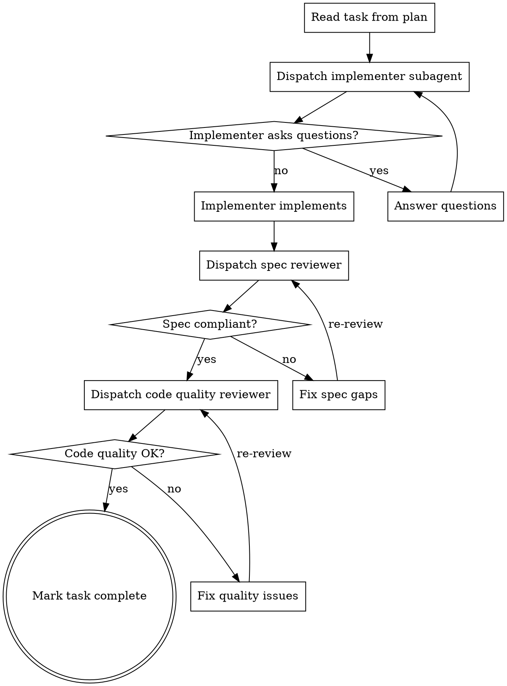

# JUCE DSP Implementation (Phase 4)

Build the audio engine module by module with two-stage review after each. This is the single most important quality gate in the playbook.

**Playbook Reference:** `~/.agents/juce-agent/playbooks/vst-plugin-playbook-v6-unified.json` Phase 4

## Pre-Flight Checks (run before EVERY DSP module)

Before implementing any DSP module, verify:

- [ ] **EM-03:** In any FDN implementation, verify mixing matrix is in FEEDBACK path, not just output
- [ ] **EM-04:** Compute max delay length at 192kHz: `max_base * (192000/48000)`. Buffer must be >= this.
- [ ] **EM-05:** Reverse playback uses `(start+length-1)`, not `(start+length)`
- [ ] **EM-06:** All circular buffer indices use `& mask` wrapping
- [ ] **EM-08:** Verify filter Q mapping at reso=0 and reso=1
- [ ] **CM-02:** FFT needs `std::unique_ptr<juce::dsp::FFT>` due to non-copyable
- [ ] **CM-08:** Latency at non-48kHz: compute from `fftSize * decimationFactor`

## Process Flow



## Two-Stage Review Process

### Stage 1: Spec Compliance Review

**Checks:**
- Correct algorithm implementation
- Correct formula constants
- Correct parameter ranges
- Correct signal flow

**Key insight:** The spec reviewer checks if the code matches what was specified. It does NOT check for bugs outside the spec.

### Stage 2: Code Quality Review

**Checks:**
- Buffer overflows
- Off-by-one errors
- Thread safety
- Edge cases
- Performance issues
- Audio thread safety

**Key insight from playbook:** Code quality reviewer caught EM-03 (FHT not in feedback — critical), EM-04 (buffer overflow), EM-05/06/07 (3 GlitchEngine bugs), EM-08 (Q constant). Spec reviewer alone would have missed ALL of these.

**Order matters:** NEVER start code quality review before spec compliance is ✅

## Audio Thread Safety Checklist

Before any DSP module is approved, verify:

```cpp
// In prepareToPlay - pre-allocate ALL buffers
void prepareToPlay(double sampleRate, int samplesPerBlock) {
    // ✅ Pre-allocate buffers
    buffer.setSize(2, samplesPerBlock * 2);  // Account for max rate

    // ✅ Initialize SmoothedValue
    smoothedParam.reset(sampleRate, 0.02);  // 20ms
    smoothedParam.setCurrentAndTargetValue(initialValue);

    // ✅ Reset all state
    for (auto& state : moduleStates) {
        state.reset();
    }
}

// In processBlock - NO allocations, NO locks
void processBlock(juce::AudioBuffer<float>& buffer, juce::MidiBuffer&) {
    juce::ScopedNoDenormals noDenormals;  // ✅ Always first

    // ✅ Handle mono input
    if (buffer.getNumChannels() == 1) {
        buffer.copyFrom(1, 0, buffer, 0, 0, buffer.getNumSamples());
    }

    // ✅ Set target once per block
    smoothedParam.setTargetValue(apvts.getRawParameterValue("param")->load());

    // ✅ Call getNextValue per sample
    for (int sample = 0; sample < buffer.getNumSamples(); ++sample) {
        const float v = smoothedParam.getNextValue();  // CRITICAL!
        // Use v in processing...
    }
}
```

## Prevention Rules (from real bugs)

| ID | Bug | Prevention |
|---|---|---|
| EM-03 | FHT at output only, not in feedback | FHT must be in feedback path |
| EM-04 | Buffer overflow at >48kHz | Compute max delay at 192kHz |
| EM-05 | Reverse playback off-by-one | Use `(start+length-1)` not `(start+length)` |
| EM-06 | writeHead unbounded overflow | All circular indices use `& mask` |
| EM-07 | Drift on reverse grains | No drift on reverse grains |
| EM-08 | Q constant wrong | Verify at param=0 and param=1 |
| CM-02 | FFT needs unique_ptr | `std::unique_ptr<juce::dsp::FFT> fft;` |
| CM-03 | Heap allocation in processBlock | Pre-allocate in prepareToPlay |
| CM-04 | Stack allocation in processBlock | Use member arrays |
| CM-05 | SmoothedValue once per block | Call getNextValue() per sample |
| CM-06 | Delay line same sample | Read at writePos - delay - i |
| CM-07 | Double scaling | Apply coefficient once |
| CM-14 | Coefficients every sample | Move outside loop |

## Common DSP Module Templates

### Filter Module

```cpp
class ResonantFilter {
public:
    void prepare(double sampleRate, int /*samplesPerBlock*/) {
        filter.reset();
        filter.setMode(juce::dsp::StateVariableTPTFilter<float>::Mode::Lowpass);
        // Note: set sample rate via ProcessSpec, not direct assignment
    }

    void reset() { filter.reset(); }

    void process(juce::AudioBuffer<float>& buffer) {
        juce::dsp::AudioBlock<float> block(buffer);
        juce::dsp::ProcessContextReplacing<float> context(block);
        filter.process(context);
    }

    void setCutoff(float freq) { filter.setCutoffFrequency(freq); }
    void setResonance(float q) { filter.setResonance(q); }

private:
    juce::dsp::StateVariableTPTFilter<float> filter;
};
```

#### Filter Module Sound Design Context

**From Sound Design KB:**

| Sonic Goal | Cutoff Range | Resonance Range | Filter Type |
|------------|-------------|-----------------|-------------|
| Warm | 0.2-0.4 | 0.1-0.2 | Lowpass |
| Bright | 0.6-1.0 | 0.1-0.3 | Lowpass |
| Resonant | 0.4-0.6 | 0.5-0.8 | Lowpass |
| Aggressive | 0.3-0.5 | 0.3-0.5 | Highpass |

**Perceptual Note:**
Human hearing perceives cutoff logarithmically. Use skew factor on cutoff parameter for perceptually linear response.

**Educational:**
- Cutoff at 0.5 doesn't sound "halfway" — use exponential mapping
- Resonance >0.7 can cause self-oscillation
- Highpass filters remove low end; use for aggressive sounds

### Delay Module

```cpp
class DelayLine {
public:
    void prepare(double sampleRate, int samplesPerBlock) {
        // Scale for max sample rate (192kHz)
        const int maxDelaySamples = static_cast<int>(maxDelayMs / 1000.0 * 192000.0);
        delay.setMaximumDelayInSamples(maxDelaySamples);
        delay.reset();
    }

    void reset() { delay.reset(); }

    void process(juce::AudioBuffer<float>& buffer) {
        for (int channel = 0; channel < buffer.getNumChannels(); ++channel) {
            auto* data = buffer.getWritePointer(channel);
            for (int sample = 0; sample < buffer.getNumSamples(); ++sample) {
                const float delayed = delay.popSample(channel);
                delay.pushSample(channel, data[sample]);
                data[sample] = data[sample] * dryMix + delayed * wetMix;
            }
        }
    }

private:
    juce::dsp::DelayLine<float, juce::dsp::DelayLineInterpolationTypes::Linear> delay;
    float maxDelayMs = 1000.0f;
    float dryMix = 0.5f, wetMix = 0.5f;
};
```

#### Delay Module Sound Design Context

**From Sound Design KB:**

| Sonic Goal | Delay Time | Feedback | Mix |
|------------|-----------|----------|-----|
| Subtle echo | 0.2-0.5s | 0.2-0.4 | 0.2-0.3 |
| Rhythmic slap | 0.05-0.15s | 0.1-0.2 | 0.3-0.4 |
| Atmospheric | 0.3-1.0s | 0.4-0.6 | 0.3-0.5 |

**Perceptual Note:**
Use equal-power crossfade for wet/dry mixing: `cos(mix * PI/2)` and `sin(mix * PI/2)`

**Educational:**
- Short delays (<50ms) create comb filtering, not distinct echoes
- Long feedback (>0.7) can cause runaway — limit to 0.95
- Feedback of 0.5-0.6 creates gradual decay without runaway

## Phase Gate

Before proceeding to processor integration, verify:

- [ ] Each module passed two-stage review (spec + code quality)
- [ ] All critical and important issues resolved
- [ ] Fix subagents re-reviewed
- [ ] Automated tests pass
- [ ] Build succeeds
- [ ] Pre-flight checks re-run for next module

## Integration with Other Skills

**Required before this skill:**
- **superpowers:juce-plugin-spec** — Define the plugin before implementing

**Use with:**
- **superpowers:subagent-driven-development** — Dispatch subagents for implementation
- **superpowers:juce-sound-design-bridge** — Get sound design context for DSP parameters
- **superpowers:juce-ui-bridge** — Get UI implementation guidance for DSP module controls

**Required after this skill:**
- **superpowers:juce-daw-testing** — Test in DAW after implementation

### UI Implementation Context (from UI Knowledge Base)

After implementing each DSP module, the UI bridge provides guidance for control implementation:

**Filter Module UI:**
- Primary control: Rotary knob for cutoff (48-64px)
- Secondary control: Rotary knob for resonance (32-40px)
- Filter type: Radio buttons or dropdown
- Visual: Optional filter response display
- Parameter: Logarithmic skew for perceptual linearity

**Delay Module UI:**
- Primary controls: Time, Feedback, Mix sliders
- Recommended: Linear horizontal sliders for time and mix
- Feedback: Rotary knob
- Visual: Optional delay visualization

**Reverb Module UI:**
- Primary: Room size, damping, wet level
- Recommended: Large knobs for size and wet level
- Damping: Medium knob
- Visual: Optional reverb tail visualization

## Fallback and Error Handling

### DSP Algorithm Unclear

**Symptom:** Algorithm in spec is vague or math is unclear

**Fallback:**
```markdown
**Algorithm Clarification Needed**

The spec describes `<algorithm>` but details are incomplete.

**Resolution options:**
1. Check JUCE built-in DSP classes (dsp::IIR, dsp::StateVariableFilter, etc.)
2. Reference Sound on Sound synthesis articles
3. Ask user for reference implementation or paper

**Do not guess.** Get clarity before implementing.
```

### Build Failure During Implementation

**Symptom:** Code doesn't compile

**Fallback:**
```markdown
**Build Failure**

Common causes and fixes:

1. **Missing includes:**
   - Check module includes in Projucer/CMake
   - Add `#include <juce_dsp/juce_dsp.h>` for DSP classes

2. **Type mismatches:**
   - Check AudioProcessor float vs double
   - Use `using Filter = juce::dsp::IIR::Filter<float>;`

3. **Missing JUCE modules:**
   - Verify all needed modules in CMakeLists.txt
   - Common missing: juce_dsp, juce_audio_basics

4. **Namespace issues:**
   - Use `juce::` prefix or `using namespace juce;`

Return to Phase 3 (Build Setup) if fundamental issues.
```

### Audio Thread Violation Detected

**Symptom:** Code review finds potential audio thread issue

**Fallback:**
```cpp
// Common fixes for audio thread violations:

// 1. Allocation in processBlock - PREALLOCATE
// BAD: std::vector<float> buffer(numSamples);
// GOOD: Pre-allocate in prepareToPlay:
class MyProcessor {
    std::vector<float> buffer;
    void prepareToPlay(double sr, int blockSize) override {
        buffer.resize(blockSize); // Pre-allocate
    }
    void processBlock(AudioBuffer<float>& buffer, MidiBuffer&) override {
        // No allocations here
    }
};

// 2. Lock in processBlock - USE ATOMIC
// BAD: lock.lock();
// GOOD: Use std::atomic for cross-thread flags
std::atomic<bool> shouldReset{false};

// 3. String construction - USE PRE-FORMATTED
// BAD: String msg = "Value: " + String(value);
// GOOD: Pre-format or use debug-only logging
```

**Invoke juce-audio-thread-audit skill for full check.**

### Parameter Smoothing Issues

**Symptom:** Parameter changes cause clicks or zipper noise

**Fallback:**
```cpp
// SmoothedValue fix

// 1. Check reset in prepareToPlay:
void prepareToPlay(double sampleRate, int blockSize) override {
    cutoffSmooth.reset(sampleRate, 0.01); // 10ms smoothing
    // NOT: cutoffSmooth.reset(sampleRate, 0.0); // No smoothing!
}

// 2. Check per-sample smoothing:
void processBlock(AudioBuffer<float>& buffer, MidiBuffer&) override {
    // NOT:
    // float cutoff = cutoffSmooth.getNextValue(); // Once per block!

    // GOOD:
    for (int sample = 0; sample < buffer.getNumSamples(); ++sample) {
        float cutoff = cutoffSmooth.getNextValue(); // Per sample
        // ... use cutoff
    }
}

// Invoke juce-smoothedvalue-audit skill for full check.
```

### Two-Stage Review Failure

**Symptom:** First review stage fails

**Fallback:**
```markdown
**Review Stage 1 Failed: Spec Compliance**

The implementation doesn't match the spec.

**Required:**
1. Read the spec file: `<spec_path>`
2. Compare each requirement
3. Fix discrepancies
4. Re-run two-stage review

**Common issues:**
- Parameter range mismatch (spec says 0-1, code uses Hz)
- Algorithm substitution (spec says ladder, code uses IIR)
- Missing features from spec
```

### Sound Design Context Unavailable

**Symptom:** Cannot access Sound Design KB for parameter guidance

**Fallback:**
```markdown
**Sound Design KB temporarily unavailable**

Basic parameter guidance:

**Filter:**
- Cutoff: 0-1 normalized, use skew 0.5 for perceptual linearity
- Resonance: 0-1, values >0.7 may self-oscillate

**Delay:**
- Time: 0.05-1.0 seconds common
- Feedback: 0-0.9 (avoid infinite feedback loops)

**Reverb:**
- Room size: 0-1
- Damping: 0-1, higher = darker
- Wet level: 0-0.5 typically

Proceed with implementation using these basics.
Invoke juce-sound-design-bridge for full guidance when available.
```

## Related

- **Real-Time Safety Overview:** `~/.agents/juce-agent/playbookdata/cpp-kb/topics/realtime-safety/overview.md`
- **Atomic Audio Patterns:** `~/.agents/juce-agent/playbookdata/cpp-kb/topics/realtime-safety/atomic-audio.md`
- **Lock-Free Patterns:** `~/.agents/juce-agent/playbookdata/cpp-kb/topics/realtime-safety/lock-free-patterns.md`

## KB Dependency

This skill reads from the DSP Knowledge Base and related technical KBs. KB location is resolved via the registry — not hardcoded paths.

### Registry Resolution

1. Read `~/.claude/kb-registry.json`
2. Find the registered KB that has a `dsp` layer (or `dsp-kb` for prototype)
3. Resolve path: `registry.path + "/" + layer_name + "/"`
4. If no registered KB has a DSP layer, use fallback content (see below)

```python
# Pseudocode for KB resolution
import json

def resolve_dsp_kb():
    registry_path = os.path.expanduser("~/.claude/kb-registry.json")
    if not os.path.exists(registry_path):
        return None  # Use fallback content
    
    with open(registry_path) as f:
        registry = json.load(f)
    
    for kb in registry["registries"]:
        for layer in kb["layers"]:
            if "dsp" in layer:
                return {"kb_name": kb["name"], "kb_path": kb["path"], "layer": layer}
    
    return None  # Use fallback content
```

### Placeholder Detection

1. **Read manifest for the DSP layer:**
   ```bash
   cat <kb_path>/<layer>/manifest.json | jq '.entries[] | select(.status == "placeholder")'
   ```

2. **If entry status == "placeholder":**
   - Log: "Placeholder detected in [kb_name]/[layer]/[topic]/[filename]"
   - Invoke kb-harvest to fill it:
     ```
     kb-harvest --kb <kb_name> --auto --entry <entry-id> --batch 1
     ```
   - Wait for completion
   - Re-read KB file

3. **Read KB file and use content:**
   ```python
   import json
   kb_file = f"{kb_path}/{layer}/{topic}/{filename}"
   with open(kb_file) as f:
       data = json.load(f)
   markdown = data.get("original_markdown", "")
   code_blocks = data.get("code_blocks", [])
   ```

### Confidence Awareness

When reading a KB entry, check `harvest_metadata.overall_confidence` if present:

| Confidence | Action |
|------------|--------|
| >= 0.60 | Use content normally |
| 0.40 - 0.59 | Use content but warn: "Low confidence DSP reference (confidence: X.XX). Verify algorithm correctness before implementation." |
| < 0.40 | Do not use content. Warn user and use fallback content instead. |

**Code block confidence:** For entries with `field_provenance.code_blocks.method == "direct-extracted"`, code examples can be trusted more than `ai-synthesized` code blocks which may contain errors.

### Common KB References

Resolved dynamically from registry. Typical structure:

| DSP Topic | KB Path (relative to layer) | Description |
|-----------|---------|-------------|
| Reverb | reverb/algorithmic-reverb.json | Algorithmic reverb design |
| Reverb | reverb/convolution-reverb.json | Convolution reverb |
| Dynamics | dynamics/compressor.json | Compression algorithms |
| Dynamics | dynamics/limiter-design.json | Limiter design |

### Fallback if Harvest Fails

If registry is missing, KB not registered, or entry below confidence threshold:

```json
{
  "title": "DSP Topic",
  "status": "placeholder",
  "fallback": {
    "brief": "Basic description available",
    "key_concepts": ["concept1", "concept2"],
    "common_algorithms": ["algo1", "algo2"]
  }
}
```