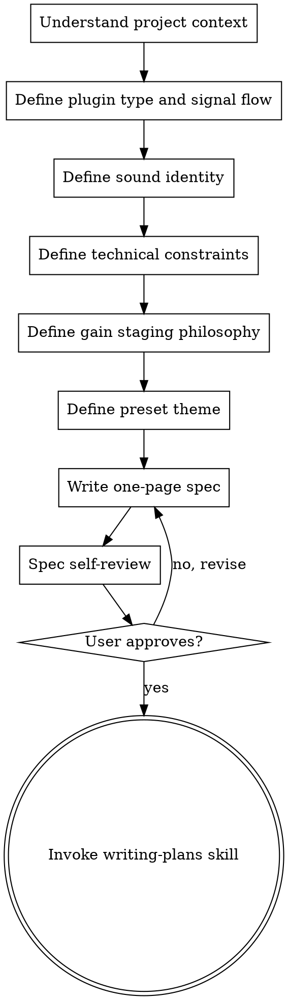

# JUCE Plugin Specification (Phase 0)

Define exactly what you're building before writing any code. AI should be ASKING YOU questions, not proposing solutions.

**Playbook Reference:** `~/.agents/juce-agent/playbooks/vst-plugin-playbook-v7-unified.json` Phase 0

> **Portable Path:** Uses `~/.agents/juce-agent/` as default. To use a different location, create `~/.claude/agent-paths.json` with custom paths.

## Hard Gate

**DO NOT** write any implementation code, create any project files, or make any architectural decisions until:
1. All questions below have been answered
2. A spec document has been written
3. User has approved the spec

## Process Flow



## Required Questions (ask one at a time)

### 1. Plugin Type and Signal Flow (human_only)

Ask these questions to understand the plugin architecture:

- **Plugin type:** Is this an effect, synthesizer, analyzer, or hybrid?
- **Signal flow:** Draw the signal path from input to output. What processing blocks are in series? What's in parallel?
- **Parameter count:** Roughly how many user-controllable parameters? Under 10? 10-30? 30+?

**Critical:** AI NEVER proposes a signal flow unprompted. User must draw or describe it.

### 2. Sound Identity (human_only)

Ask these questions to capture creative direction:

- **Reference plugins/hardware:** What existing plugins or hardware does this sound like? What does it NOT sound like?
- **Genre context:** What genres is this for?
- **Character words:** In 3-5 words, describe the sound character (warm, aggressive, lush, lo-fi, etc.)
- **Uniqueness:** What makes this plugin different from what already exists?

**Critical:** Record user's exact words. Never paraphrase. These become the creative north star.

### 2a. Sound Design Integration (human + AI)

After defining sound identity, use the juce-sound-design-bridge to:

**KB Resolution:** juce-sound-design-bridge resolves KB paths via `~/.claude/kb-registry.json`. If no registry exists, the bridge uses built-in fallback translations.

**Map sonic descriptors to capabilities:**
- User's character words (warm, bright, punchy) map to parameter ranges
- Check capability_requirements for needed DSP modules

**KB-Route Integration (NEW):**
First query the Bridge KB via kb-route for authoritative translations:
```
Read ~/.claude/skills/kb-route/SKILL.md Resolution Procedure
Parameters: bridge_descriptor="<character_word>", kb="vst-product-lifecycle"
```

If kb-route returns results with confidence >= 0.60:
- Use bridge entry parameter ranges
- Note the 'why' explanation for each parameter
- Check anti_patterns for what NOT to do

If confidence 0.40–0.59:
- Use bridge entry but warn: "Medium confidence (X.XX) — verify before applying"

If no results or confidence < 0.40:
- Fall back to juce-sound-design-bridge built-in translations
- Verify plugin design includes required modules

**Populate capability schema:**
- Document all DSP modules planned for the plugin
- List parameters each module exposes
- Note ranges and defaults

**Log creative language:**
- Record user's exact words for later reference
- Use exact terms in preset naming
- Reference these terms during DAW testing

**Example integration:**

```markdown
User says: "I want a warm, lush pad with subtle movement"

Sound Design Bridge translation:
- warm → filter_cutoff: 0.2-0.4, filter_resonance: 0.1-0.2
- lush → detune: 0.05-0.15, chorus: 0.3-0.5
- subtle movement → LFO depth: 0.1-0.2, rate: 0.1-0.3 Hz

Capability requirements:
- Required: filter_lowpass, detune_or_chorus
- Recommended: LFO

Plugin includes: ✓ filter_lowpass, ✓ chorus, ✓ LFO
```

### 3. Technical Constraints (human)

- **JUCE version:** Which JUCE version? (Recommend: 7.0.x latest)
- **Formats:** VST3, AU, AAX, Standalone? (Minimum: VST3 + Standalone)
- **Target OS:** macOS, Windows, Linux, or ALL?
- **Target DAW:** Primary DAW for testing?
- **Sample rates:** 44.1kHz, 48kHz, 96kHz, 192kHz? (Recommend: support ALL)
- **Buffer sizes:** 64 to 2048 samples?
- **CPU budget:** What's acceptable CPU usage?

### 4. Gain Staging Philosophy (human)

- **Hot signals:** When is it OK for signals to be hot (> 0dB)?
- **Conservative stages:** Are there multiple gain reduction stages that might mask the effect?
- **Output limiting:** How should the output be limited?

**Prevention Rule from EM-session1:** 6 layers of conservative gain staging was identified as root cause of "effect not noticeable." Always audit existing gain staging early.

### 5. Preset Theme and Naming (human_only)

- **Preset theme:** What's the creative concept for presets? (e.g., "quantum physics" for Epiphany Machine)
- **Preset count:** How many presets? (Recommend: 10-30 for v1)
- **Naming:** AI will suggest generic names. USER MUST APPROVE every name individually.

**Prevention Rule from EM-session1:** AI proposed generic preset names — user rejected. ALWAYS use user's exact creative language.

## Spec Document Template

Write the spec to: `docs/superpowers/specs/YYYY-MM-DD-<plugin-name>-design.md`

```markdown
# <Plugin Name> VST

## Overview
- Plugin type: [effect/synth/hybrid]
- Formats: [VST3, AU, Standalone]
- Target OS: [macOS, Windows, Linux]

## Signal Flow
[ASCII diagram or description of signal path]

## DSP Modules
### Module 1: <Name>
- Algorithm: [brief description]
- Parameters: [list with ranges and defaults]
- CPU cost: [estimate]

## Parameters
| ID | Name | Range | Default | Skew | Unit |
|----|------|-------|---------|------|------|
| gain | Gain | 0-1 | 0.5 | 1.0 | - |

## Gain Staging
- [Where signals can be hot, where they're reduced]

## GUI
- Dimensions: [width x height]
- Layout: [description]
- Colors: [hex codes if known]

## Presets
- Theme: [creative concept]
- Names: [approved by user]

## Build Instructions
- JUCE version: [version]
- CMake options: [list]
- Dependencies: [list]

## What NOT To Do
- [Explicit out-of-scope items]
```

## Spec Self-Review Checklist

After writing, check for:

1. **Placeholder scan:** Any "TBD", "TODO", incomplete sections? Fix them.
2. **Formula verification:** For each formula, compute output at param=0 and param=1. Are boundary conditions correct?
3. **Buffer sizing:** Are buffer sizes specified for max supported sample rate (192kHz)?
4. **Scope check:** Is this focused enough for a single implementation plan?
5. **Ambiguity check:** Could any requirement be interpreted two different ways?

## Prevention Rules (from playbook failure modes)

| ID | Lesson | Prevention |
|---|---|---|
| EM-session1-a | AI proposed generic preset names | ALWAYS use user's exact creative language |
| EM-session1-b | 6 layers of gain staging masked effect | Audit existing gain staging early |
| EM-session2 | Wavefolder formula amplified by PI at drive=0 | Verify formulas at boundary conditions |

### 2b. UI Design Questions (human_only)

**KB Resolution:** juce-ui-bridge resolves KB paths via `~/.claude/kb-registry.json`. If no registry exists, the bridge reads from the playbook's `ui_design` section.

After sound identity, ask about visual identity:

- **Visual style:** What visual style fits this plugin? (Modern clean, vintage hardware, minimal, creative/experimental)
- **Layout preference:** What layout works best? (Rack style, keyboard style, compact effect, tabbed interface)
- **Color preferences:** Any color preferences or brand colors?
- **Target displays:** What display sizes should be supported? (Minimum resolution, hiDPI support)
- **Control density:** How many controls visible at once? (All visible, tabs, collapsible panels)

**Critical:** Use juce-ui-bridge skill to translate visual concepts to JUCE implementations. Record user's exact words for visual identity.

**UI Integration Example:**

```markdown
User says: "I want a clean, modern interface that's easy to read"

UI Bridge translation:
- Style: Modern clean
- LookAndFeel: LookAndFeel_V4 Dark
- Layout: Compact effect or rack style
- Color: Dark theme with accent color
- Typography: Clean sans-serif, regular weight
- Recommended dimensions: Minimum 400x300, preferred 600x400
```

## Phase Gate

Before proceeding to implementation, confirm:

- [ ] Plugin type and signal flow defined
- [ ] Sound identity documented in YOUR words (not paraphrased)
- [ ] UI/visual style documented (use juce-ui-bridge for translations)
- [ ] Gain staging philosophy explicit
- [ ] Technical constraints locked (JUCE version, formats, OS, DAW)
- [ ] One-page spec written and self-reviewed
- [ ] Spec approved by YOU
- [ ] Out-of-scope list exists
- [ ] Preset theme chosen with creative names YOU approve
- [ ] Capability schema populated (DSP modules, parameters, ranges)
- [ ] Sound design integration verified (descriptors mapped)
- [ ] UI design integration verified (control sizes, colors, accessibility)

## Next Step

After user approval, invoke the **writing-plans** skill to create an implementation plan.

DO NOT invoke any implementation skill directly from this skill.