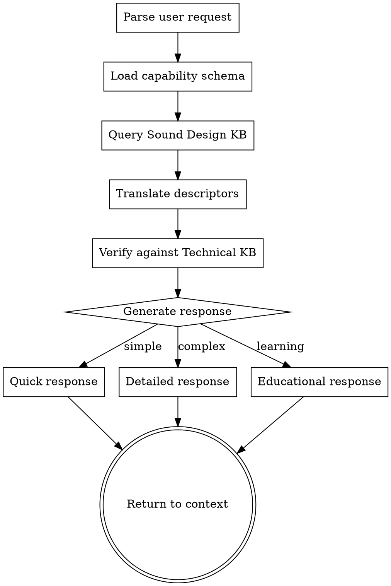

# JUCE Sound Design Bridge

Translation layer that connects Sound Design Knowledge with DSP implementation. Maps sonic descriptors to parameters using capability-based lookups.

**Playbook Reference:** `~/.agents/juce-agent/playbooks/vst-plugin-playbook-v7-unified.json` — sound_design section

## When to Use

Invoke this skill when:
- User describes sound qualitatively: "make it warmer", "more punchy", "too bright"
- User asks for preset suggestions: "I want a fat bass sound"
- User asks about parameter ranges: "What should cutoff be for a warm pad?"
- User requests sound design guidance: "How do I get movement in my sound?"
- During Phase 0 (spec) for sound identity
- During Phase 4 (DSP implementation) for parameter tuning
- During Phase 9 (DAW testing) for quality evaluation

## Trigger Keywords

- Sonic descriptors: warm, bright, punchy, fat, thin, harsh, smooth, aggressive, lush, cold
- Sound types: pad, lead, bass, drone, atmospheric, percussive
- Quality feedback: too bright, too thin, not enough movement, harsh
- Preset requests: "create a preset", "suggest parameters", "make a X sound"

## Process Flow



## Algorithm

### Step 1: Parse User Request

Extract from user input:
- Sonic descriptors (warm, bright, punchy, etc.)
- Sound type requests (pad, lead, bass)
- Quality feedback (too bright, needs movement)
- Parameter questions (what should X be?)

### Step 2: Load Capability Schema

Read the plugin's capability schema from the playbook:

```python
# Pseudocode for understanding
def load_capability_schema():
    playbook = load_json("vst-plugin-playbook-v7-unified.json")
    return playbook.get("capability_schema", {})
```

The capability schema tells us:
- What DSP modules exist in this plugin
- What parameters each module exposes
- Parameter ranges and defaults

### Step 3: KB-Route Integration

Read and follow the Resolution Procedure in `~/.claude/skills/kb-route/SKILL.md`
with parameters: `bridge_descriptor="<user_input>"`, `kb="vst-product-lifecycle"`

If kb-route returns results with confidence >= 0.60:
- Use parameters from bridge entry
- Apply anti_patterns warnings to output
- Note source: "KB: bridge/<category>/<descriptor>"

If confidence 0.40-0.59:
- Use with warning: "Medium confidence (X.XX) — verify before applying"

If no results or confidence < 0.40:
- Fall back to built-in translation table (Step 4 below)
- Check ground truth presets for the descriptor
- If descriptor is vague, prepare clarifying questions
- Note: "Using fallback translation (no KB entry found)"

### Step 4: Translate

Map from sound design concepts to technical parameters:

| Sound Design Concept | Technical Translation |
|---------------------|----------------------|
| "Warm" | filter_cutoff: [0.2, 0.4], slight detune |
| "Bright" | filter_cutoff: [0.6, 1.0], resonance: [0.1, 0.3] |
| "Punchy" | fast attack, filter envelope, compression |
| "Fat" | detune + stereo width + saturation |
| "Movement" | LFO modulation, filter envelope |

### Step 5: Verify

Cross-reference with Technical KB:
- Do these parameters exist in this plugin?
- Are the ranges valid for this implementation?
- Are there any DSP constraints that apply?

## Progressive Disclosure

### Quick Response (for simple queries)

Direct parameter suggestions:

```markdown
**For "warm pad" sound:**
- filter_cutoff: 0.25-0.35
- filter_resonance: 0.1-0.2
- osc_detune: 0.08-0.12 (if available)
- chorus_depth: 0.3-0.5 (if available)

Confidence: high (ground truth preset exists)
```

### Detailed Response (for complex queries)

Full parameter breakdown with alternatives:

```markdown
**"Warm pad" parameter analysis:**

**Primary Parameters:**
| Parameter | Range | Why | Confidence |
|-----------|-------|-----|------------|
| filter_cutoff | 0.2-0.4 | Lower cutoff reduces high harmonics | high |
| filter_resonance | 0.1-0.2 | Subtle resonance adds warmth | high |
| osc_detune | 0.05-0.15 | Slight detune adds thickness | medium |

**Alternative Approaches:**
- If no detune: Use chorus at 0.3-0.5 depth
- If no filter: Use LP filter at 2-4kHz equivalent

**Capability Check:**
Your plugin has: filter_lowpass, chorus
Missing: osc_detune (use alternative approach)

**Sources:** Sound on Sound: Filter Design, preset_analysis
```

### Educational Response (for learning)

Includes WHY behind parameters:

```markdown
**"Warm pad" sound design analysis:**

**Why these parameters:**

**Filter Cutoff (0.2-0.4):**
A lowpass filter at 20-40% cutoff reduces high frequency content. Our ears perceive warmth when the 2-4kHz range is attenuated. The cutoff frequency isn't linear - use skew=0.5 for perceptually even sweep.

**Detune (0.05-0.15):**
Detuning oscillators by 5-15 cents creates beating patterns our ears perceive as "thickness" or "richness". Too much (>30 cents) sounds out of tune; too little (<5 cents) sounds static.

**Chorus (0.3-0.5 depth):**
Chorus adds pitch modulation and delay variation, creating stereo width and movement. For warm pads, keep rate slow (0.1-0.3 Hz equivalent) and depth moderate.

**Common Mistakes:**
- Setting chorus depth too high (>0.7) creates phase issues in mono
- Forgetting that filter cutoff needs skew for perceptual linearity
- Overlapping too many effects (detune + chorus + phaser) = muddy

**Related Concepts:**
- Equal power crossfade for wet/dry mixing
- Filter resonance and self-oscillation
- Stereo width vs mono compatibility
```

## Iteration Protocol

### Handling Feedback

When user provides feedback like "too bright" or "not enough movement":

1. **Look up feedback_mapping:**

```json
"too_bright": {
  "primary_adjustments": [
    {"parameter": "filter_cutoff", "direction": "decrease", "typical_amount": 0.15}
  ],
  "follow_up_questions": ["Is the brightness from harmonics or filter?"]
}
```

2. **Apply adjustment:**

```markdown
**Adjusting for "too bright":**

Decreasing filter_cutoff by ~0.15 (from 0.75 to 0.60).
This reduces high frequency content.

If the brightness is from harmonics rather than filter:
- Consider reducing drive/saturation instead
- Or use a lowpass filter after the distortion stage
```

3. **Ask clarifying question if confidence is low:**

```markdown
Is the brightness from:
- A) Harmonics (distortion/saturation adding high frequencies)
- B) Filter (cutoff set too high)
```

### A/B Comparison

When iterating on presets:

```markdown
**A/B Comparison:**

| | Version A | Version B |
|---|-----------|-----------|
| filter_cutoff | 0.75 | 0.60 |
| filter_resonance | 0.3 | 0.2 |
| Drive | 0.5 | 0.4 |

**A:** Brighter, more aggressive. Good for cutting through mix.
**B:** Warmer, smoother. Good for pads and background.

Which direction would you like to continue?
```

## Descriptor Synthesis Protocol

When a descriptor isn't in the KB:

1. **Decompose into known concepts:**
   - "Glitchy" → detune + LFO + noise + random modulation

2. **Check for vague descriptor entry:**
   - Is there a clarifying question we should ask?

3. **Synthesize from related concepts:**
   - Look up similar descriptors
   - Combine parameters from related sounds

4. **Mark confidence level:**
   - High: Ground truth or verified source
   - Medium: Derived from synthesis rules
   - Low: Speculative, needs validation

5. **Log for future improvement:**
   - Add to validation log for review

## Quality Criteria Checklist

During Phase 9 (DAW testing), use this checklist:

```markdown
## Sound Quality Checklist

### Frequency Balance
- [ ] Balanced across spectrum
- [ ] No harsh resonances
- [ ] Tight low end (not muddy)
- [ ] Present high end (not harsh)

### Dynamic Range
- [ ] Appropriate compression
- [ ] Transient punches through
- [ ] Even sustain

### Stereo Image
- [ ] Appropriate width
- [ ] Mono compatible
- [ ] Low end centered

### Harmonic Content
- [ ] Appropriate distortion
- [ ] Musical harmonics
- [ ] Not over-processed

### Movement
- [ ] LFO rate appropriate
- [ ] Envelope shapes correct
- [ ] Not over-modulated
```

## Integration with Other Skills

**juce-plugin-spec (Phase 0):**
- During sound identity definition, use translations to help user articulate goals
- Use capability_requirements to validate plugin has needed DSP modules
- Log user's exact creative language (never paraphrase)

**juce-dsp-implementation (Phase 4):**
- After each module, provide sound design context
- Use translations to suggest parameter defaults
- Verify parameter ranges produce expected sonic results

**juce-daw-testing (Phase 9):**
- Use quality_criteria checklist
- Use feedback_mapping to interpret user feedback
- Log results to validation logs

## Example Usage

### User: "I want a warm pad sound"

```markdown
**Sound Design Bridge Translation:**

**Warm Pad** (high confidence)

**Required DSP:**
- Lowpass filter
- Optional: Chorus/detune

**Parameter Suggestions:**
| Parameter | Value | Range | Why |
|-----------|-------|-------|-----|
| filter_cutoff | 0.3 | 0.2-0.4 | Attenuates high frequencies for warmth |
| filter_resonance | 0.15 | 0.1-0.2 | Subtle resonance adds character |
| filter_type | LP | — | Lowpass for warmth |

**If available:**
| Parameter | Value | Range | Why |
|-----------|-------|-------|-----|
| osc_detune | 0.1 | 0.05-0.15 | Creates thickness through beating |
| chorus_depth | 0.4 | 0.3-0.5 | Adds width and movement |

**Educational Note:**
Warmth comes from reducing high frequencies and adding subtle complexity through detune or modulation. Avoid over-processing — one modulation effect is usually enough.

**Verification:**
Plugin capabilities checked: filter_lowpass ✓
Missing: chorus (use stereo detune alternative)

Confidence: high (ground truth preset exists)
```

### User: "Make it less harsh"

```markdown
**Feedback Translation:**

**"Harsh" → Reduce high frequency energy**

**Primary Adjustments:**
| Parameter | Change | Why |
|-----------|--------|-----|
| filter_resonance | -0.2 | Resonance at cutoff adds energy |
| drive | -0.15 | If distortion present |

**Clarifying Question:**
Is the harshness from:
- A) Filter resonance (whistling quality)
- B) Distortion (fuzzy/gritty quality)
- C) High end (bright, piercing)

This helps me suggest the most effective adjustment.

**Quick Fix (try first):**
Decrease filter_resonance by 0.2. If still harsh, decrease filter_cutoff by 0.15.

Confidence: high
```

## Sources and Citations

All translations cite sources:

- `ground_truth` — Verified by human testing (highest confidence)
- `preset_analysis` — Derived from analyzing working presets
- `Sound on Sound` — Professional audio magazine
- `music_dsp` — Community knowledge base
- `synthesis_principle` — Established synthesis theory

Ground truth presets are preferred. When speculating, confidence is marked low and clarification is requested.

## Key Files

- **KB Registry:** `~/.claude/kb-registry.json` — resolves KB locations
- **Playbook:** `~/.agents/juce-agent/playbooks/vst-plugin-playbook-v7-unified.json` — sound_design section
- **Ground Truth Presets:** `~/.agents/juce-agent/validation-logs/GROUND_TRUTH_PRESETS.md`
- **Validation Logs:** `~/.agents/juce-agent/validation-logs/<project-name>/`
- **Global Patterns:** `~/.agents/juce-agent/validation-logs/global-patterns.json`

## Validation Logging

After providing translations or preset suggestions during DAW testing:

1. **Log results** to `validation-logs/<project-name>/<date>-<preset>.md`
2. **Update global patterns** in `global-patterns.json`:
   - Increment correct/adjusted/failed counts
   - Update confidence scores
   - Add new clarifications for vague descriptors
3. **Mark ground truth** when verified by human testing

## Confidence Scoring

Confidence values are numerical (0.1 to 0.99):

| Level | Value | Source |
|-------|-------|--------|
| High | 0.85 | Ground truth or verified source |
| Medium | 0.65 | Derived from principles |
| Low | 0.45 | Speculative, needs validation |
| Needs Clarification | 0.25 | Vague descriptor, multiple interpretations |

Confidence increases (+0.05) with successful use, decreases (-0.10) with adjustments needed.

**Threshold note:** These levels apply to built-in fallback translations (used when kb-route finds no entry). Bridge results returned via kb-route use kb-route's own thresholds: >= 0.60 = use normally, 0.40–0.59 = warn, < 0.40 = exclude. Do not mix the two scales.

## Fallback and Error Handling

### Playbook Unavailable

**Symptom:** Cannot load `~/.agents/juce-agent/playbooks/vst-plugin-playbook-v7-unified.json`

**Fallback:**
```markdown
The Sound Design Knowledge Base is temporarily unavailable.

**Basic guidance:**
- For "warm" sounds: Reduce high frequencies (filter cutoff 0.2-0.4)
- For "bright" sounds: Increase high frequencies (filter cutoff 0.6-1.0)
- For "punchy" sounds: Use fast attack (0-50ms), filter envelope
- For "ambient" sounds: Use reverb/delay, slow LFO modulation

Please restart the agent or check playbook availability.
```

### Capability Not Found

**Symptom:** Requested DSP capability doesn't exist in capability schema

**Fallback:**
```markdown
**Capability not found:** `<capability_name>`

**Available alternatives:**
- List similar capabilities from schema
- Suggest parameter approximations

**Example:** If "granular" not available, suggest:
- Use delay with modulation for granular-like effects
- Or note that granular synthesis requires different architecture
```

### Translation Confidence Low

**Symptom:** Confidence < 0.5 for translation

**Fallback:**
```markdown
**Low confidence translation** (confidence: 0.45)

This translation is speculative. I recommend:
1. Start with suggested values as a starting point
2. Adjust by ear during DAW testing
3. Document what worked for future improvement

Would you like me to explain the reasoning, or proceed with testing?
```

### Validation Log Write Failure

**Symptom:** Cannot write to validation logs directory

**Fallback:**
```markdown
**Warning:** Cannot log validation results.

The translation will still be provided, but results won't be saved for learning.
Please check directory permissions: `~/.agents/juce-agent/validation-logs/`

Continue with sound design guidance. Results can be logged manually later.
```

### Conflicting Requirements Detected

**Symptom:** User requests contradictory qualities (e.g., "warm AND bright")

**Fallback:**
```markdown
**Conflict detected:** `<conflict_description>`

These qualities are contradictory:
- Warm: Low cutoff (0.2-0.4), reduces high frequencies
- Bright: High cutoff (0.6-1.0), emphasizes high frequencies

**Resolution options:**
1. **Choose primary:** Which quality is more important?
2. **Middle ground:** Neutral cutoff (0.5) with character from other parameters
3. **Layered approach:** Two sounds layered together

Which direction would you like to explore?
```

### Descriptor Not in Knowledge Base

**Symptom:** User uses unfamiliar sonic descriptor

**Fallback:**
```markdown
**Unknown descriptor:** `<descriptor>`

I don't have a direct translation for this term.

**Clarifying questions:**
- Can you describe the sound in other terms? (warm, bright, harsh, smooth?)
- What reference sounds have this quality?
- What parameters would you adjust?

Based on your description, I can suggest:
- Similar known descriptors
- Parameter ranges that might achieve the effect

Let me help translate this to DSP parameters.
```

### Ground Truth Preset Unverified

**Symptom:** Selected preset has verification_status: needs_testing

**Fallback:**
```markdown
**Note:** This preset hasn't been verified in DAW testing yet.

Parameter values are derived from sound design principles but haven't been confirmed by human testing.

**Recommendation:**
- Use as starting point
- Adjust by ear during DAW testing
- Report results for verification
```