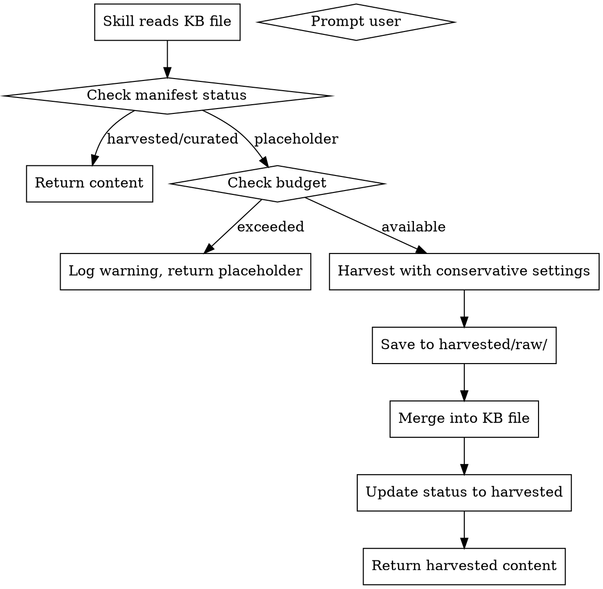

# KB Autofill (Auto-Harvesting)

Background skill that fills KB placeholders automatically when other skills need content.

**Playbook Reference:** `~/.agents/juce-agent/playbookdata/`

## When This Skill Is Used

```markdown
# When juce-dsp-implementation skill accesses dsp-kb/reverb/algorithmic-reverb.json:

1. Read KB file
2. Check status field (or look for "[Content to be harvested]" in markdown)
3. If status == "placeholder":
   a. Log: "Placeholder detected in dsp-kb/reverb/algorithmic-reverb.json"
   b. Invoke kb-autofill with conservative settings
   c. Wait for completion
   d. Re-read KB file
4. Use harvested content
```

## Invocation

**Automatic (placeholder detection):**
Other skills check for placeholder status and invoke this skill.

**Explicit (skill call):**
Other skills can call via Agent tool:

```
Use the Agent tool:
- subagent_type: "kb-autofill"
- prompt: "Harvest dsp-kb/reverb/algorithmic-reverb.json with budget 50 credits"
```

## Conservative Harvesting Settings

| Setting | kb-autofill | kb-harvest (manual) |
|---------|-------------|---------------------|
| Max queries | 3 | 5 |
| Deep crawls | 1 | 3 |
| Timeout | 60s | 300s |
| Budget | 100 credits | Unlimited |

**Why conservative:** Auto-harvest should be fast and predictable, not thorough. Manual harvest can take time for comprehensive content.

## Workflow



## Placeholder Detection

Two methods:

**1. Manifest status field:**
```json
{
  "kb_name": "dsp-kb",
  "phases": [
    {
      "name": "reverb",
      "files": {
        "algorithmic-reverb.json": {
          "status": "placeholder"
        }
      }
    }
  ]
}
```

**2. File content fallback:**
```json
{
  "title": "Algorithmic Reverb",
  "status": "placeholder",
  "markdown": "[Content to be harvested]"
}
```

## Budget Configuration

File: `~/.claude/kb-harvest-config.json`

```json
{
  "session_budget": 100,
  "budget_exceeded_action": "prompt",
  "auto_harvest_enabled": true,
  "default_sources_priority": {
    "CCRMA": 10,
    "JUCE forum": 9,
    "EarLevel blog": 9,
    "musicdsp.org": 8,
    "default": 5
  },
  "merge_after_harvest": true,
  "quality_check": false
}
```

**Budget actions:**
- `prompt`: Ask user before continuing (default)
- `continue`: Log warning and continue anyway
- `stop`: Stop harvesting, return what's collected

## Execution Commands

```bash
cd ~/.agents/juce-agent/playbookdata

# Conservative harvest (auto mode)
./scripts/harvest-batch.sh --kb dsp-kb --topic reverb --file algorithmic-reverb.json \
  --queries 3 --crawls 1 --no-crawl

# Merge immediately
python3 scripts/merge-harvested.py dsp-kb --topic reverb --file algorithmic-reverb.json
```

## Content Merge Process

After harvest:
1. Read raw JSON from `harvested/raw/`
2. Extract markdown from best result (longest content)
3. Update KB file's `markdown` field
4. Update status to `"harvested"`
5. Keep `harvested_at` timestamp

**Merge criteria:**
- Select result with longest markdown content
- Prefer results from prioritized domains
- Fall back to concatenating top 3 results if single result is short

## Error Handling

### Budget Exceeded

```markdown
**Warning:** Session budget exceeded (100 credits)

**Options:**
1. `prompt` mode: Log warning, return placeholder content with notice
2. `continue` mode: Continue anyway (logged)
3. `stop` mode: Stop and return collected content
```

### API Down

```markdown
**Error:** Firecrawl API unavailable

**Fallback:**
- Return placeholder content with notice
- Allow calling skill to continue with degraded content
- Log error for later retry
```

### Content Quality Poor

```markdown
**Warning:** Harvested content seems low quality

**Actions:**
- Check if search terms match topic
- Try fallback sources
- Return best available content
- Log for manual review
```

## Status Values

| Status | Meaning |
|--------|---------|
| `placeholder` | File created but not harvested |
| `harvested` | Content harvested but not reviewed |
| `curated` | Content reviewed and approved |
| `failed` | Harvest failed, needs retry |

## Integration with Other Skills

**Used by:**
- `juce-dsp-implementation` - DSP module content
- `juce-sound-design-bridge` - Sound design translations
- `juce-ui-bridge` - UI implementation guidance
- `juce-plugin-spec` - Plugin specification content

**Uses:**
- `harvest-deep.py` - Main harvester
- `merge-harvested.py` - Content merger

## Example: Skill Calling kb-autofill

```markdown
## In juce-dsp-implementation SKILL.md:

### KB Dependency

This skill requires content from the Knowledge Base. Before using KB content:

1. Check if file exists and has harvested content:
   - Read manifest: `{kb}/manifest.json`
   - Check file status: `status != "placeholder"`

2. If placeholder:
   - Log: "Placeholder detected, invoking kb-autofill"
   - Use Agent tool to invoke kb-autofill:
     ```
     Agent(
       subagent_type="kb-autofill",
       prompt="Harvest dsp-kb/reverb/algorithmic-reverb.json with budget 50 credits"
     )
     ```
   - Wait for result, then continue

3. Read KB file and use content
```

## Fallback Content

If auto-harvest fails or is disabled, return fallback content:

```json
{
  "title": "Algorithmic Reverb",
  "status": "placeholder",
  "fallback": {
    "brief": "Algorithmic reverb uses delay lines and feedback to create artificial reverberation.",
    "key_concepts": ["delay lines", "feedback", "all-pass filters", "comb filters"],
    "common_algorithms": ["Freeverb", "Schroeder", "FDN"]
  }
}
```