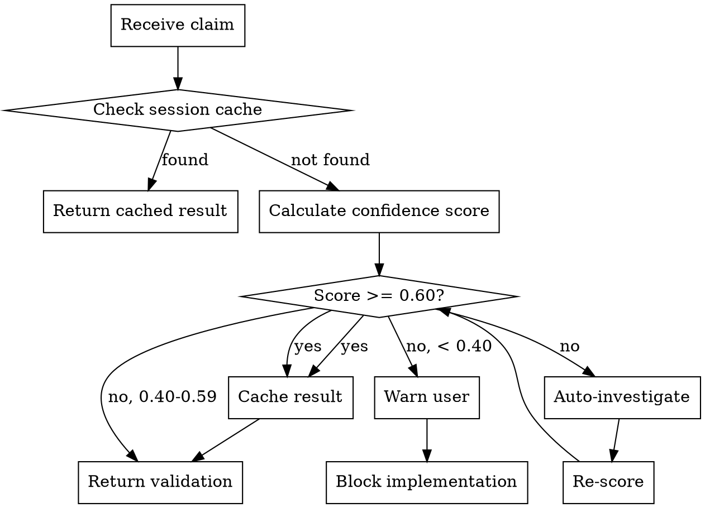

# KB Validate

Validates technical knowledge claims from KB files, playbooks, and web sources before implementation. Uses multi-factor confidence scoring to assess claim reliability.

## Invocation

```
/kb-validate                                    # Show status and help
/kb-validate --claim "JUCE SmoothedValue uses getNextValue() per sample"
/kb-validate --auto --source ${last_skill_output}
/kb-validate --gate --check-session
/kb-validate --refresh                         # Invalidate cache
/kb-validate --report                          # Generate full validation report
```

## When This Skill Triggers

1. **Post-Knowledge Hook**: After kb-harvest, kb-sync, firecrawl-scrape, firecrawl-search return technical content
2. **Pre-Implementation Gate**: Before Write/Edit operations that create or modify code files
3. **Manual Invocation**: When user or playbook explicitly requests validation

## Workflow



## Confidence Levels

| Score | Level | Action |
|-------|-------|--------|
| >= 0.85 | HIGH | Proceed, no warning |
| 0.60 - 0.84 | MEDIUM | Proceed, log warning |
| 0.40 - 0.59 | LOW | Auto-investigate, then warn if still low |
| < 0.40 | FAIL | Block implementation, require user decision |

## Prerequisites

- Source files must be readable (KB files, playbooks)
- Session cache initialized in memory
- For auto-investigate: WebSearch available (replaces firecrawl-search)
- When validating KB entries: reads `harvest_metadata` if present to factor `overall_confidence` into scoring (see confidence-scorer.md)

## Commands

### Status Command

Show validation status:

```markdown
**KB Validate Status**
- Cached claims: 12
- Session validations: 8 HIGH, 3 MEDIUM, 1 LOW (resolved)
- Failed claims: 0
```

### Validate Command

Validate a specific claim:

```markdown
/kb-validate --claim "SmoothedValue uses getNextValue() per sample"

**Result:** ✅ HIGH (0.92)
- Source: juce-kb/realtime/smoothedvalue.json (full read)
- Cross-refs: 2 (juce-kb, dsp-kb)
- Recency: < 1 year
- Contradictions: None
```

### Gate Command

Pre-implementation gate check:

```markdown
/kb-validate --gate --check-session

**Session Validation Status**
- All claims validated: 12 claims
- Confidence distribution: 8 HIGH, 3 MEDIUM, 1 LOW (resolved)
- Blocking issues: 0
- **PROCEED** with implementation
```

### Report Command

Generate full validation report:

```markdown
/kb-validate --report

See: validation-report.md for format
```

## Integration Points

**Called by:**
- Post-knowledge hooks (firecrawl-*, kb-*)
- Pre-implementation hooks (Write, Edit on code files)
- Manual invocation from playbooks ([Auditor] role)

**Uses:**
- confidence-scorer.md - Calculate confidence scores
- cache-manager.md - Session cache operations
- auto-investigate.md - Deep search for low confidence
- validation-report.md - Output formatting

## Output Formats

See validation-report.md for complete format specification.
See templates/user-warning.md for user-facing warnings.