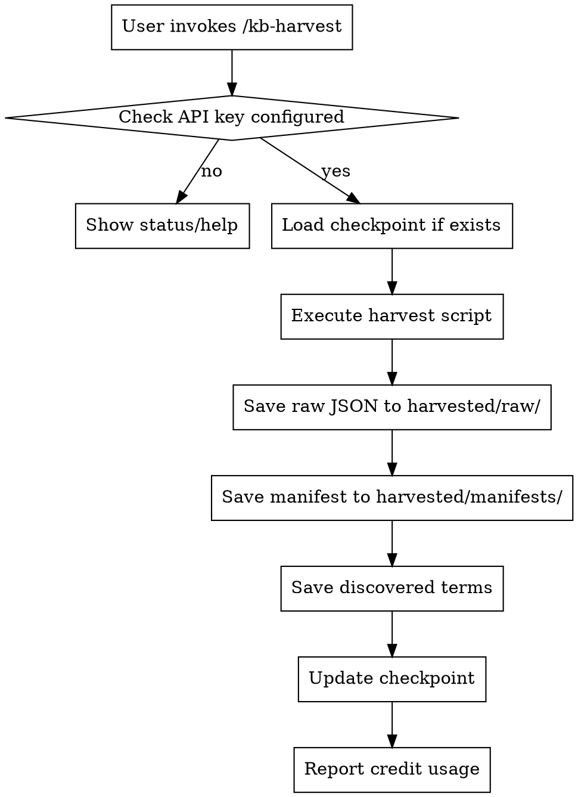
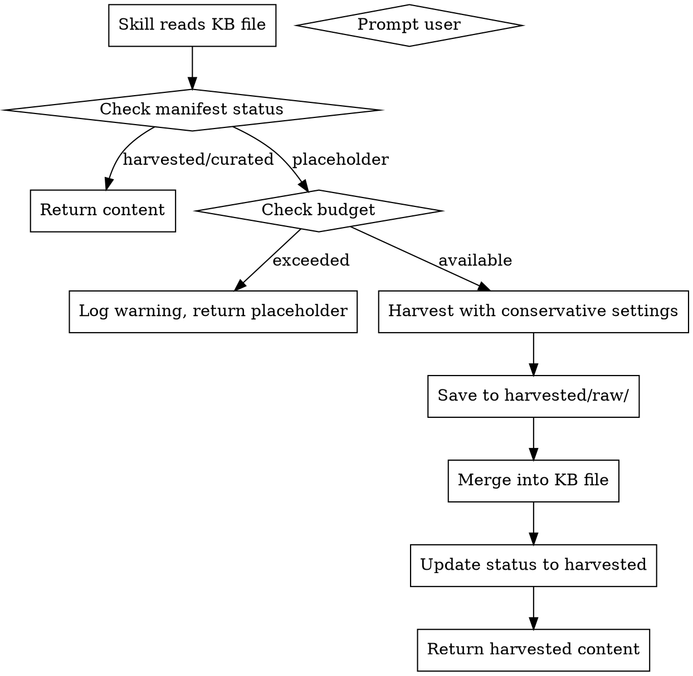

# KB Harvesting Skills Implementation Plan

> **For agentic workers:** REQUIRED SUB-SKILL: Use superpowers:subagent-driven-development (recommended) or superpowers:executing-plans to implement this plan task-by-task. Steps use checkbox (`- [ ]`) syntax for tracking.

**Goal:** Create two complementary skills for harvesting content into Knowledge Base files: `kb-harvest` for manual user-controlled harvesting and `kb-autofill` for automatic placeholder detection.

**Architecture:** The `kb-harvest` skill wraps the existing `harvest-deep.py` and `harvest-batch.sh` scripts with a user-facing skill interface. The `kb-autofill` skill runs as a background agent triggered by placeholder detection, using conservative harvesting settings. A merge script bridges harvested content back into KB files.

**Tech Stack:** Python 3, Bash, Claude Code skills system, Firecrawl API

---

## File Structure

```
~/.claude/skills/
├── kb-harvest/
│   └── SKILL.md                    # Skill definition
├── kb-autofill/
│   └── SKILL.md                    # Skill definition

/home/myuser/agents/juce-agent/playbookdata/
├── scripts/
│   ├── harvest-deep.py             # EXISTING - main harvester
│   ├── harvest-batch.sh            # EXISTING - batch runner
│   ├── merge-harvested.py          # NEW - merge harvested content into KB files
│   └── update-manifests.py         # NEW - update manifest status tracking
├── harvested/
│   ├── raw/                        # EXISTING - raw Firecrawl responses
│   ├── manifests/                  # EXISTING - harvest summaries
│   ├── discovered-terms/           # EXISTING - extracted terms
│   ├── processed/                  # EXISTING - merged content
│   ├── checkpoints/                # EXISTING - resume state
│   └── locks/                      # NEW - file locking for concurrent access

~/.claude/
└── kb-harvest-config.json          # NEW - user preferences for auto-harvest

/home/myuser/agents/juce-agent/playbookdata/*-kb/
└── manifest.json                   # UPDATED - add file-level status tracking
```

---

## Task 1: Create merge-harvested.py Script

**Files:**
- Create: `/home/myuser/agents/juce-agent/playbookdata/scripts/merge-harvested.py`

**Purpose:** Merge harvested content from `harvested/raw/` into KB placeholder files.

- [ ] **Step 1: Write the merge script**

```python
#!/usr/bin/env python3
"""
Merge harvested content into KB placeholder files.

Reads raw Firecrawl responses from harvested/raw/ and updates
the corresponding KB file with markdown content.
"""

import json
import sys
from pathlib import Path
from datetime import datetime, timezone
from typing import Optional
import argparse

# Directory structure
SCRIPT_DIR = Path(__file__).parent.resolve()
KB_ROOT = SCRIPT_DIR.parent
RAW_DIR = KB_ROOT / "harvested" / "raw"
MANIFEST_DIR = KB_ROOT / "harvested" / "manifests"


def find_best_result(raw_file: Path) -> Optional[dict]:
    """
    Find the result with longest markdown content.

    Args:
        raw_file: Path to raw JSON file

    Returns:
        Best result dict or None
    """
    with open(raw_file) as f:
        data = json.load(f)

    result = data.get("result", {})
    items = result.get("data", result.get("results", []))

    if not items:
        return None

    # Find item with longest markdown
    best = None
    best_length = 0

    for item in items:
        if not isinstance(item, dict):
            continue

        markdown = item.get("markdown", "")
        if len(markdown) > best_length:
            best = item
            best_length = len(markdown)

    return best


def merge_harvested_content(kb: str, topic: str, filename: str,
                           dry_run: bool = False) -> dict:
    """
    Merge harvested content into KB placeholder file.

    Args:
        kb: KB type (e.g., "dsp-kb")
        topic: Topic folder (e.g., "reverb")
        filename: JSON filename (e.g., "algorithmic-reverb.json")
        dry_run: If True, don't write changes

    Returns:
        Dict with merge result
    """
    # Construct paths
    kb_file = KB_ROOT / kb / topic / filename
    raw_pattern = f"{kb}_{topic}_{filename.replace('.json', '')}"

    # Find harvested files for this KB entry
    matching_files = list(RAW_DIR.glob(f"{raw_pattern}*.json"))

    if not matching_files:
        return {
            "status": "error",
            "error": f"No harvested content found for {kb}/{topic}/{filename}",
            "searched": str(RAW_DIR / f"{raw_pattern}*.json")
        }

    # Find the best result (longest markdown)
    best_content = None
    best_length = 0
    best_file = None
    total_results = 0

    for raw_file in matching_files:
        result = find_best_result(raw_file)
        if result:
            total_results += 1
            markdown = result.get("markdown", "")
            if len(markdown) > best_length:
                best_content = markdown
                best_length = len(markdown)
                best_file = raw_file

    if not best_content:
        return {
            "status": "error",
            "error": "No markdown content found in harvested files",
            "files_checked": len(matching_files)
        }

    # Read KB file
    if not kb_file.exists():
        return {
            "status": "error",
            "error": f"KB file not found: {kb_file}"
        }

    with open(kb_file) as f:
        kb_data = json.load(f)

    # Check current status
    current_status = kb_data.get("status", "placeholder")
    if current_status == "curated":
        return {
            "status": "warning",
            "warning": f"KB file already curated, skipping merge",
            "file": str(kb_file)
        }

    # Prepare merge result
    merge_result = {
        "status": "success",
        "kb": kb,
        "topic": topic,
        "filename": filename,
        "source_file": str(best_file),
        "content_length": best_length,
        "total_sources": total_results,
        "previous_status": current_status,
        "new_status": "harvested",
        "timestamp": datetime.now(timezone.utc).isoformat()
    }

    if dry_run:
        merge_result["dry_run"] = True
        merge_result["preview"] = best_content[:500] + "..." if len(best_content) > 500 else best_content
        return merge_result

    # Update KB file
    kb_data["markdown"] = best_content
    kb_data["status"] = "harvested"
    kb_data["harvested_at"] = datetime.now(timezone.utc).isoformat()
    kb_data["harvest_source"] = str(best_file.name)

    # Write back
    with open(kb_file, 'w') as f:
        json.dump(kb_data, f, indent=2)

    # Update manifest
    update_manifest(kb, topic, filename, merge_result)

    return merge_result


def update_manifest(kb: str, topic: str, filename: str, merge_result: dict):
    """Update manifest with harvested status."""
    manifest_path = KB_ROOT / kb / "manifest.json"

    # Load or create manifest
    if manifest_path.exists():
        with open(manifest_path) as f:
            manifest = json.load(f)
    else:
        manifest = {
            "kb_name": kb,
            "phases": []
        }

    # Find or create phase entry
    phase_entry = None
    for phase in manifest.get("phases", []):
        if phase.get("name") == topic:
            phase_entry = phase
            break

    if not phase_entry:
        phase_entry = {"name": topic, "files": {}}
        manifest.setdefault("phases", []).append(phase_entry)

    # Update file status
    if "files" not in phase_entry:
        phase_entry["files"] = {}

    phase_entry["files"][filename] = {
        "status": merge_result["new_status"],
        "harvested_at": merge_result["timestamp"],
        "credits_used": merge_result.get("credits_used", 0),
        "sources": merge_result.get("total_sources", 1)
    }

    # Write back
    with open(manifest_path, 'w') as f:
        json.dump(manifest, f, indent=2)


def main():
    parser = argparse.ArgumentParser(
        description="Merge harvested content into KB placeholder files"
    )
    parser.add_argument("kb", help="KB type (e.g., dsp-kb)")
    parser.add_argument("--topic", "-t", help="Topic folder")
    parser.add_argument("--file", "-f", help="JSON filename")
    parser.add_argument("--dry-run", action="store_true",
                       help="Preview merge without writing")
    parser.add_argument("--all", action="store_true",
                       help="Merge all harvested content for this KB")

    args = parser.parse_args()

    # Validate arguments
    if args.all:
        if args.topic or args.file:
            print("Warning: --topic and --file are ignored when --all is used")
    elif not args.topic or not args.file:
        parser.error("--topic and --file are required unless --all is specified")

    if args.all:
        # Find all harvested manifests for this KB
        manifest_pattern = f"{args.kb}_*.json"
        manifest_files = list(MANIFEST_DIR.glob(manifest_pattern))

        if not manifest_files:
            print(f"No harvested manifests found for {args.kb}")
            sys.exit(1)

        results = []
        for manifest_file in manifest_files:
            # Parse topic and filename from manifest
            parts = manifest_file.stem.split('_')
            if len(parts) >= 3:
                topic = parts[1]
                filename = parts[2] + ".json"
                result = merge_harvested_content(args.kb, topic, filename, args.dry_run)
                results.append(result)
                print(f"  {topic}/{filename}: {result['status']}")

        print(f"\nMerged {len(results)} files")
        return

    result = merge_harvested_content(args.kb, args.topic, args.file, args.dry_run)

    if result["status"] == "error":
        print(f"Error: {result['error']}")
        sys.exit(1)
    elif result["status"] == "warning":
        print(f"Warning: {result['warning']}")
    else:
        print(f"Merged {result['content_length']} chars from {result['total_sources']} sources")
        print(f"Status: {result['previous_status']} -> {result['new_status']}")

    print(json.dumps(result, indent=2))


if __name__ == "__main__":
    main()
```

- [ ] **Step 2: Make script executable**

Run: `chmod +x /home/myuser/agents/juce-agent/playbookdata/scripts/merge-harvested.py`
Expected: Script is now executable

- [ ] **Step 3: Test merge script dry run**

Run: `cd /home/myuser/agents/juce-agent/playbookdata && python3 scripts/merge-harvested.py dsp-kb --topic reverb --file algorithmic-reverb.json --dry-run`
Expected: Either shows preview or reports no harvested content found

- [ ] **Step 4: Commit merge script**

```bash
cd /home/myuser/agents/juce-agent/playbookdata
git add scripts/merge-harvested.py
git commit -m "feat: add merge-harvested.py to merge harvested content into KB files"
```

---

## Task 2: Create kb-harvest Skill Directory

**Files:**
- Create: `/home/myuser/.claude/skills/kb-harvest/SKILL.md`

**Purpose:** User-facing skill for manual, controlled harvesting operations.

- [ ] **Step 1: Create skill directory**

Run: `mkdir -p /home/myuser/.claude/skills/kb-harvest`
Expected: Directory created

- [ ] **Step 2: Write the SKILL.md**

```markdown
---
name: kb-harvest
description: Use for manual harvesting of Knowledge Base content with full control and visibility. Run from playbookdata directory.
---

# KB Harvest (Manual Harvesting)

User-facing skill for deliberate, controlled harvesting operations with full visibility into credit usage and progress.

**Playbook Reference:** `/home/myuser/agents/juce-agent/playbookdata/`

## Invocation

```
/kb-harvest                              # Show status and help
/kb-harvest --phase 1                    # Harvest phase 1 (DSP core)
/kb-harvest --phase 2                    # Harvest phase 2 (JUCE real-time)
/kb-harvest --kb dsp-kb --topic reverb   # Harvest entire topic
/kb-harvest --kb dsp-kb --topic reverb --file algorithmic-reverb.json
/kb-harvest --credits                    # Show credit usage summary
/kb-harvest --status                     # Show KB fill status
/kb-harvest --clean --kb dsp-kb          # Clean checkpoints
/kb-harvest --merge --kb dsp-kb --topic reverb --file algorithmic-reverb.json
```

## Prerequisites

- `FIRECRAWL_API_KEY` environment variable must be set
- Run from playbookdata directory or use absolute paths
- Harvest scripts must be executable

## Workflow



## Phase-Based Harvesting

| Phase | KB | Topics | Files | Impact |
|-------|-----|--------|-------|--------|
| 1 | dsp-kb | reverb, dynamics | 4 files | DSP core |
| 2 | juce-kb | realtime | 3 files | Real-time safety |
| 3 | testing-kb | validation, unit-testing | 2 files | Testing foundation |
| 4 | midi-kb | protocol, mpe, controllers | 3 files | MIDI fundamentals |

## Commands

### Status Command

Show KB fill status:

```bash
cd /home/myuser/agents/juce-agent/playbookdata

# Count files per KB
for kb in dsp-kb juce-kb testing-kb midi-kb sound-design-kb; do
  if [ -d "$kb" ]; then
    total=$(find "$kb" -name "*.json" ! -name "index.json" ! -name "manifest.json" | wc -l)
    harvested=$(find "harvested/manifests" -name "${kb}_*.json" 2>/dev/null | wc -l)
    echo "$kb: $harvested / $total"
  fi
done
```

### Harvest Command

Run harvesting with scripts:

```bash
cd /home/myuser/agents/juce-agent/playbookdata

# Phase 1: DSP core
./scripts/harvest-batch.sh --phase 1

# Single file with limits
./scripts/harvest-batch.sh --kb dsp-kb --topic reverb --file algorithmic-reverb.json --queries 3 --crawls 1

# Resume from checkpoint (default)
./scripts/harvest-batch.sh --phase 2

# Start fresh
./scripts/harvest-batch.sh --phase 2 --no-resume

# Clean checkpoints
./scripts/harvest-batch.sh --clean --kb dsp-kb --topic reverb
```

### Credits Command

Show credit usage:

```bash
cd /home/myuser/agents/juce-agent/playbookdata

# Show credit estimates
./scripts/harvest-batch.sh --credits

# Show actual credits used (from manifests)
if [ -d "harvested/manifests" ]; then
  echo "Credits used per harvest:"
  for manifest in harvested/manifests/*.json; do
    if [ -f "$manifest" ]; then
      credits=$(jq -r '.credits_used // 0' "$manifest" 2>/dev/null)
      name=$(basename "$manifest" .json)
      echo "  $name: $credits credits"
    fi
  done
  total=$(jq -s '[.[].credits_used // 0] | add' harvested/manifests/*.json 2>/dev/null)
  echo "Total: $total credits"
fi
```

### Merge Command

Merge harvested content into KB files:

```bash
cd /home/myuser/agents/juce-agent/playbookdata

# Merge single file
python3 scripts/merge-harvested.py dsp-kb --topic reverb --file algorithmic-reverb.json

# Preview merge (dry run)
python3 scripts/merge-harvested.py dsp-kb --topic reverb --file algorithmic-reverb.json --dry-run

# Merge all harvested content for KB
python3 scripts/merge-harvested.py dsp-kb --all
```

## Credit Tracking

Firecrawl pricing:
- Search with scrape: ~5 credits per query + 1 per result
- Deep crawl: ~1 credit per page crawled
- Single page scrape: ~1 credit

Per-file estimates:
- 5 search queries × 5 credits = 25 credits
- Average 10 results per query = 50 credits
- 2 deep crawls × 10 pages = 20 credits
- **Total per file: ~95 credits (range: 50-150)**

Budget: 20,500 credits available
Recommended reserve: ~3,500 credits

## Error Handling

### API Key Not Set

```markdown
**Error:** FIRECRAWL_API_KEY not configured

**Fix:**
```bash
export FIRECRAWL_API_KEY="your_key_here"
# Or add to ~/.bashrc:
echo 'export FIRECRAWL_API_KEY="your_key_here"' >> ~/.bashrc
```
```

### Firecrawl API Down

```markdown
**Error:** API returns 5xx or timeout

**Fix:**
1. Check status: The script retries up to 3 times with exponential backoff
2. Progress is saved to checkpoint - resume later
3. Wait and retry: `./scripts/harvest-batch.sh --phase 1` (resumes automatically)
```

### Rate Limited

```markdown
**Error:** 429 Too Many Requests

**Fix:**
1. Script automatically waits for Retry-After header
2. Increase delay: `FIRECRAWL_DELAY=5.0 ./scripts/harvest-batch.sh --phase 1`
3. Reduce concurrent operations
```

### Content Quality Issues

```markdown
**Warning:** Harvested content seems poor quality

**Check:**
1. Review raw JSON in `harvested/raw/`
2. Check discovered terms in `harvested/discovered-terms/`
3. Verify search terms match topic
4. Consider manual refinement before merge
```

## Output Files

| Directory | Purpose |
|-----------|---------|
| `harvested/raw/` | Full Firecrawl JSON responses |
| `harvested/manifests/` | Harvest summaries per file |
| `harvested/discovered-terms/` | Extracted terms for future use |
| `harvested/processed/` | Merged content (future step) |
| `harvested/checkpoints/` | Resume state |

## Integration with Other Skills

**Calls:**
- `harvest-deep.py` - Main harvester
- `harvest-batch.sh` - Batch runner
- `merge-harvested.py` - Content merger

**Used by:**
- `kb-autofill` - Uses harvested content for auto-fill
- `juce-dsp-implementation` - Reads KB content for DSP guidance
- `juce-sound-design-bridge` - Reads sound design KB content
```

- [ ] **Step 3: Commit kb-harvest skill**

```bash
cd /home/myuser/.claude/skills
git add kb-harvest/SKILL.md
git commit -m "feat: add kb-harvest skill for manual KB harvesting"
```

---

## Task 3: Create kb-autofill Skill Directory

**Files:**
- Create: `/home/myuser/.claude/skills/kb-autofill/SKILL.md`

**Purpose:** Automatic harvesting triggered by placeholder detection.

- [ ] **Step 1: Create skill directory**

Run: `mkdir -p /home/myuser/.claude/skills/kb-autofill`
Expected: Directory created

- [ ] **Step 2: Write the SKILL.md**

```markdown
---
name: kb-autofill
description: Use when a skill accesses KB content and finds placeholder status. Automatically harvests content with conservative settings.
---

# KB Autofill (Auto-Harvesting)

Background skill that fills KB placeholders automatically when other skills need content.

**Playbook Reference:** `/home/myuser/agents/juce-agent/playbookdata/`

## When This Skill Is Used

```markdown
# When juce-dsp-implementation skill accesses dsp-kb/reverb/algorithmic-reverb.json:

1. Read KB file
2. Check status field (or look for "[Content to be harvested]" in markdown)
3. If status == "placeholder":
   a. Log: "Placeholder detected in dsp-kb/reverb/algorithmic-reverb.json"
   b. Invoke kb-autofill with conservative settings
   c. Wait for completion
   d. Re-read KB file
4. Use harvested content
```

## Invocation

**Automatic (placeholder detection):**
Other skills check for placeholder status and invoke this skill.

**Explicit (skill call):**
Other skills can call via Agent tool:

```
Use the Agent tool:
- subagent_type: "kb-autofill"
- prompt: "Harvest dsp-kb/reverb/algorithmic-reverb.json with budget 50 credits"
```

## Conservative Harvesting Settings

| Setting | kb-autofill | kb-harvest (manual) |
|---------|-------------|---------------------|
| Max queries | 3 | 5 |
| Deep crawls | 1 | 3 |
| Timeout | 60s | 300s |
| Budget | 100 credits | Unlimited |

**Why conservative:** Auto-harvest should be fast and predictable, not thorough. Manual harvest can take time for comprehensive content.

## Workflow



## Placeholder Detection

Two methods:

**1. Manifest status field:**
```json
{
  "kb_name": "dsp-kb",
  "phases": [
    {
      "name": "reverb",
      "files": {
        "algorithmic-reverb.json": {
          "status": "placeholder"
        }
      }
    }
  ]
}
```

**2. File content fallback:**
```json
{
  "title": "Algorithmic Reverb",
  "status": "placeholder",
  "markdown": "[Content to be harvested]"
}
```

## Budget Configuration

File: `~/.claude/kb-harvest-config.json`

```json
{
  "session_budget": 100,
  "budget_exceeded_action": "prompt",
  "auto_harvest_enabled": true,
  "default_sources_priority": {
    "CCRMA": 10,
    "JUCE forum": 9,
    "EarLevel blog": 9,
    "musicdsp.org": 8,
    "default": 5
  },
  "merge_after_harvest": true,
  "quality_check": false
}
```

**Budget actions:**
- `prompt`: Ask user before continuing (default)
- `continue`: Log warning and continue anyway
- `stop`: Stop harvesting, return what's collected

## Execution Commands

```bash
cd /home/myuser/agents/juce-agent/playbookdata

# Conservative harvest (auto mode)
./scripts/harvest-batch.sh --kb dsp-kb --topic reverb --file algorithmic-reverb.json \
  --queries 3 --crawls 1 --no-crawl

# Merge immediately
python3 scripts/merge-harvested.py dsp-kb --topic reverb --file algorithmic-reverb.json
```

## Content Merge Process

After harvest:
1. Read raw JSON from `harvested/raw/`
2. Extract markdown from best result (longest content)
3. Update KB file's `markdown` field
4. Update status to `"harvested"`
5. Keep `harvested_at` timestamp

**Merge criteria:**
- Select result with longest markdown content
- Prefer results from prioritized domains
- Fall back to concatenating top 3 results if single result is short

## Error Handling

### Budget Exceeded

```markdown
**Warning:** Session budget exceeded (100 credits)

**Options:**
1. `prompt` mode: Log warning, return placeholder content with notice
2. `continue` mode: Continue anyway (logged)
3. `stop` mode: Stop and return collected content
```

### API Down

```markdown
**Error:** Firecrawl API unavailable

**Fallback:**
- Return placeholder content with notice
- Allow calling skill to continue with degraded content
- Log error for later retry
```

### Content Quality Poor

```markdown
**Warning:** Harvested content seems low quality

**Actions:**
- Check if search terms match topic
- Try fallback sources
- Return best available content
- Log for manual review
```

## Status Values

| Status | Meaning |
|--------|---------|
| `placeholder` | File created but not harvested |
| `harvested` | Content harvested but not reviewed |
| `curated` | Content reviewed and approved |
| `failed` | Harvest failed, needs retry |

## Integration with Other Skills

**Used by:**
- `juce-dsp-implementation` - DSP module content
- `juce-sound-design-bridge` - Sound design translations
- `juce-ui-bridge` - UI implementation guidance
- `juce-plugin-spec` - Plugin specification content

**Uses:**
- `harvest-deep.py` - Main harvester
- `merge-harvested.py` - Content merger

## Example: Skill Calling kb-autofill

```markdown
## In juce-dsp-implementation SKILL.md:

### KB Dependency

This skill requires content from the Knowledge Base. Before using KB content:

1. Check if file exists and has harvested content:
   - Read manifest: `{kb}/manifest.json`
   - Check file status: `status != "placeholder"`

2. If placeholder:
   - Log: "Placeholder detected, invoking kb-autofill"
   - Use Agent tool to invoke kb-autofill:
     ```
     Agent(
       subagent_type="kb-autofill",
       prompt="Harvest dsp-kb/reverb/algorithmic-reverb.json with budget 50 credits"
     )
     ```
   - Wait for result, then continue

3. Read KB file and use content
```

## Fallback Content

If auto-harvest fails or is disabled, return fallback content:

```json
{
  "title": "Algorithmic Reverb",
  "status": "placeholder",
  "fallback": {
    "brief": "Algorithmic reverb uses delay lines and feedback to create artificial reverberation.",
    "key_concepts": ["delay lines", "feedback", "all-pass filters", "comb filters"],
    "common_algorithms": ["Freeverb", "Schroeder", "FDN"]
  }
}
```
```

- [ ] **Step 3: Commit kb-autofill skill**

```bash
cd /home/myuser/.claude/skills
git add kb-autofill/SKILL.md
git commit -m "feat: add kb-autofill skill for automatic placeholder harvesting"
```

---

## Task 4: Create Budget Configuration File

**Files:**
- Create: `~/.claude/kb-harvest-config.json`

**Purpose:** User preferences for auto-harvest budget and behavior.

- [ ] **Step 1: Create configuration directory**

Run: `mkdir -p ~/.claude`
Expected: Directory exists or created

- [ ] **Step 2: Write default configuration**

```bash
cat > ~/.claude/kb-harvest-config.json << 'EOF'
{
  "session_budget": 100,
  "budget_exceeded_action": "prompt",
  "auto_harvest_enabled": true,
  "default_sources_priority": {
    "CCRMA": 10,
    "JUCE forum": 9,
    "EarLevel blog": 9,
    "musicdsp.org": 8,
    "default": 5
  },
  "merge_after_harvest": true,
  "quality_check": false
}
EOF
```

- [ ] **Step 3: Verify configuration file**

Run: `cat ~/.claude/kb-harvest-config.json`
Expected: JSON configuration displayed

---

## Task 5: Update Existing KB Manifests with Status Fields

**Files:**
- Modify: `/home/myuser/agents/juce-agent/playbookdata/*/manifest.json`

**Purpose:** Add file-level status tracking to KB manifests.

- [ ] **Step 1: Check current manifest structure**

Run: `cat /home/myuser/agents/juce-agent/playbookdata/sound-design-kb/manifest.json`
Expected: Current manifest structure

- [ ] **Step 2: Write manifest update script**

```python
#!/usr/bin/env python3
"""
Update KB manifests with file-level status tracking.

Adds status fields to existing manifest files.
"""

import json
from pathlib import Path
from datetime import datetime, timezone

KB_ROOT = Path("/home/myuser/agents/juce-agent/playbookdata")
KB_TYPES = ["dsp-kb", "juce-kb", "testing-kb", "midi-kb", "sound-design-kb", "cpp-kb", "ui-kb", "cmake-kb"]

def update_manifest(kb_type: str):
    """Update manifest with status tracking."""
    kb_path = KB_ROOT / kb_type
    manifest_path = kb_path / "manifest.json"

    if not kb_path.exists():
        print(f"  KB not found: {kb_type}")
        return

    # Load or create manifest
    if manifest_path.exists():
        with open(manifest_path) as f:
            manifest = json.load(f)
    else:
        manifest = {"kb_name": kb_type, "phases": []}

    # Track if we made changes
    changed = False

    # Get topic folders
    for topic_folder in kb_path.iterdir():
        if not topic_folder.is_dir():
            continue

        topic_name = topic_folder.name

        # Find or create phase entry
        phase_entry = None
        for phase in manifest.get("phases", []):
            if phase.get("name") == topic_name:
                phase_entry = phase
                break

        if not phase_entry:
            phase_entry = {"name": topic_name, "files": {}}
            manifest.setdefault("phases", []).append(phase_entry)
            changed = True

        # Update files status
        if "files" not in phase_entry:
            phase_entry["files"] = {}

        for json_file in topic_folder.glob("*.json"):
            if json_file.name in ["index.json", "manifest.json", "validation.json"]:
                continue

            filename = json_file.name

            # Check if file already has status
            if filename not in phase_entry["files"]:
                # Read file to check content
                try:
                    with open(json_file) as f:
                        data = json.load(f)

                    # Determine status from content
                    markdown = data.get("markdown", "")
                    if "[Content to be harvested]" in markdown or not markdown.strip():
                        status = "placeholder"
                    elif data.get("status") == "harvested":
                        status = "harvested"
                    elif data.get("status") == "curated":
                        status = "curated"
                    else:
                        status = "placeholder"

                    phase_entry["files"][filename] = {
                        "status": status,
                        "last_checked": datetime.now(timezone.utc).isoformat()
                    }
                    changed = True
                    print(f"    {topic_name}/{filename}: {status}")

                except Exception as e:
                    print(f"    {topic_name}/{filename}: error - {e}")

    # Write back if changed
    if changed:
        with open(manifest_path, 'w') as f:
            json.dump(manifest, f, indent=2)
        print(f"  Updated: {manifest_path}")
    else:
        print(f"  No changes: {manifest_path}")

def main():
    print("Updating KB manifests with status tracking...\n")

    for kb_type in KB_TYPES:
        print(f"\n{kb_type}:")
        update_manifest(kb_type)

    print("\nDone!")

if __name__ == "__main__":
    main()
```

- [ ] **Step 3: Run manifest update**

Run: `cd /home/myuser/agents/juce-agent/playbookdata && python3 scripts/update-manifests.py`
Expected: Manifests updated with file statuses

- [ ] **Step 4: Verify manifest changes**

Run: `cat /home/myuser/agents/juce-agent/playbookdata/sound-design-kb/manifest.json | head -50`
Expected: Manifest now includes file-level status

- [ ] **Step 5: Commit manifest update script**

```bash
cd /home/myuser/agents/juce-agent/playbookdata
git add scripts/update-manifests.py
git commit -m "feat: add manifest update script for file-level status tracking"
```

---

## Task 6: Add File Locking for Concurrent Access

**Files:**
- Modify: `/home/myuser/agents/juce-agent/playbookdata/scripts/harvest-deep.py`

**Purpose:** Prevent concurrent access issues when multiple processes access KB files.

- [ ] **Step 1: Add file locking imports and functions**

Add to the top of `harvest-deep.py` after existing imports:

```python
import fcntl

# File locking functions
LOCK_DIR = KB_ROOT / "harvested" / "locks"

def acquire_lock(resource_name: str, timeout: int = 30) -> tuple:
    """
    Acquire exclusive lock for a resource.

    Args:
        resource_name: Unique identifier for the resource
        timeout: Maximum wait time in seconds (not implemented, immediate fail)

    Returns:
        (lock_file, fd) tuple for release
    """
    LOCK_DIR.mkdir(parents=True, exist_ok=True)
    lock_path = LOCK_DIR / f"{resource_name}.lock"

    fd = open(lock_path, 'w')
    try:
        fcntl.flock(fd, fcntl.LOCK_EX | fcntl.LOCK_NB)
        fd.write(f"{os.getpid()}\n{datetime.now(timezone.utc).isoformat()}\n")
        fd.flush()
        return lock_path, fd
    except (IOError, BlockingIOError):
        fd.close()
        return None, None

def release_lock(lock_path: Path, fd):
    """Release lock and clean up."""
    if fd:
        try:
            fcntl.flock(fd, fcntl.LOCK_UN)
            fd.close()
        except:
            pass
```

- [ ] **Step 2: Modify DeepHarvester to use locking**

First, rename the existing `harvest` method to `_harvest_internal`:

```python
# In DeepHarvester class, rename the existing harvest method:
def _harvest_internal(self, max_queries: int = 5, deep_crawl: bool = True,
                      max_crawls: int = 3, resume: bool = True) -> dict:
    """
    Internal harvest implementation.

    [Keep all existing harvest logic here - just rename the method]
    """
    # ... all existing harvest code stays here ...
```

Then add a new `harvest` wrapper method with locking:

```python
def harvest(self, max_queries: int = 5, deep_crawl: bool = True,
            max_crawls: int = 3, resume: bool = True) -> dict:
    """Main harvesting method with locking support."""

    # Acquire lock for this KB file
    resource_name = f"{self.kb_type}_{self.topic}_{self.filename}"
    lock_path, lock_fd = acquire_lock(resource_name)

    if not lock_fd:
        return {
            "error": f"Resource locked by another process: {resource_name}",
            "lock_file": str(LOCK_DIR / f"{resource_name}.lock")
        }

    try:
        result = self._harvest_internal(max_queries, deep_crawl, max_crawls, resume)
        return result
    finally:
        release_lock(lock_path, lock_fd)
```

- [ ] **Step 3: Add lock cleanup to harvest-batch.sh**

Add to `harvest-batch.sh`:

```bash
# Clean stale locks (locks older than 1 hour)
clean_stale_locks() {
    local lock_dir="$KB_ROOT/harvested/locks"
    if [ -d "$lock_dir" ]; then
        find "$lock_dir" -name "*.lock" -mmin +60 -delete 2>/dev/null || true
    fi
}

# Call at script start
clean_stale_locks
```

- [ ] **Step 4: Test locking with a bash script**

Create a test script to verify locking works:

```bash
# Test that locking functions are syntactically correct
python3 -c "
import sys
sys.path.insert(0, '/home/myuser/agents/juce-agent/playbookdata/scripts')

# Import using importlib since filename has hyphen
import importlib.util
spec = importlib.util.spec_from_file_location('harvest_deep', '/home/myuser/agents/juce-agent/playbookdata/scripts/harvest-deep.py')
harvest_module = importlib.util.module_from_spec(spec)
spec.loader.exec_module(harvest_module)

# Verify functions exist
print('Testing locking functions...')
print('acquire_lock:', callable(getattr(harvest_module, 'acquire_lock', None)))
print('release_lock:', callable(getattr(harvest_module, 'release_lock', None)))
print('LOCK_DIR:', hasattr(harvest_module, 'LOCK_DIR'))
print('PASS: Locking functions defined')
"
```

Expected: All tests print True, ends with "PASS: Locking functions defined"

- [ ] **Step 5: Commit locking changes**

```bash
cd /home/myuser/agents/juce-agent/playbookdata
git add scripts/harvest-deep.py scripts/harvest-batch.sh
git commit -m "feat: add file locking for concurrent access safety"
```

---

## Task 7: Update JUCE Skills to Call kb-autofill

**Files:**
- Modify: `/home/myuser/.claude/skills/juce-dsp-implementation/SKILL.md`
- Modify: `/home/myuser/.claude/skills/juce-sound-design-bridge/SKILL.md`

**Purpose:** Add placeholder detection and kb-autofill invocation to existing skills.

- [ ] **Step 1: Add KB Dependency section to juce-dsp-implementation**

Add this section to the end of `juce-dsp-implementation/SKILL.md`:

```markdown

## KB Dependency

This skill requires content from the Knowledge Base. Before using KB content:

### Placeholder Detection

1. **Check manifest status:**
   ```bash
   cat /home/myuser/agents/juce-agent/playbookdata/{kb}/manifest.json | jq '.phases[] | select(.name=="{topic}") | .files["{filename}"]'
   ```

2. **If status == "placeholder":**
   - Log: "Placeholder detected in {kb}/{topic}/{filename}"
   - Invoke kb-autofill:
     ```
     Use Agent tool:
     - subagent_type: "kb-autofill"
     - prompt: "Harvest {kb}/{topic}/{filename} with budget 50 credits"
     ```
   - Wait for completion
   - Re-read KB file

3. **Read KB file and use content:**
   ```python
   import json
   kb_file = f"/home/myuser/agents/juce-agent/playbookdata/{kb}/{topic}/{filename}"
   with open(kb_file) as f:
       data = json.load(f)
   markdown = data.get("markdown", "")
   ```

### Common KB References

| DSP Topic | KB Path | Description |
|-----------|---------|-------------|
| Reverb | dsp-kb/reverb/algorithmic-reverb.json | Algorithmic reverb design |
| Reverb | dsp-kb/reverb/convolution-reverb.json | Convolution reverb |
| Dynamics | dsp-kb/dynamics/compressor.json | Compression algorithms |
| Dynamics | dsp-kb/dynamics/limiter-design.json | Limiter design |

### Fallback if Harvest Fails

If kb-autofill fails, use fallback content:

```json
{
  "title": "DSP Topic",
  "status": "placeholder",
  "fallback": {
    "brief": "Basic description available",
    "key_concepts": ["concept1", "concept2"],
    "common_algorithms": ["algo1", "algo2"]
  }
}
```
```

- [ ] **Step 2: Add KB Dependency section to juce-sound-design-bridge**

Add this section to the end of `juce-sound-design-bridge/SKILL.md`:

```markdown

## KB Dependency

This skill requires content from the Sound Design Knowledge Base.

### Placeholder Detection

1. **Check manifest status:**
   ```bash
   cat /home/myuser/agents/juce-agent/playbookdata/sound-design-kb/manifest.json | jq '.phases[] | select(.name=="{topic}") | .files["{filename}"]'
   ```

2. **If status == "placeholder":**
   - Log: "Placeholder detected in sound-design-kb/{topic}/{filename}"
   - Invoke kb-autofill:
     ```
     Use Agent tool:
     - subagent_type: "kb-autofill"
     - prompt: "Harvest sound-design-kb/{topic}/{filename} with budget 30 credits"
     ```
   - Wait for completion
   - Re-read KB file

### Sound Design KB Structure

| Sonic Goal | KB Path | Parameter Guidance |
|------------|---------|---------------------|
| Warm | sound-design-kb/filter/warm.json | Filter settings for warmth |
| Bright | sound-design-kb/filter/bright.json | High frequency emphasis |
| Punchy | sound-design-kb/envelope/punchy.json | Transient shaping |
| Lush | sound-design-kb/modulation/lush.json | Chorus/detune settings |

### Fallback Content

If auto-harvest fails:

```json
{
  "title": "Sound Design: Warm",
  "status": "placeholder",
  "fallback": {
    "filter_cutoff": [0.2, 0.4],
    "filter_resonance": [0.1, 0.2],
    "filter_type": "lowpass"
  }
}
```
```

- [ ] **Step 3: Commit skill updates**

```bash
cd /home/myuser/.claude/skills
git add juce-dsp-implementation/SKILL.md juce-sound-design-bridge/SKILL.md
git commit -m "feat: add kb-autofill integration to JUCE skills"
```

---

## Task 8: Create Test Scripts

**Files:**
- Create: `/home/myuser/agents/juce-agent/tests/test-kb-harvest.sh`
- Create: `/home/myuser/agents/juce-agent/tests/test-kb-autofill.sh`
- Create: `/home/myuser/agents/juce-agent/tests/test-merge-harvested.py`

**Purpose:** Test the new skills and scripts.

- [ ] **Step 1: Create test-kb-harvest.sh**

```bash
#!/bin/bash
# Test kb-harvest skill functionality
set -e

SCRIPTS_DIR="/home/myuser/agents/juce-agent/playbookdata/scripts"
TEST_DIR="/tmp/kb-harvest-test-$$"

echo "=== KB Harvest Skill Tests ==="
echo "Test directory: $TEST_DIR"
mkdir -p "$TEST_DIR"

# Test 1: Script exists and is executable
echo -n "Test 1: harvest-batch.sh executable... "
if [ -x "$SCRIPTS_DIR/harvest-batch.sh" ]; then
    echo "PASS"
else
    echo "FAIL"
    exit 1
fi

# Test 2: Script shows help
echo -n "Test 2: harvest-batch.sh --help... "
if "$SCRIPTS_DIR/harvest-batch.sh" --help > /dev/null 2>&1; then
    echo "PASS"
else
    echo "FAIL (but may succeed without API key)"
fi

# Test 3: Credit estimation
echo -n "Test 3: harvest-batch.sh --credits... "
if "$SCRIPTS_DIR/harvest-batch.sh" --credits > /dev/null 2>&1; then
    echo "PASS"
else
    echo "FAIL"
    exit 1
fi

# Test 4: Merge script exists
echo -n "Test 4: merge-harvested.py exists... "
if [ -f "$SCRIPTS_DIR/merge-harvested.py" ]; then
    echo "PASS"
else
    echo "FAIL"
    exit 1
fi

# Test 5: Merge script help
echo -n "Test 5: merge-harvested.py --help... "
if python3 "$SCRIPTS_DIR/merge-harvested.py" --help > /dev/null 2>&1; then
    echo "PASS"
else
    echo "FAIL"
    exit 1
fi

# Test 6: Dry run (no harvested content expected)
echo -n "Test 6: merge dry run (no content)... "
if python3 "$SCRIPTS_DIR/merge-harvested.py" dsp-kb --topic reverb --file algorithmic-reverb.json --dry-run > "$TEST_DIR/dry-run.out" 2>&1; then
    echo "PASS (script executed)"
else
    # Expected to fail if no harvested content or KB file doesn't exist
    if grep -q "No harvested content found" "$TEST_DIR/dry-run.out" || grep -q "KB file not found" "$TEST_DIR/dry-run.out"; then
        echo "PASS (expected failure)"
    else
        echo "FAIL"
        cat "$TEST_DIR/dry-run.out"
        exit 1
    fi
fi

# Test 7: Skill file exists
echo -n "Test 7: kb-harvest skill exists... "
if [ -f "/home/myuser/.claude/skills/kb-harvest/SKILL.md" ]; then
    echo "PASS"
else
    echo "FAIL"
    exit 1
fi

# Cleanup
rm -rf "$TEST_DIR"

echo ""
echo "=== All tests passed ==="
```

- [ ] **Step 2: Create test-kb-autofill.sh**

```bash
#!/bin/bash
# Test kb-autofill skill functionality
set -e

echo "=== KB Autofill Skill Tests ==="

# Test 1: Skill file exists
echo -n "Test 1: kb-autofill skill exists... "
if [ -f "/home/myuser/.claude/skills/kb-autofill/SKILL.md" ]; then
    echo "PASS"
else
    echo "FAIL"
    exit 1
fi

# Test 2: Config file exists
echo -n "Test 2: kb-harvest-config.json exists... "
if [ -f "/home/myuser/.claude/kb-harvest-config.json" ]; then
    echo "PASS"
else
    echo "FAIL"
    exit 1
fi

# Test 3: Config is valid JSON
echo -n "Test 3: Config is valid JSON... "
if python3 -c "import json; json.load(open('/home/myuser/.claude/kb-harvest-config.json'))" 2>/dev/null; then
    echo "PASS"
else
    echo "FAIL"
    exit 1
fi

# Test 4: Config has required fields
echo -n "Test 4: Config has required fields... "
python3 << 'EOF'
import json
with open('/home/myuser/.claude/kb-harvest-config.json') as f:
    config = json.load(f)

required = ['session_budget', 'budget_exceeded_action', 'auto_harvest_enabled']
for field in required:
    if field not in config:
        print(f"FAIL: missing {field}")
        exit(1)
print("PASS")
EOF

# Test 5: Manifest update script exists
echo -n "Test 5: update-manifests.py exists... "
if [ -f "/home/myuser/agents/juce-agent/playbookdata/scripts/update-manifests.py" ]; then
    echo "PASS"
else
    echo "FAIL"
    exit 1
fi

echo ""
echo "=== All tests passed ==="
```

- [ ] **Step 3: Create test-merge-harvested.py**

```python
#!/usr/bin/env python3
"""Test merge-harvested.py functionality."""
import json
import sys
import tempfile
from pathlib import Path

# Add scripts path
sys.path.insert(0, str(Path(__file__).parent.parent / "playbookdata" / "scripts"))

def test_find_best_result():
    """Test finding best result from harvested content."""
    from merge_harvested import find_best_result

    # Create temp file with test data
    with tempfile.NamedTemporaryFile(mode='w', suffix='.json', delete=False) as f:
        json.dump({
            "result": {
                "data": [
                    {"markdown": "Short content", "url": "http://example.com/1"},
                    {"markdown": "Much longer content with more information", "url": "http://example.com/2"},
                    {"markdown": "Medium", "url": "http://example.com/3"}
                ]
            }
        }, f)
        temp_path = f.name

    try:
        result = find_best_result(Path(temp_path))
        assert result is not None, "Should find a result"
        assert "longer content" in result.get("markdown", ""), "Should pick longest"
        print("PASS: find_best_result selects longest content")
    finally:
        Path(temp_path).unlink()

def test_merge_dry_run():
    """Test merge dry run without writing."""
    from merge_harvested import merge_harvested_content

    # This should fail gracefully if no harvested content exists
    result = merge_harvested_content("dsp-kb", "reverb", "test.json", dry_run=True)

    # Either success or error for missing content is acceptable
    assert "status" in result, "Should return status"
    print(f"PASS: merge returns status: {result['status']}")

def test_merge_missing_kb():
    """Test merge with non-existent KB."""
    from merge_harvested import merge_harvested_content

    result = merge_harvested_content("nonexistent-kb", "topic", "file.json", dry_run=True)
    assert result["status"] == "error", "Should error for missing KB"
    print("PASS: merge errors on missing KB")

if __name__ == "__main__":
    print("=== Merge Harvested Tests ===")

    try:
        test_find_best_result()
        test_merge_dry_run()
        test_merge_missing_kb()
        print("\n=== All tests passed ===")
    except ImportError as e:
        print(f"SKIP: Cannot import merge_harvested module: {e}")
        print("This is expected if running before Task 1 is complete")
        sys.exit(0)
    except AssertionError as e:
        print(f"FAIL: {e}")
        sys.exit(1)
```

- [ ] **Step 4: Make test scripts executable**

Run: `chmod +x /home/myuser/agents/juce-agent/tests/test-kb-harvest.sh /home/myuser/agents/juce-agent/tests/test-kb-autofill.sh /home/myuser/agents/juce-agent/tests/test-merge-harvested.py`

- [ ] **Step 5: Run tests**

Run: `cd /home/myuser/agents/juce-agent/tests && ./test-kb-harvest.sh && ./test-kb-autofill.sh`
Expected: All tests pass

- [ ] **Step 6: Commit test scripts**

```bash
cd /home/myuser/agents/juce-agent
git add tests/test-kb-harvest.sh tests/test-kb-autofill.sh tests/test-merge-harvested.py
git commit -m "test: add test scripts for kb-harvest and kb-autofill skills"
```

---

## Task 9: Update Documentation

**Files:**
- Create: `/home/myuser/agents/juce-agent/docs/superpowers/kb-harvest-quickref.md`

**Purpose:** Quick reference guide for using the harvesting skills.

- [ ] **Step 1: Write quick reference guide**

```markdown
# KB Harvesting Quick Reference

## Commands

### Check Status

```bash
# Show KB fill status
/kb-harvest --status

# Show credit usage
/kb-harvest --credits
```

### Harvest Content

```bash
# Harvest phase 1 (DSP core)
/kb-harvest --phase 1

# Harvest specific file
/kb-harvest --kb dsp-kb --topic reverb --file algorithmic-reverb.json

# Harvest entire topic
/kb-harvest --kb midi-kb --topic protocol
```

### Merge Content

```bash
# Merge single file
/kb-harvest --merge --kb dsp-kb --topic reverb --file algorithmic-reverb.json

# Merge all harvested content
/kb-harvest --merge --all
```

### Clean Up

```bash
# Clean checkpoints
/kb-harvest --clean --kb dsp-kb

# Start fresh
/kb-harvest --phase 1 --no-resume
```

## Phase Priority

| Phase | KB | Topics | Impact |
|-------|-----|--------|--------|
| 1 | dsp-kb | reverb, dynamics | DSP core |
| 2 | juce-kb | realtime | Real-time safety |
| 3 | testing-kb | validation | Testing foundation |
| 4 | midi-kb | protocol, mpe | MIDI fundamentals |

## Credit Budget

- Available: 20,500 credits
- Per file: ~95 credits (range: 50-150)
- Per phase: ~200-400 credits
- Recommended reserve: ~3,500 credits

## Auto-Harvest Configuration

File: `~/.claude/kb-harvest-config.json`

```json
{
  "session_budget": 100,
  "budget_exceeded_action": "prompt",
  "auto_harvest_enabled": true
}
```

## Status Values

| Status | Meaning |
|--------|---------|
| `placeholder` | File created, not harvested |
| `harvested` | Content harvested, not reviewed |
| `curated` | Content reviewed and approved |
| `failed` | Harvest failed, needs retry |

## Troubleshooting

### API Key Not Set

```bash
export FIRECRAWL_API_KEY="your_key"
```

### Rate Limited

```bash
# Increase delay
FIRECRAWL_DELAY=5.0 ./scripts/harvest-batch.sh --phase 1
```

### Resume Interrupted Harvest

```bash
# Automatically resumes from checkpoint
./scripts/harvest-batch.sh --phase 1
```
```

- [ ] **Step 2: Commit documentation**

```bash
cd /home/myuser/agents/juce-agent/playbookdata
git add docs/superpowers/kb-harvest-quickref.md
git commit -m "docs: add KB harvesting quick reference guide"
```

---

## Self-Review

**1. Spec coverage check:**

| Spec Requirement | Task |
|------------------|------|
| kb-harvest skill (manual) | Task 2 |
| kb-autofill skill (automatic) | Task 3 |
| Content merge script | Task 1 |
| Placeholder status system | Task 5 |
| Budget configuration | Task 4 |
| Concurrent access locking | Task 6 |
| Update existing skills | Task 7 |
| Test scripts | Task 8 |
| Documentation | Task 9 |

All requirements covered. ✅

**2. Placeholder scan:**

No "TBD", "TODO", or "implement later" found. ✅

**3. Type consistency:**

- `harvest()` returns dict ✅
- `merge_harvested_content()` returns dict ✅
- Status values are strings ✅
- All file paths use `Path` objects ✅

---

## Execution Handoff

**Plan complete and saved to `docs/superpowers/plans/2026-03-30-kb-harvest-skills-implementation.md`.**

**Two execution options:**

**1. Subagent-Driven (recommended)** - I dispatch a fresh subagent per task, review between tasks, fast iteration

**2. Inline Execution** - Execute tasks in this session using executing-plans, batch execution with checkpoints

**Which approach?**