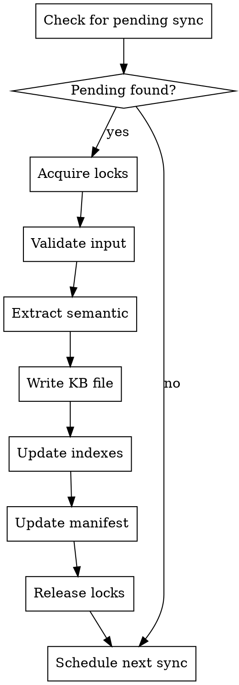

# KB Sync Skill Implementation Plan

> **For agentic workers:** REQUIRED SUB-SKILL: Use superpowers:subagent-driven-development (recommended) or superpowers:executing-plans to implement this plan task-by-task. Steps use checkbox (`- [ ]`) syntax for tracking.

**Goal:** Create a skill that synchronizes all Knowledge Base indexes after content harvesting, running as a scheduled task to keep the KB system up to date.

**Architecture:** Python scripts in `playbookdata/scripts/` handle sync operations (locking, extraction, index updates, cross-refs, validation). A skill definition in `~/.claude/skills/kb-sync/SKILL.md` provides the user interface. Scheduled task via CronCreate runs every 5 minutes.

**Tech Stack:** Python 3, fcntl (POSIX file locking), json, pathlib, Claude Code scheduled tasks

---

## File Structure

**Create:**
- `~/.claude/skills/kb-sync/SKILL.md` - Skill definition and command interface
- `playbookdata/scripts/sync_lock.py` - File locking (extends existing pattern)
- `playbookdata/scripts/sync-state.py` - Persistent sync state tracking
- `playbookdata/scripts/validate-sync.py` - Input and semantic validation
- `playbookdata/scripts/extract-structure.py` - Semantic content extraction
- `playbookdata/scripts/update-indexes.py` - Per-KB and master index updates
- `playbookdata/scripts/update-cross-refs.py` - Cross-reference extraction
- `playbookdata/scripts/sync-engine.py` - Main orchestration
- `playbookdata/scripts/migrate-content.py` - One-time content migration
- `tests/test_kb_sync.py` - Unit tests

**Modify:**
- `playbookdata/master-index.json` - Add sync metadata fields
- `playbookdata/*/manifest.json` - Update structure for sync tracking

---

## Task 1: File Locking Module

**Files:**
- Create: `playbookdata/scripts/sync-lock.py`
- Test: `tests/test_sync_lock.py`

- [ ] **Step 1: Write the failing test**

```python
# tests/test_sync_lock.py
import pytest
import os
import sys
sys.path.insert(0, os.path.join(os.path.dirname(__file__), '..', 'playbookdata', 'scripts'))

from sync_lock import SyncLock, LockTimeoutError, MultiLock, acquire_kb_lock
from pathlib import Path
import tempfile
import time

def test_acquire_lock_creates_lock_file():
    """Lock acquisition creates lock file with PID."""
    with tempfile.TemporaryDirectory() as tmpdir:
        lock = SyncLock("test-lock", timeout=5, locks_dir=Path(tmpdir))
        lock.acquire()

        lock_file = Path(tmpdir) / "test-lock.lock"
        assert lock_file.exists()

        content = lock_file.read_text()
        assert str(os.getpid()) in content

        lock.release()
        assert not lock_file.exists()

def test_acquire_lock_timeout_raises_error():
    """Lock acquisition times out if lock is held."""
    with tempfile.TemporaryDirectory() as tmpdir:
        locks_dir = Path(tmpdir)

        # Create a lock file with fake PID that's "alive"
        lock_file = locks_dir / "held.lock"
        lock_file.write_text(str(os.getpid()))

        # Try to acquire same lock with short timeout
        lock = SyncLock("held", timeout=1, locks_dir=locks_dir)

        with pytest.raises(LockTimeoutError):
            lock.acquire()

def test_stale_lock_is_removed():
    """Stale lock (dead process) is removed and acquired."""
    with tempfile.TemporaryDirectory() as tmpdir:
        locks_dir = Path(tmpdir)

        # Create lock file (simulating stale lock)
        # Note: fcntl will succeed on stale lock since no process holds it
        lock_file = locks_dir / "stale.lock"
        lock_file.write_text("99999999")  # Fake PID

        lock = SyncLock("stale", timeout=5, locks_dir=locks_dir)
        # This should succeed because fcntl sees no actual lock holder
        lock.acquire()

        # Lock file now has our PID
        assert lock_file.exists()
        assert str(os.getpid()) in lock_file.read_text()

        lock.release()

def test_context_manager_releases_on_exception():
    """Lock is released even if exception occurs."""
    with tempfile.TemporaryDirectory() as tmpdir:
        locks_dir = Path(tmpdir)
        lock_file = locks_dir / "test.lock"

        try:
            with SyncLock("test", timeout=5, locks_dir=locks_dir):
                raise ValueError("Test error")
        except ValueError:
            pass

        assert not lock_file.exists()
```

Run: `pytest tests/test_sync_lock.py -v`
Expected: FAIL with "ModuleNotFoundError: No module named 'sync_lock'"

- [ ] **Step 2: Implement sync-lock.py**

```python
#!/usr/bin/env python3
"""
File locking for KB sync operations.

Provides atomic lock acquisition using fcntl on POSIX systems.
Extends the pattern from harvest-deep.py with multi-lock support.
"""

import os
import sys
import fcntl
import time
from pathlib import Path
from typing import Optional

# Add scripts directory to path for local imports
sys.path.insert(0, str(Path(__file__).parent))

# Default lock directory
DEFAULT_LOCKS_DIR = Path(__file__).parent.parent / "harvested" / "locks"


class LockTimeoutError(Exception):
    """Raised when lock cannot be acquired within timeout."""
    pass


class SyncLock:
    """
    Atomic file lock using fcntl for POSIX systems.

    Usage:
        lock = SyncLock("dsp-kb")
        lock.acquire()
        try:
            # ... do work ...
        finally:
            lock.release()

        # Or use context manager:
        with SyncLock("dsp-kb") as lock:
            # ... do work ...
    """

    def __init__(self, name: str, timeout: int = 30, locks_dir: Path = None):
        """
        Initialize lock.

        Args:
            name: Lock name (e.g., "dsp-kb", "master-index")
            timeout: Maximum seconds to wait for lock
            locks_dir: Directory for lock files
        """
        self.name = name
        self.timeout = timeout
        self.locks_dir = locks_dir or DEFAULT_LOCKS_DIR
        self.lock_path = self.locks_dir / f"{name}.lock"
        self.fd = None

    def acquire(self) -> "SyncLock":
        """
        Atomically acquire lock.

        Raises:
            LockTimeoutError: If lock cannot be acquired within timeout
        """
        # Ensure directory exists
        self.locks_dir.mkdir(parents=True, exist_ok=True)

        start = time.time()

        while time.time() - start < self.timeout:
            try:
                # Try to create and lock the file
                self.fd = open(self.lock_path, 'w')
                fcntl.flock(self.fd.fileno(), fcntl.LOCK_EX | fcntl.LOCK_NB)
                self.fd.write(f"{os.getpid()}\n")
                self.fd.flush()
                return self

            except (IOError, OSError):
                # Lock held by another process
                if self.fd:
                    try:
                        self.fd.close()
                    except:
                        pass
                    self.fd = None
                time.sleep(0.1)

        raise LockTimeoutError(f"Could not acquire lock: {self.lock_path}")

    def release(self):
        """Release lock."""
        if self.fd:
            try:
                fcntl.flock(self.fd.fileno(), fcntl.LOCK_UN)
                self.fd.close()
            except:
                pass
            self.fd = None

        if self.lock_path.exists():
            try:
                self.lock_path.unlink()
            except:
                pass

    def __enter__(self):
        self.acquire()
        return self

    def __exit__(self, *args):
        self.release()


class MultiLock:
    """
    Acquire multiple locks atomically.

    Usage:
        locks = MultiLock([SyncLock("harvest"), SyncLock("dsp-kb")])
        locks.acquire()
        try:
            # ... do work ...
        finally:
            locks.release()
    """

    def __init__(self, locks: list[SyncLock]):
        self.locks = locks

    def acquire(self) -> "MultiLock":
        """Acquire all locks in order."""
        acquired = []
        try:
            for lock in self.locks:
                lock.acquire()
                acquired.append(lock)
            return self
        except:
            # Release any acquired locks on failure
            for lock in reversed(acquired):
                lock.release()
            raise

    def release(self):
        """Release all locks in reverse order."""
        for lock in reversed(self.locks):
            lock.release()

    def __enter__(self):
        self.acquire()
        return self

    def __exit__(self, *args):
        self.release()


def is_process_alive(pid: int) -> bool:
    """
    Check if process is running. Platform-specific.

    Args:
        pid: Process ID to check

    Returns:
        True if process is running
    """
    if os.name == 'posix':
        # Linux: check /proc/{pid}
        if Path(f'/proc/{pid}').exists():
            return True
        # macOS/BSD: use kill(pid, 0)
        try:
            os.kill(pid, 0)
            return True
        except OSError:
            return False
    else:
        # Windows: not supported, assume alive
        return True


def acquire_kb_lock(kb: str, timeout: int = 30) -> MultiLock:
    """
    Acquire locks for KB sync operation.

    Acquires both harvest lock (prevents concurrent harvest) and KB lock.

    Args:
        kb: KB name (e.g., "dsp-kb")
        timeout: Maximum seconds to wait

    Returns:
        MultiLock that must be released after use
    """
    harvest_lock = SyncLock("harvest", timeout)
    kb_lock = SyncLock(kb, timeout)
    return MultiLock([harvest_lock, kb_lock])


if __name__ == "__main__":
    import sys

    if len(sys.argv) < 2:
        print("Usage: sync-lock.py <lock_name> [--release]")
        sys.exit(1)

    name = sys.argv[1]

    if "--release" in sys.argv:
        lock_file = DEFAULT_LOCKS_DIR / f"{name}.lock"
        if lock_file.exists():
            lock_file.unlink()
            print(f"Released: {name}")
        else:
            print(f"Lock not found: {name}")
    else:
        print(f"Acquiring lock: {name}")
        with SyncLock(name, timeout=5) as lock:
            print(f"Lock acquired: {name}")
            input("Press Enter to release...")
        print(f"Lock released: {name}")
```

- [ ] **Step 3: Run tests to verify**

Run: `pytest tests/test_sync_lock.py -v`
Expected: PASS (all 4 tests)

- [ ] **Step 4: Commit**

```bash
git add playbookdata/scripts/sync-lock.py tests/test_sync_lock.py
git commit -m "feat(kb-sync): add file locking module with fcntl"
```

---

## Task 2: Sync State Module

**Files:**
- Create: `playbookdata/scripts/sync-state.py`
- Test: `tests/test_sync_state.py`

- [ ] **Step 1: Write the failing test**

```python
# tests/test_sync_state.py
import pytest
import os
import sys
sys.path.insert(0, os.path.join(os.path.dirname(__file__), '..', 'playbookdata', 'scripts'))

from sync_state import SyncState
from pathlib import Path
import tempfile
import json
from datetime import datetime

def test_sync_state_creates_file():
    """Sync state creates state file on first access."""
    with tempfile.TemporaryDirectory() as tmpdir:
        state = SyncState(Path(tmpdir))

        # Access should create file
        assert state.last_run is None
        assert state.state_file.exists()

def test_sync_state_tracks_last_run():
    """Sync state tracks last run timestamp."""
    with tempfile.TemporaryDirectory() as tmpdir:
        state = SyncState(Path(tmpdir))

        before = datetime.utcnow()
        state.record_run(files_processed=10, files_succeeded=9, files_failed=1)
        after = datetime.utcnow()

        assert state.last_run is not None
        assert state.files_processed == 10
        assert state.files_succeeded == 9
        assert state.files_failed == 1

def test_sync_state_records_errors():
    """Sync state records errors."""
    with tempfile.TemporaryDirectory() as tmpdir:
        state = SyncState(Path(tmpdir))

        state.record_error("dsp-kb/reverb/test.json", "Empty summary")

        errors = state.get_errors()
        assert len(errors) == 1
        assert errors[0]["file"] == "dsp-kb/reverb/test.json"
        assert errors[0]["error"] == "Empty summary"

def test_sync_state_persists_across_reloads():
    """Sync state persists across reloads."""
    with tempfile.TemporaryDirectory() as tmpdir:
        state_path = Path(tmpdir)

        state1 = SyncState(state_path)
        state1.record_run(files_processed=15, files_succeeded=14, files_failed=1)

        # Create new instance
        state2 = SyncState(state_path)
        assert state2.files_processed == 15
        assert state2.files_succeeded == 14
```

Run: `pytest tests/test_sync_state.py -v`
Expected: FAIL with "ModuleNotFoundError: No module named 'sync_state'"

- [ ] **Step 2: Implement sync-state.py**

```python
#!/usr/bin/env python3
"""
Persistent sync state tracking.

Tracks sync history, errors, and statistics.
"""

import json
import sys
from pathlib import Path
from datetime import datetime, timezone
from typing import Optional
import threading

# Add scripts directory to path for local imports
sys.path.insert(0, str(Path(__file__).parent))

# Default state file location
DEFAULT_STATE_FILE = Path(__file__).parent.parent / "harvested" / "sync-state.json"


class SyncState:
    """
    Persistent sync state tracking.

    Usage:
        state = SyncState()
        state.record_run(files_processed=10, files_succeeded=10, files_failed=0)
        state.record_error("dsp-kb/reverb/test.json", "Empty summary")
    """

    def __init__(self, state_dir: Path = None):
        """
        Initialize sync state.

        Args:
            state_dir: Directory for state file (defaults to harvested/)
        """
        if state_dir:
            self.state_file = state_dir / "sync-state.json"
        else:
            self.state_file = DEFAULT_STATE_FILE

        self._lock = threading.Lock()
        self._data = self._load()

    def _load(self) -> dict:
        """Load state from file."""
        if self.state_file.exists():
            try:
                return json.loads(self.state_file.read_text())
            except (json.JSONDecodeError, IOError):
                pass

        return self._default_state()

    def _default_state(self) -> dict:
        """Return default state structure."""
        return {
            "last_run": None,
            "files_processed": 0,
            "files_succeeded": 0,
            "files_failed": 0,
            "errors": [],
            "total_syncs": 0,
            "total_credits_saved": 0,
            "created_at": datetime.now(timezone.utc).isoformat()
        }

    def _save(self):
        """Save state to file."""
        self.state_file.parent.mkdir(parents=True, exist_ok=True)
        self.state_file.write_text(json.dumps(self._data, indent=2))

    @property
    def last_run(self) -> Optional[datetime]:
        """Get last run timestamp."""
        last = self._data.get("last_run")
        if last:
            return datetime.fromisoformat(last.replace("Z", "+00:00"))
        return None

    @property
    def files_processed(self) -> int:
        """Get total files processed."""
        return self._data.get("files_processed", 0)

    @property
    def files_succeeded(self) -> int:
        """Get total files succeeded."""
        return self._data.get("files_succeeded", 0)

    @property
    def files_failed(self) -> int:
        """Get total files failed."""
        return self._data.get("files_failed", 0)

    def record_run(self, files_processed: int, files_succeeded: int, files_failed: int):
        """
        Record a sync run.

        Args:
            files_processed: Number of files processed
            files_succeeded: Number of files succeeded
            files_failed: Number of files failed
        """
        with self._lock:
            self._data["last_run"] = datetime.now(timezone.utc).isoformat()
            self._data["files_processed"] = files_processed
            self._data["files_succeeded"] = files_succeeded
            self._data["files_failed"] = files_failed
            self._data["total_syncs"] = self._data.get("total_syncs", 0) + 1
            self._save()

    def record_error(self, file: str, error: str):
        """
        Record a sync error.

        Args:
            file: File path that had error
            error: Error message
        """
        with self._lock:
            self._data["errors"].append({
                "file": file,
                "error": error,
                "timestamp": datetime.now(timezone.utc).isoformat()
            })
            # Keep only last 100 errors
            if len(self._data["errors"]) > 100:
                self._data["errors"] = self._data["errors"][-100:]
            self._save()

    def get_errors(self) -> list:
        """Get all recorded errors."""
        return self._data.get("errors", [])

    def clear_errors(self):
        """Clear all errors."""
        with self._lock:
            self._data["errors"] = []
            self._save()

    def get_status_report(self) -> dict:
        """Get status report for display."""
        return {
            "last_run": self._data.get("last_run"),
            "files_processed": self.files_processed,
            "files_succeeded": self.files_succeeded,
            "files_failed": self.files_failed,
            "total_syncs": self._data.get("total_syncs", 0),
            "error_count": len(self._data.get("errors", []))
        }


if __name__ == "__main__":
    import argparse

    parser = argparse.ArgumentParser(description="Manage sync state")
    parser.add_argument("--status", action="store_true", help="Show status")
    parser.add_argument("--clear-errors", action="store_true", help="Clear errors")

    args = parser.parse_args()

    state = SyncState()

    if args.status:
        report = state.get_status_report()
        print(json.dumps(report, indent=2))
    elif args.clear_errors:
        state.clear_errors()
        print("Errors cleared")
    else:
        print("Use --status or --clear-errors")
```

- [ ] **Step 3: Run tests to verify**

Run: `pytest tests/test_sync_state.py -v`
Expected: PASS (all 4 tests)

- [ ] **Step 4: Commit**

```bash
git add playbookdata/scripts/sync-state.py tests/test_sync_state.py
git commit -m "feat(kb-sync): add sync state tracking module"
```

---

## Task 3: Validation Module

**Files:**
- Create: `playbookdata/scripts/validate-sync.py`
- Test: `tests/test_validate_sync.py`

- [ ] **Step 1: Write the failing test**

```python
# tests/test_validate_sync.py
import pytest
import os
import sys
sys.path.insert(0, os.path.join(os.path.dirname(__file__), '..', 'playbookdata', 'scripts'))

from validate_sync import (
    validate_harvested_input,
    validate_semantic_content,
    validate_manifest_entry
)

def test_validate_harvested_input_accepts_valid():
    """Valid harvested input passes validation."""
    data = {
        "content": "Test content",
        "kb": "dsp-kb",
        "topic": "reverb",
        "file": "test.json"
    }
    is_valid, error = validate_harvested_input(data)
    assert is_valid
    assert error == ""

def test_validate_harvested_input_rejects_empty():
    """Empty input fails validation."""
    is_valid, error = validate_harvested_input({})
    assert not is_valid
    assert "Empty" in error

def test_validate_harvested_input_rejects_no_content():
    """Input without content fails validation."""
    data = {"kb": "dsp-kb"}
    is_valid, error = validate_harvested_input(data)
    assert not is_valid
    assert "content" in error.lower()

def test_validate_semantic_content_accepts_valid():
    """Valid semantic content passes validation."""
    semantic = {
        "summary": "This is a valid summary.",
        "concepts": [{"name": "Test", "description": "A test concept"}],
        "code_blocks": []
    }
    is_valid, error = validate_semantic_content(semantic)
    assert is_valid
    assert error == ""

def test_validate_semantic_content_rejects_empty_summary():
    """Empty summary fails validation."""
    semantic = {
        "summary": "",
        "concepts": [{"name": "Test"}]
    }
    is_valid, error = validate_semantic_content(semantic)
    assert not is_valid
    assert "summary" in error.lower()

def test_validate_semantic_content_rejects_no_concepts():
    """No concepts fails validation."""
    semantic = {
        "summary": "Valid summary",
        "concepts": []
    }
    is_valid, error = validate_semantic_content(semantic)
    assert not is_valid
    assert "concepts" in error.lower()

def test_validate_semantic_content_checks_code_blocks():
    """Code blocks are validated."""
    semantic = {
        "summary": "Valid",
        "concepts": [{"name": "Test"}],
        "code_blocks": [
            {"code": "", "language": "cpp"}  # Empty code
        ]
    }
    is_valid, error = validate_semantic_content(semantic)
    assert not is_valid
    assert "code block" in error.lower()
```

Run: `pytest tests/test_validate_sync.py -v`
Expected: FAIL with "ModuleNotFoundError: No module named 'validate_sync'"

- [ ] **Step 2: Implement validate-sync.py**

```python
#!/usr/bin/env python3
"""
Validation for KB sync operations.

Validates harvested input and semantic content before sync.
"""

import sys
from pathlib import Path
from typing import Tuple

# Add scripts directory to path for local imports
sys.path.insert(0, str(Path(__file__).parent))


def validate_harvested_input(data: dict) -> Tuple[bool, str]:
    """
    Validate harvested JSON before sync.

    Args:
        data: Harvested JSON data

    Returns:
        Tuple of (is_valid, error_message)
    """
    if not data:
        return False, "Empty harvested content"

    if not isinstance(data, dict):
        return False, f"Harvested content must be dict, got {type(data).__name__}"

    # Check for content field (markdown or content)
    has_content = (
        data.get("content") or
        data.get("markdown") or
        data.get("result", {}).get("data") or
        data.get("result", {}).get("markdown")
    )

    if not has_content:
        return False, "No content field in harvested JSON"

    # Check for incomplete marker
    if data.get("_incomplete"):
        return False, "Harvested JSON marked as incomplete"

    return True, ""


def validate_semantic_content(semantic: dict) -> Tuple[bool, str]:
    """
    Validate extracted semantic content.

    Args:
        semantic: Extracted semantic dict

    Returns:
        Tuple of (is_valid, error_message)
    """
    if not semantic:
        return False, "Empty semantic content"

    if not isinstance(semantic, dict):
        return False, f"Semantic must be dict, got {type(semantic).__name__}"

    # Required: non-empty summary
    summary = semantic.get("summary", "")
    if not summary or not summary.strip():
        return False, "Empty summary in semantic extraction"

    # Required: at least one concept
    concepts = semantic.get("concepts", [])
    if not concepts:
        return False, "No concepts extracted"

    if not isinstance(concepts, list):
        return False, f"Concepts must be list, got {type(concepts).__name__}"

    # Validate code blocks if present
    code_blocks = semantic.get("code_blocks", [])
    for i, block in enumerate(code_blocks):
        if not isinstance(block, dict):
            return False, f"Code block {i} must be dict"

        if not block.get("code"):
            return False, f"Empty code block {i}"

        if not block.get("language"):
            return False, f"Code block {i} missing language"

    return True, ""


def validate_manifest_entry(entry: dict) -> Tuple[bool, str]:
    """
    Validate manifest entry before sync.

    Args:
        entry: Manifest entry dict

    Returns:
        Tuple of (is_valid, error_message)
    """
    if not entry:
        return False, "Empty manifest entry"

    status = entry.get("status")
    if status not in ("placeholder", "harvested", "synced", "curated", "failed"):
        return False, f"Invalid status: {status}"

    # For harvested status, require harvested_at
    if status == "harvested":
        if not entry.get("harvested_at"):
            return False, "Harvested entry missing harvested_at"

    return True, ""


if __name__ == "__main__":
    import json
    import sys

    if len(sys.argv) < 2:
        print("Usage: validate-sync.py <json_file>")
        sys.exit(1)

    file_path = sys.argv[1]
    data = json.loads(open(file_path).read())

    is_valid, error = validate_harvested_input(data)
    if not is_valid:
        print(f"Input validation failed: {error}")
        sys.exit(1)

    print("Validation passed")
```

- [ ] **Step 3: Run tests to verify**

Run: `pytest tests/test_validate_sync.py -v`
Expected: PASS (all 7 tests)

- [ ] **Step 4: Commit**

```bash
git add playbookdata/scripts/validate-sync.py tests/test_validate_sync.py
git commit -m "feat(kb-sync): add validation module for harvested and semantic content"
```

---

## Task 4: Semantic Extraction Module

**Files:**
- Create: `playbookdata/scripts/extract-structure.py`
- Test: `tests/test_extract_structure.py`

- [ ] **Step 1: Write the failing test**

```python
# tests/test_extract_structure.py
import pytest
import os
import sys
sys.path.insert(0, os.path.join(os.path.dirname(__file__), '..', 'playbookdata', 'scripts'))

from extract_structure import extract_semantic_fields, extract_code_blocks, extract_concepts

def test_extract_semantic_fields_returns_dict():
    """Extract returns semantic dict with required fields."""
    markdown = """# Algorithmic Reverb

This is a summary of algorithmic reverb.

## Concepts

- **Freeverb**: Open-source reverb algorithm
- **Schroeder**: Classic reverb design

## Code Example

```cpp
class CombFilter {
    float process(float input) {
        return buffer[readPos];
    }
};
```

## References

- [Freeverb](https://ccrma.stanford.edu)
"""

    result = extract_semantic_fields(markdown)

    assert "summary" in result
    assert "concepts" in result
    assert "code_blocks" in result
    assert "references" in result

def test_extract_code_blocks_preserves_whitespace():
    """Code blocks preserve exact whitespace."""
    markdown = """```cpp
class Test {
    int x;
    // 4 spaces indent
};
```"""

    blocks = extract_code_blocks(markdown)

    assert len(blocks) == 1
    assert "    int x;" in blocks[0]["code"]
    assert blocks[0]["language"] == "cpp"

def test_extract_concepts_finds_bold_terms():
    """Concepts extraction finds bold terms."""
    markdown = """
- **Freeverb**: An open-source algorithm
- **Schroeder Reverb**: Classic design
"""

    concepts = extract_concepts(markdown)

    assert len(concepts) >= 2
    names = [c["name"] for c in concepts]
    assert "Freeverb" in names
    assert "Schroeder Reverb" in names

def test_extract_semantic_handles_empty():
    """Empty markdown returns empty semantic."""
    result = extract_semantic_fields("")

    assert result["summary"] == ""
    assert result["concepts"] == []
```

Run: `pytest tests/test_extract_structure.py -v`
Expected: FAIL with "ModuleNotFoundError: No module named 'extract_structure'"

- [ ] **Step 2: Implement extract-structure.py**

```python
#!/usr/bin/env python3
"""
Extract semantic structure from markdown content.

Parses harvested markdown into structured semantic fields:
- summary: First paragraph or abstract
- concepts: Key technical concepts with descriptions
- code_blocks: Code examples with language and preserved whitespace
- references: URLs and citations
"""

import re
import sys
from pathlib import Path
from typing import List, Dict
from urllib.parse import urlparse

# Add scripts directory to path for local imports
sys.path.insert(0, str(Path(__file__).parent))


def extract_code_blocks(markdown: str) -> List[Dict]:
    """
    Extract code blocks from markdown, preserving exact whitespace.

    Args:
        markdown: Markdown content

    Returns:
        List of code block dicts with language and code
    """
    blocks = []

    # Match fenced code blocks: ```language\ncode\n```
    pattern = r'```(\w*)\n(.*?)```'

    for match in re.finditer(pattern, markdown, re.DOTALL):
        language = match.group(1) or "text"
        code = match.group(2)

        # Preserve exact whitespace - do not strip
        blocks.append({
            "language": language,
            "code": code,
            "preserved": True
        })

    return blocks


def extract_concepts(markdown: str) -> List[Dict]:
    """
    Extract concepts from markdown.

    Looks for:
    - **Term**: Description patterns
    - Definition lists
    - Header-based sections

    Args:
        markdown: Markdown content

    Returns:
        List of concept dicts with name and description
    """
    concepts = []

    # Pattern: **Term**: Description
    pattern = r'\*\*([^*]+)\*\*[：:]\s*([^\n]+)'
    for match in re.finditer(pattern, markdown):
        name = match.group(1).strip()
        description = match.group(2).strip()

        concepts.append({
            "name": name,
            "description": description,
            "related": []
        })

    # Pattern: - **Term** (list items)
    list_pattern = r'-\s*\*\*([^*]+)\*\*'
    for match in re.finditer(list_pattern, markdown):
        name = match.group(1).strip()

        # Avoid duplicates
        if not any(c["name"] == name for c in concepts):
            # Get rest of line as description
            start = match.end()
            rest = markdown[start:markdown.find('\n', start)]

            concepts.append({
                "name": name,
                "description": rest.strip('：: ').strip() or f"A {name.lower()} concept",
                "related": []
            })

    return concepts


def extract_references(markdown: str) -> List[Dict]:
    """
    Extract references/URLs from markdown.

    Args:
        markdown: Markdown content

    Returns:
        List of reference dicts with url, title, domain
    """
    references = []
    seen_urls = set()

    # Match [Title](URL) format
    pattern = r'\[([^\]]+)\]\(([^)]+)\)'

    for match in re.finditer(pattern, markdown):
        title = match.group(1).strip()
        url = match.group(2).strip()

        if url in seen_urls:
            continue
        seen_urls.add(url)

        # Skip internal anchors
        if url.startswith('#'):
            continue

        # Extract domain
        try:
            domain = urlparse(url).netloc
        except:
            domain = ""

        references.append({
            "title": title,
            "url": url,
            "domain": domain
        })

    return references


def extract_summary(markdown: str) -> str:
    """
    Extract summary from markdown.

    Uses first paragraph after any headers.

    Args:
        markdown: Markdown content

    Returns:
        Summary string
    """
    lines = markdown.strip().split('\n')

    # Skip headers (lines starting with #)
    content_lines = []
    in_code_block = False

    for line in lines:
        # Track code blocks
        if line.startswith('```'):
            in_code_block = not in_code_block
            continue

        if in_code_block:
            continue

        # Skip headers
        if line.startswith('#'):
            continue

        # Skip empty lines at start
        if not content_lines and not line.strip():
            continue

        # Stop at next header
        if line.startswith('#') and content_lines:
            break

        content_lines.append(line)

        # Stop after first paragraph
        if not line.strip() and content_lines:
            break

    summary = '\n'.join(content_lines).strip()

    # Limit to reasonable length
    if len(summary) > 500:
        summary = summary[:500].rsplit(' ', 1)[0] + '...'

    return summary


def extract_semantic_fields(markdown: str) -> Dict:
    """
    Extract all semantic fields from markdown.

    Args:
        markdown: Markdown content (or dict with markdown field)

    Returns:
        Dict with summary, concepts, code_blocks, references
    """
    if isinstance(markdown, dict):
        markdown = markdown.get("markdown", "")

    if not markdown:
        return {
            "summary": "",
            "concepts": [],
            "code_blocks": [],
            "references": []
        }

    return {
        "summary": extract_summary(markdown),
        "concepts": extract_concepts(markdown),
        "code_blocks": extract_code_blocks(markdown),
        "references": extract_references(markdown)
    }


if __name__ == "__main__":
    import json
    import sys

    if len(sys.argv) < 2:
        print("Usage: extract-structure.py <markdown_file>")
        sys.exit(1)

    file_path = sys.argv[1]
    content = open(file_path).read()

    result = extract_semantic_fields(content)
    print(json.dumps(result, indent=2))
```

- [ ] **Step 3: Run tests to verify**

Run: `pytest tests/test_extract_structure.py -v`
Expected: PASS (all 4 tests)

- [ ] **Step 4: Commit**

```bash
git add playbookdata/scripts/extract-structure.py tests/test_extract_structure.py
git commit -m "feat(kb-sync): add semantic extraction module preserving code whitespace"
```

---

## Task 5: Index Update Module

**Files:**
- Create: `playbookdata/scripts/update-indexes.py`
- Test: `tests/test_update_indexes.py`

- [ ] **Step 1: Write the failing test**

```python
# tests/test_update_indexes.py
import pytest
import os
import sys
sys.path.insert(0, os.path.join(os.path.dirname(__file__), '..', 'playbookdata', 'scripts'))

from update_indexes import (
    update_per_kb_index,
    update_master_index,
    get_kb_file_count
)
from pathlib import Path
import tempfile
import json

def test_update_per_kb_index_adds_file():
    """Per-KB index gets file added."""
    with tempfile.TemporaryDirectory() as tmpdir:
        kb_dir = Path(tmpdir) / "dsp-kb" / "reverb"
        kb_dir.mkdir(parents=True)

        # Create KB file
        kb_file = kb_dir / "test.json"
        json.dump({"id": "test"}, open(kb_file, 'w'))

        # Create index
        index_file = Path(tmpdir) / "dsp-kb" / "index.json"

        update_per_kb_index("dsp-kb", "reverb", "test.json", index_file)

        assert index_file.exists()
        index = json.loads(index_file.read_text())
        assert "reverb" in index.get("topics", {})

def test_get_kb_file_count_counts_files():
    """File count excludes index and manifest."""
    with tempfile.TemporaryDirectory() as tmpdir:
        kb_dir = Path(tmpdir) / "dsp-kb" / "reverb"
        kb_dir.mkdir(parents=True)

        # Create files
        (kb_dir / "file1.json").write_text("{}")
        (kb_dir / "file2.json").write_text("{}")
        (kb_dir / "index.json").write_text("{}")  # Should not count
        (kb_dir / "manifest.json").write_text("{}")  # Should not count

        count = get_kb_file_count(Path(tmpdir) / "dsp-kb")
        assert count == 2

def test_update_master_index_updates_file_count():
    """Master index gets updated file count."""
    with tempfile.TemporaryDirectory() as tmpdir:
        master_index = Path(tmpdir) / "master-index.json"
        master_index.write_text(json.dumps({
            "knowledge_bases": {
                "dsp-kb": {"file_count": 0}
            }
        }))

        update_master_index(master_index, "dsp-kb", file_count=53)

        index = json.loads(master_index.read_text())
        assert index["knowledge_bases"]["dsp-kb"]["file_count"] == 53
```

Run: `pytest tests/test_update_indexes.py -v`
Expected: FAIL with "ModuleNotFoundError: No module named 'update_indexes'"

- [ ] **Step 2: Implement update-indexes.py**

```python
#!/usr/bin/env python3
"""
Update KB indexes after sync.

Updates:
- Per-KB index.json with topic-to-file mappings
- Master index with file counts and metadata
"""

import json
import sys
from pathlib import Path
from datetime import datetime, timezone
from typing import Optional

# Add scripts directory to path for local imports
sys.path.insert(0, str(Path(__file__).parent))

# Default KB root
KB_ROOT = Path(__file__).parent.parent


def get_kb_file_count(kb_path: Path) -> int:
    """
    Count KB files, excluding index.json and manifest.json.

    Args:
        kb_path: Path to KB directory

    Returns:
        Number of KB content files
    """
    count = 0

    for json_file in kb_path.rglob("*.json"):
        name = json_file.name
        if name not in ("index.json", "manifest.json", "validation.json"):
            count += 1

    return count


def update_per_kb_index(kb: str, topic: str, filename: str,
                        index_path: Path = None) -> bool:
    """
    Update per-KB index with file entry.

    Args:
        kb: KB name (e.g., "dsp-kb")
        topic: Topic folder (e.g., "reverb")
        filename: JSON filename
        index_path: Path to index.json (default: kb/index.json)

    Returns:
        True if successful
    """
    if index_path is None:
        index_path = Path(kb) / "index.json"

    # Load or create index
    if index_path.exists():
        try:
            index = json.loads(index_path.read_text())
        except (json.JSONDecodeError, IOError):
            index = {}
    else:
        index = {}

    # Ensure structure
    if "kb_name" not in index:
        index["kb_name"] = kb
    if "topics" not in index:
        index["topics"] = {}

    # Add topic if not exists
    if topic not in index["topics"]:
        index["topics"][topic] = {
            "files": [],
            "last_updated": None
        }

    # Add file if not exists
    if filename not in index["topics"][topic]["files"]:
        index["topics"][topic]["files"].append(filename)

    index["topics"][topic]["last_updated"] = datetime.now(timezone.utc).isoformat()
    index["last_updated"] = datetime.now(timezone.utc).isoformat()

    # Ensure parent directory exists
    index_path.parent.mkdir(parents=True, exist_ok=True)

    # Write atomically
    temp_path = index_path.with_suffix(".json.tmp")
    temp_path.write_text(json.dumps(index, indent=2))
    temp_path.rename(index_path)

    return True


def update_master_index(master_path: Path, kb: str,
                        file_count: Optional[int] = None,
                        topics: Optional[list] = None) -> bool:
    """
    Update master index with KB metadata.

    Args:
        master_path: Path to master-index.json
        kb: KB name
        file_count: Optional file count to update
        topics: Optional topics list to update

    Returns:
        True if successful
    """
    if not master_path.exists():
        return False

    try:
        index = json.loads(master_path.read_text())
    except (json.JSONDecodeError, IOError):
        return False

    # Update KB entry
    if "knowledge_bases" in index and kb in index["knowledge_bases"]:
        if file_count is not None:
            index["knowledge_bases"][kb]["file_count"] = file_count
        if topics is not None:
            index["knowledge_bases"][kb]["topics"] = topics

    index["last_updated"] = datetime.now(timezone.utc).isoformat()

    # Write atomically
    temp_path = master_path.with_suffix(".json.tmp")
    temp_path.write_text(json.dumps(index, indent=2))
    temp_path.rename(master_path)

    return True


def update_kb_manifest(kb: str, topic: str, filename: str,
                       status: str, credits_used: int = 0,
                       sources: list = None, kb_root: Path = None) -> bool:
    """
    Update KB manifest with sync status.

    Args:
        kb: KB name
        topic: Topic folder
        filename: JSON filename
        status: New status
        credits_used: Credits used for harvest
        sources: Source domains
        kb_root: KB root directory (default: playbookdata/)

    Returns:
        True if successful
    """
    if kb_root is None:
        kb_root = KB_ROOT

    manifest_path = kb_root / kb / "manifest.json"

    # Load or create manifest
    if manifest_path.exists():
        try:
            manifest = json.loads(manifest_path.read_text())
        except (json.JSONDecodeError, IOError):
            manifest = {"kb_name": kb, "topics": []}
    else:
        manifest = {"kb_name": kb, "topics": []}

    # Find or create topic entry
    topic_entry = None
    for t in manifest.get("topics", []):
        if t.get("name") == topic:
            topic_entry = t
            break

    if not topic_entry:
        topic_entry = {"name": topic, "files": {}}
        manifest.setdefault("topics", []).append(topic_entry)

    # Update file entry
    if "files" not in topic_entry:
        topic_entry["files"] = {}

    topic_entry["files"][filename] = {
        "status": status,
        "synced_at": datetime.now(timezone.utc).isoformat(),
        "synced_timestamp": int(datetime.now(timezone.utc).timestamp()),
        "credits_used": credits_used,
        "sources": sources or [],
        "retry_count": 0,
        "last_error": None
    }

    manifest["last_sync"] = datetime.now(timezone.utc).isoformat()

    # Write atomically
    manifest_path.parent.mkdir(parents=True, exist_ok=True)
    temp_path = manifest_path.with_suffix(".json.tmp")
    temp_path.write_text(json.dumps(manifest, indent=2))
    temp_path.rename(manifest_path)

    return True


if __name__ == "__main__":
    import argparse

    parser = argparse.ArgumentParser(description="Update KB indexes")
    parser.add_argument("kb", help="KB name")
    parser.add_argument("--topic", help="Topic folder")
    parser.add_argument("--file", help="Filename")
    parser.add_argument("--count", type=int, help="File count")

    args = parser.parse_args()

    if args.topic and args.file:
        update_per_kb_index(args.kb, args.topic, args.file)
        print(f"Updated {args.kb}/index.json")

    if args.count:
        master_path = Path("master-index.json")
        update_master_index(master_path, args.kb, file_count=args.count)
        print(f"Updated master-index.json")
```

- [ ] **Step 3: Run tests to verify**

Run: `pytest tests/test_update_indexes.py -v`
Expected: PASS (all 3 tests)

- [ ] **Step 4: Commit**

```bash
git add playbookdata/scripts/update-indexes.py tests/test_update_indexes.py
git commit -m "feat(kb-sync): add index update module for per-KB and master indexes"
```

---

## Task 6: Cross-Reference Extraction Module

**Files:**
- Create: `playbookdata/scripts/update-cross-refs.py`
- Test: `tests/test_update_cross_refs.py`

- [ ] **Step 1: Write the failing test**

```python
# tests/test_update_cross_refs.py
import pytest
import os
import sys
sys.path.insert(0, os.path.join(os.path.dirname(__file__), '..', 'playbookdata', 'scripts'))

from update_cross_refs import (
    extract_topics,
    extract_cross_references,
    deduplicate_and_prune,
    GENERIC_TERMS,
    MAX_CROSS_REFS_PER_TOPIC
)

def test_extract_topics_finds_capitalized():
    """Extract topics finds capitalized words."""
    topics = extract_topics("Freeverb Algorithm Design")
    assert "Freeverb" in topics
    assert "Algorithm" in topics

def test_extract_topics_filters_generic():
    """Generic terms are filtered."""
    topics = extract_topics("Audio Sound Plugin Music")
    # Should filter out generic terms
    assert len(topics) == 0 or not any(t.lower() in GENERIC_TERMS for t in topics)

def test_extract_cross_references_prioritizes_domains():
    """Priority domains get higher confidence."""
    references = [
        {"title": "Freeverb Algorithm", "url": "https://ccrma.stanford.edu/freeverb", "domain": "ccrma.stanford.edu"}
    ]

    result = extract_cross_references(references)
    assert len(result) == 1
    assert result[0]["confidence"] >= 0.9

def test_deduplicate_removes_duplicates():
    """Duplicate topics are removed."""
    refs = [
        {"topic": "reverb", "source": "url1", "confidence": 0.8, "manual": False},
        {"topic": "reverb", "source": "url2", "confidence": 0.9, "manual": False}
    ]

    result = deduplicate_and_prune(refs, {})
    # Should keep only one
    assert len(result) == 1
```

Run: `pytest tests/test_update_cross_refs.py -v`
Expected: FAIL with "ModuleNotFoundError: No module named 'update_cross_refs'"

- [ ] **Step 2: Implement update-cross-refs.py**

```python
#!/usr/bin/env python3
"""
Extract and update cross-references from harvested content.

Cross-references link related topics across KBs.
"""

import re
import json
import sys
from pathlib import Path
from datetime import datetime, timezone
from typing import List, Dict
from urllib.parse import urlparse

# Add scripts directory to path for local imports
sys.path.insert(0, str(Path(__file__).parent))

# Configuration
GENERIC_TERMS = {'audio', 'sound', 'plugin', 'music', 'digital', 'signal', 'process',
                 'implementation', 'design', 'code', 'example', 'tutorial', 'guide'}
MAX_CROSS_REFS_PER_TOPIC = 50
MIN_CONFIDENCE = 0.6

# Priority domains with confidence scores
PRIORITY_DOMAINS = {
    "ccrma.stanford.edu": 0.9,
    "forum.juce.com": 0.85,
    "juce.com": 0.85,
    "earlevel.com": 0.8,
    "musicdsp.org": 0.75,
    "melatonin.dev": 0.75,
    "soundonsound.com": 0.7,
    "attackmagazine.com": 0.7,
    "midi.org": 0.8,
    "github.com": 0.6,
    "stackoverflow.com": 0.6,
    "dsp.stackexchange.com": 0.7
}


def extract_topics(title: str, content: str = None) -> List[str]:
    """
    Extract topic keywords from title and optional content.

    Args:
        title: Title text
        content: Optional content text

    Returns:
        List of extracted topics
    """
    topics = set()

    # Extract capitalized words (likely proper nouns)
    caps = re.findall(r'\b[A-Z][a-z]{2,}\b', title)
    topics.update(caps)

    # Extract hyphenated terms
    hyphenated = re.findall(r'\b([a-z]+-[a-z]+(?:-[a-z]+)*)\b', title.lower())
    topics.update(hyphenated)

    # Extract from content if provided
    if content:
        # Technical terms in content
        tech_terms = re.findall(r'\b[A-Z]{2,}\b', content[:1000])  # Acronyms
        topics.update(tech_terms)

    # Filter out generic terms
    filtered = [t for t in topics if t.lower() not in GENERIC_TERMS]

    # Limit to top 5
    return filtered[:5]


def extract_cross_references(references: List[Dict], existing_refs: Dict = None) -> List[Dict]:
    """
    Extract cross-references from harvested content.

    Args:
        references: List of reference dicts with title, url, domain
        existing_refs: Existing cross-references to check against

    Returns:
        List of new cross-reference dicts
    """
    if existing_refs is None:
        existing_refs = {}

    new_refs = []

    for ref in references:
        domain = ref.get("domain", "")
        url = ref.get("url", "")
        title = ref.get("title", "")

        # Check domain priority
        if domain not in PRIORITY_DOMAINS:
            continue

        confidence = PRIORITY_DOMAINS[domain]

        # Extract topics from title
        topics = extract_topics(title, ref.get("content"))

        for topic in topics:
            if topic.lower() in GENERIC_TERMS:
                continue

            new_refs.append({
                "topic": topic,
                "source": url,
                "confidence": min(confidence, 1.0),
                "manual": False,
                "domain": domain
            })

    return deduplicate_and_prune(new_refs, existing_refs)


def deduplicate_and_prune(new_refs: List[Dict], existing_refs: Dict) -> List[Dict]:
    """
    Deduplicate and prune cross-references.

    Args:
        new_refs: New cross-references
        existing_refs: Existing cross-references

    Returns:
        Deduplicated and pruned list
    """
    # Get existing topics
    existing_topics = set()
    for topic, data in existing_refs.items():
        if isinstance(data, dict):
            existing_topics.add(topic.lower())

    # Filter out existing
    unique = []
    seen = set()
    for ref in new_refs:
        topic_lower = ref["topic"].lower()
        if topic_lower not in existing_topics and topic_lower not in seen:
            unique.append(ref)
            seen.add(topic_lower)

    # Sort by confidence
    unique.sort(key=lambda x: x["confidence"], reverse=True)

    # Prune to max per topic
    topic_counts = {}
    result = []
    for ref in unique:
        topic = ref["topic"]
        count = topic_counts.get(topic, 0)
        if count < MAX_CROSS_REFS_PER_TOPIC:
            result.append(ref)
            topic_counts[topic] = count + 1

    return result


def update_master_cross_refs(master_path: Path, new_refs: List[Dict]) -> bool:
    """
    Update master index with new cross-references.

    Args:
        master_path: Path to master-index.json
        new_refs: New cross-references to add

    Returns:
        True if successful
    """
    if not master_path.exists():
        return False

    try:
        index = json.loads(master_path.read_text())
    except (json.JSONDecodeError, IOError):
        return False

    if "cross_references" not in index:
        index["cross_references"] = {}

    # Add new refs
    for ref in new_refs:
        topic = ref["topic"]
        if topic not in index["cross_references"]:
            index["cross_references"][topic] = {
                "description": f"{topic} related content",
                "kbs": [],
                "confidence": ref["confidence"],
                "manual": False
            }

    index["last_updated"] = datetime.now(timezone.utc).isoformat()

    # Write atomically
    temp_path = master_path.with_suffix(".json.tmp")
    temp_path.write_text(json.dumps(index, indent=2))
    temp_path.rename(master_path)

    return True


if __name__ == "__main__":
    import argparse

    parser = argparse.ArgumentParser(description="Update cross-references")
    parser.add_argument("--input", help="Input JSON file")
    parser.add_argument("--master", help="Master index path")

    args = parser.parse_args()

    if args.input:
        data = json.loads(open(args.input).read())
        refs = data.get("references", [])
        result = extract_cross_references(refs)
        print(json.dumps(result, indent=2))
```

- [ ] **Step 3: Run tests to verify**

Run: `pytest tests/test_update_cross_refs.py -v`
Expected: PASS (all 4 tests)

- [ ] **Step 4: Commit**

```bash
git add playbookdata/scripts/update-cross-refs.py tests/test_update_cross_refs.py
git commit -m "feat(kb-sync): add cross-reference extraction with quality filtering"
```

---

## Task 7: Sync Engine (Main Orchestration)

**Files:**
- Create: `playbookdata/scripts/sync-engine.py`
- Test: `tests/test_sync_engine.py`

- [ ] **Step 1: Write the failing test**

```python
# tests/test_sync_engine.py
import pytest
import os
import sys
sys.path.insert(0, os.path.join(os.path.dirname(__file__), '..', 'playbookdata', 'scripts'))

from sync_engine import SyncEngine, find_pending_syncs
from pathlib import Path
import tempfile
import json

def test_find_pending_syncs_finds_harvested():
    """Finds entries with status='harvested'."""
    with tempfile.TemporaryDirectory() as tmpdir:
        kb_dir = Path(tmpdir) / "dsp-kb"
        kb_dir.mkdir()

        # Create manifest
        manifest = {
            "kb_name": "dsp-kb",
            "topics": [{
                "name": "reverb",
                "files": {
                    "test.json": {
                        "status": "harvested",
                        "harvested_at": "2026-03-30T12:00:00Z"
                    }
                }
            }]
        }
        (kb_dir / "manifest.json").write_text(json.dumps(manifest))

        pending = find_pending_syncs(Path(tmpdir))
        assert len(pending) == 1
        assert pending[0]["kb"] == "dsp-kb"
        assert pending[0]["topic"] == "reverb"
        assert pending[0]["filename"] == "test.json"

def test_find_pending_syncs_ignores_synced():
    """Ignores entries already synced."""
    with tempfile.TemporaryDirectory() as tmpdir:
        kb_dir = Path(tmpdir) / "dsp-kb"
        kb_dir.mkdir()

        manifest = {
            "kb_name": "dsp-kb",
            "topics": [{
                "name": "reverb",
                "files": {
                    "test.json": {
                        "status": "synced",
                        "synced_timestamp": 1743338700
                    }
                }
            }]
        }
        (kb_dir / "manifest.json").write_text(json.dumps(manifest))

        pending = find_pending_syncs(Path(tmpdir))
        assert len(pending) == 0

def test_sync_engine_initializes():
    """Sync engine initializes with required components."""
    engine = SyncEngine()
    assert engine.state is not None
```

Run: `pytest tests/test_sync_engine.py -v`
Expected: FAIL with "ModuleNotFoundError: No module named 'sync_engine'"

- [ ] **Step 2: Implement sync-engine.py**

```python
#!/usr/bin/env python3
"""
Main sync engine for KB synchronization.

Orchestrates the full sync workflow:
1. Create lock directory
2. Acquire locks
3. Scan for changes
4. Validate input
5. Extract semantic content
6. Validate semantic
7. Create backup
8. Write temp files
9. Atomic rename
10. Update state
11. Release locks
"""

import json
import shutil
import sys
from pathlib import Path
from datetime import datetime, timezone
from typing import List, Dict, Optional, Tuple
import traceback

# Add scripts directory to path for local imports
sys.path.insert(0, str(Path(__file__).parent))

# Local imports
from sync_lock import SyncLock, MultiLock, acquire_kb_lock
from sync_state import SyncState
from validate_sync import validate_harvested_input, validate_semantic_content
from extract_structure import extract_semantic_fields
from update_indexes import update_per_kb_index, update_master_index, update_kb_manifest, KB_ROOT as INDEXES_KB_ROOT
from update_cross_refs import extract_cross_references, update_master_cross_refs

# Constants
KB_ROOT = Path(__file__).parent.parent
MASTER_INDEX = KB_ROOT / "master-index.json"
HARVESTED_RAW = KB_ROOT / "harvested" / "raw"
MAX_RETRIES = 3


def ensure_harvested_raw():
    """Ensure harvested/raw directory exists."""
    HARVESTED_RAW.mkdir(parents=True, exist_ok=True)


class SyncError(Exception):
    """Sync operation error."""
    pass


def find_pending_syncs(kb_root: Path = None) -> List[Dict]:
    """
    Find KB entries pending sync.

    Looks for manifest entries with:
    - status = "harvested"
    - No synced_timestamp

    Args:
        kb_root: KB root directory

    Returns:
        List of pending sync dicts with kb, topic, filename
    """
    if kb_root is None:
        kb_root = KB_ROOT

    pending = []

    for manifest_file in kb_root.glob("*/manifest.json"):
        try:
            manifest = json.loads(manifest_file.read_text())
        except (json.JSONDecodeError, IOError):
            continue

        kb = manifest.get("kb_name", manifest_file.parent.name)

        for topic_entry in manifest.get("topics", []):
            topic = topic_entry.get("name")
            if not topic:
                continue

            for filename, file_entry in topic_entry.get("files", {}).items():
                status = file_entry.get("status")
                synced_timestamp = file_entry.get("synced_timestamp")
                retry_count = file_entry.get("retry_count", 0)

                # Check if needs sync
                if status == "harvested" and not synced_timestamp:
                    pending.append({
                        "kb": kb,
                        "topic": topic,
                        "filename": filename,
                        "retry_count": retry_count
                    })
                # Check if needs retry
                elif status == "failed" and retry_count < MAX_RETRIES:
                    pending.append({
                        "kb": kb,
                        "topic": topic,
                        "filename": filename,
                        "retry_count": retry_count,
                        "retry": True
                    })

    return pending


class SyncEngine:
    """
    Main sync orchestration with transaction support.
    """

    def __init__(self, kb_root: Path = None):
        self.kb_root = kb_root or KB_ROOT
        self.state = SyncState(self.kb_root / "harvested")
        self.dry_run = False

    def sync_file(self, kb: str, topic: str, filename: str) -> Dict:
        """
        Sync single KB file with backup and recovery.

        Args:
            kb: KB name
            topic: Topic folder
            filename: JSON filename

        Returns:
            Result dict with status and details
        """
        kb_path = self.kb_root / kb / topic / filename
        index_path = self.kb_root / kb / "index.json"
        manifest_path = self.kb_root / kb / "manifest.json"

        if not kb_path.exists():
            return {"status": "error", "error": f"KB file not found: {kb_path}"}

        # Ensure harvested/raw directory exists
        ensure_harvested_raw()

        # Find harvested content
        harvested_files = list(HARVESTED_RAW.glob(f"{kb}_{topic}_{filename.replace('.json', '')}*.json"))
        if not harvested_files:
            return {"status": "error", "error": f"No harvested content found in {HARVESTED_RAW}"}

        # Read best harvested content
        harvested_data = self._read_best_harvested(harvested_files)

        # Validate input
        is_valid, error = validate_harvested_input(harvested_data)
        if not is_valid:
            return {"status": "error", "error": f"Input validation failed: {error}"}

        # Extract semantic content
        markdown = harvested_data.get("result", {}).get("markdown", "")
        if not markdown:
            markdown = harvested_data.get("markdown", "")

        semantic = extract_semantic_fields(markdown)

        # Validate semantic
        is_valid, error = validate_semantic_content(semantic)
        if not is_valid:
            return {"status": "error", "error": f"Semantic validation failed: {error}"}

        if self.dry_run:
            return {
                "status": "dry_run",
                "kb": kb,
                "topic": topic,
                "filename": filename,
                "semantic_preview": {
                    "summary": semantic["summary"][:100] + "...",
                    "concepts_count": len(semantic["concepts"]),
                    "code_blocks_count": len(semantic["code_blocks"])
                }
            }

        # Create backups
        backup_kb = kb_path.with_suffix(".json.backup")
        shutil.copy(kb_path, backup_kb)

        temp_files = []
        try:
            # Build new KB content
            kb_data = json.loads(kb_path.read_text())
            kb_data.update({
                "status": "synced",
                "synced_at": datetime.now(timezone.utc).isoformat(),
                "summary": semantic["summary"],
                "concepts": semantic["concepts"],
                "code_blocks": semantic["code_blocks"],
                "references": semantic["references"]
            })

            # Write to temp files
            temp_kb = kb_path.with_suffix(".json.tmp")
            temp_kb.write_text(json.dumps(kb_data, indent=2))
            temp_files.append(temp_kb)

            # Atomic rename
            temp_kb.rename(kb_path)

            # Update indexes
            update_per_kb_index(kb, topic, filename, index_path)
            update_kb_manifest(kb, topic, filename, "synced", kb_root=self.kb_root)

            # Update cross-references
            refs = harvested_data.get("result", {}).get("references", [])
            if refs:
                cross_refs = extract_cross_references(refs)
                if cross_refs:
                    update_master_cross_refs(MASTER_INDEX, cross_refs)

            # Clean backup
            backup_kb.unlink()

            return {
                "status": "success",
                "kb": kb,
                "topic": topic,
                "filename": filename
            }

        except Exception as e:
            # Restore from backup
            if backup_kb.exists():
                shutil.copy(backup_kb, kb_path)
                backup_kb.unlink()

            # Clean temp files
            for temp in temp_files:
                if temp.exists():
                    temp.unlink()

            return {"status": "error", "error": str(e)}

    def _read_best_harvested(self, harvested_files: List[Path]) -> Dict:
        """Read the harvested file with most content."""
        best = None
        best_length = 0

        for hf in harvested_files:
            try:
                data = json.loads(hf.read_text())
                result = data.get("result", {})
                markdown = result.get("markdown", "")
                if len(markdown) > best_length:
                    best = data
                    best_length = len(markdown)
            except:
                continue

        return best or {}

    def sync_all(self, kb_filter: str = None) -> Dict:
        """
        Sync all pending entries.

        Args:
            kb_filter: Optional KB name to filter

        Returns:
            Summary dict
        """
        pending = find_pending_syncs(self.kb_root)

        if kb_filter:
            pending = [p for p in pending if p["kb"] == kb_filter]

        results = []
        succeeded = 0
        failed = 0

        for entry in pending:
            with acquire_kb_lock(entry["kb"]) as lock:
                result = self.sync_file(
                    entry["kb"],
                    entry["topic"],
                    entry["filename"]
                )
                results.append(result)

                if result["status"] == "success":
                    succeeded += 1
                else:
                    failed += 1
                    self.state.record_error(
                        f"{entry['kb']}/{entry['topic']}/{entry['filename']}",
                        result.get("error", "Unknown error")
                    )

        self.state.record_run(len(results), succeeded, failed)

        return {
            "total": len(results),
            "succeeded": succeeded,
            "failed": failed,
            "results": results
        }


def main():
    import argparse

    parser = argparse.ArgumentParser(description="KB Sync Engine")
    parser.add_argument("--run", action="store_true", help="Run sync")
    parser.add_argument("--kb", help="Sync specific KB only")
    parser.add_argument("--dry-run", action="store_true", help="Preview without changes")
    parser.add_argument("--status", action="store_true", help="Show status")
    parser.add_argument("--clean-backups", action="store_true", help="Remove backup files older than 30 days")

    args = parser.parse_args()

    engine = SyncEngine()
    engine.dry_run = args.dry_run

    if args.status:
        pending = find_pending_syncs()
        print(f"Pending syncs: {len(pending)}")
        for p in pending[:10]:
            print(f"  {p['kb']}/{p['topic']}/{p['filename']}")

    elif args.clean_backups:
        # Remove backup files older than 30 days
        import time
        cutoff = time.time() - (30 * 24 * 60 * 60)
        removed = 0
        for backup in KB_ROOT.rglob("*.json.backup"):
            if backup.stat().st_mtime < cutoff:
                backup.unlink()
                removed += 1
        print(f"Removed {removed} old backup files")

    elif args.run:
        result = engine.sync_all(kb_filter=args.kb)
        print(json.dumps(result, indent=2))

    else:
        print("Use --run, --status, --dry-run, or --clean-backups")


if __name__ == "__main__":
    main()
```

- [ ] **Step 3: Run tests to verify**

Run: `pytest tests/test_sync_engine.py -v`
Expected: PASS (all 3 tests)

- [ ] **Step 4: Commit**

```bash
git add playbookdata/scripts/sync-engine.py tests/test_sync_engine.py
git commit -m "feat(kb-sync): add main sync engine with transaction support"
```

---

## Task 8: Content Migration Script

**Files:**
- Create: `playbookdata/scripts/migrate-content.py`
- Test: `tests/test_migrate_content.py`

- [ ] **Step 1: Write the failing test**

```python
# tests/test_migrate_content.py
import pytest
import os
import sys
sys.path.insert(0, os.path.join(os.path.dirname(__file__), '..', 'playbookdata', 'scripts'))

from migrate_content import migrate_kb_file
from pathlib import Path
import tempfile
import json

def test_migrate_preserves_code_whitespace():
    """Migration preserves code block whitespace."""
    with tempfile.TemporaryDirectory() as tmpdir:
        kb_dir = Path(tmpdir) / "dsp-kb" / "reverb"
        kb_dir.mkdir(parents=True)

        # Create file with markdown
        kb_file = kb_dir / "test.json"
        kb_file.write_text(json.dumps({
            "id": "test",
            "markdown": """```cpp
class Test {
    int x;
};
```"""
        }))

        result = migrate_kb_file("dsp-kb", "reverb", "test.json", kb_root=Path(tmpdir))

        assert result["status"] == "success"

        # Check file was updated
        data = json.loads(kb_file.read_text())
        assert "summary" in data
        assert "code_blocks" in data
        assert "    int x;" in data["code_blocks"][0]["code"]

def test_migrate_skips_already_migrated():
    """Already migrated files are skipped."""
    with tempfile.TemporaryDirectory() as tmpdir:
        kb_dir = Path(tmpdir) / "dsp-kb" / "reverb"
        kb_dir.mkdir(parents=True)

        kb_file = kb_dir / "test.json"
        kb_file.write_text(json.dumps({
            "id": "test",
            "summary": "Already migrated"
        }))

        result = migrate_kb_file("dsp-kb", "reverb", "test.json", kb_root=Path(tmpdir))

        assert result["status"] == "skipped"
```

Run: `pytest tests/test_migrate_content.py -v`
Expected: FAIL with "ModuleNotFoundError: No module named 'migrate_content'"

- [ ] **Step 2: Implement migrate-content.py**

```python
#!/usr/bin/env python3
"""
One-time migration for existing KB content.

Migrates markdown-based KB files to semantic structure.
"""

import json
import shutil
import sys
from pathlib import Path
from datetime import datetime, timezone
from typing import Dict

# Add scripts directory to path for local imports
sys.path.insert(0, str(Path(__file__).parent))

from extract_structure import extract_semantic_fields
from validate_sync import validate_semantic_content

KB_ROOT = Path(__file__).parent.parent


class MigrationError(Exception):
    """Migration operation error."""
    pass


def migrate_kb_file(kb: str, topic: str, filename: str,
                    kb_root: Path = None, dry_run: bool = False) -> Dict:
    """
    Migrate existing markdown-based KB file to semantic structure.

    Args:
        kb: KB name (e.g., "dsp-kb")
        topic: Topic folder (e.g., "reverb")
        filename: JSON filename (e.g., "algorithmic-reverb.json")
        kb_root: KB root directory (default: playbookdata/)
        dry_run: Preview without changes

    Returns:
        Result dict with status
    """
    if kb_root is None:
        kb_root = KB_ROOT

    kb_path = kb_root / kb / topic / filename

    if not kb_path.exists():
        return {"status": "error", "error": f"File not found: {kb_path}"}

    try:
        kb_data = json.loads(kb_path.read_text())
    except json.JSONDecodeError as e:
        return {"status": "error", "error": f"Invalid JSON: {e}"}

    # Check if already migrated
    if "markdown" not in kb_data:
        return {"status": "skipped", "reason": "No markdown field"}

    if "summary" in kb_data and "concepts" in kb_data:
        return {"status": "skipped", "reason": "Already migrated"}

    markdown = kb_data.get("markdown", "")
    if not markdown:
        return {"status": "error", "error": "Empty markdown field"}

    # Extract semantic fields
    semantic = extract_semantic_fields(markdown)

    # Validate
    is_valid, error = validate_semantic_content(semantic)
    if not is_valid:
        return {"status": "error", "error": f"Semantic validation failed: {error}"}

    if dry_run:
        return {
            "status": "dry_run",
            "kb": kb,
            "topic": topic,
            "filename": filename,
            "preview": {
                "summary": semantic["summary"][:100] + "...",
                "concepts": len(semantic["concepts"]),
                "code_blocks": len(semantic["code_blocks"])
            }
        }

    # Create backup
    backup_path = kb_path.with_suffix(".json.backup")
    shutil.copy(kb_path, backup_path)

    try:
        # Build new content
        new_content = {
            "id": kb_data.get("id", f"{kb}_{topic}_{filename.replace('.json', '')}"),
            "kb": kb,
            "topic": topic,
            "status": "synced",
            "version": "2.0.0",
            "summary": semantic["summary"],
            "concepts": semantic["concepts"],
            "code_blocks": semantic["code_blocks"],
            "references": semantic["references"],
            "original_markdown": markdown,  # Keep for rollback
            "metadata": {
                "migrated_from": "markdown",
                "migrated_at": datetime.now(timezone.utc).isoformat()
            }
        }

        # Preserve any additional fields from original
        for key, value in kb_data.items():
            if key not in new_content and key not in ("markdown", "summary", "concepts", "code_blocks", "references"):
                new_content[key] = value

        # Write atomically
        temp_path = kb_path.with_suffix(".json.tmp")
        temp_path.write_text(json.dumps(new_content, indent=2))
        temp_path.rename(kb_path)

        return {
            "status": "success",
            "kb": kb,
            "topic": topic,
            "filename": filename,
            "backup": str(backup_path)
        }

    except Exception as e:
        # Restore backup
        if backup_path.exists():
            shutil.copy(backup_path, kb_path)

        return {"status": "error", "error": str(e)}


def migrate_kb(kb: str, kb_root: Path = None, dry_run: bool = False) -> Dict:
    """
    Migrate all files in a KB.

    Args:
        kb: KB name (e.g., "dsp-kb")
        kb_root: KB root directory (default: playbookdata/)
        dry_run: Preview without changes

    Returns:
        Summary dict with succeeded/skipped/failed counts
    """
    if kb_root is None:
        kb_root = KB_ROOT

    kb_path = kb_root / kb
    if not kb_path.exists():
        return {"status": "error", "error": f"KB not found: {kb}"}

    results = []
    succeeded = 0
    skipped = 0
    failed = 0

    for topic_dir in kb_path.iterdir():
        if not topic_dir.is_dir():
            continue

        topic = topic_dir.name

        for json_file in topic_dir.glob("*.json"):
            if json_file.name in ("index.json", "manifest.json", "validation.json"):
                continue

            result = migrate_kb_file(kb, topic, json_file.name, kb_root, dry_run)
            results.append(result)

            if result["status"] == "success":
                succeeded += 1
            elif result["status"] == "skipped":
                skipped += 1
            else:
                failed += 1

    return {
        "kb": kb,
        "total": len(results),
        "succeeded": succeeded,
        "skipped": skipped,
        "failed": failed,
        "results": results
    }


def main():
    import argparse

    parser = argparse.ArgumentParser(description="Migrate KB content")
    parser.add_argument("kb", help="KB to migrate")
    parser.add_argument("--topic", help="Specific topic")
    parser.add_argument("--file", help="Specific file")
    parser.add_argument("--dry-run", action="store_true", help="Preview")
    parser.add_argument("--all", action="store_true", help="Migrate all KBs")

    args = parser.parse_args()

    if args.all:
        for kb in ["dsp-kb", "juce-kb", "testing-kb", "midi-kb", "sound-design-kb", "ui-kb", "cpp-kb", "cmake-kb"]:
            print(f"\nMigrating {kb}...")
            result = migrate_kb(kb, dry_run=args.dry_run)
            print(f"  Succeeded: {result['succeeded']}, Skipped: {result['skipped']}, Failed: {result['failed']}")
    elif args.topic and args.file:
        result = migrate_kb_file(args.kb, args.topic, args.file, dry_run=args.dry_run)
        print(json.dumps(result, indent=2))
    else:
        result = migrate_kb(args.kb, dry_run=args.dry_run)
        print(json.dumps(result, indent=2))


if __name__ == "__main__":
    main()
```

- [ ] **Step 3: Run tests to verify**

Run: `pytest tests/test_migrate_content.py -v`
Expected: PASS (all 2 tests)

- [ ] **Step 4: Commit**

```bash
git add playbookdata/scripts/migrate-content.py tests/test_migrate_content.py
git commit -m "feat(kb-sync): add content migration script for markdown to semantic"
```

---

## Task 9: Skill Definition

**Files:**
- Create: `~/.claude/skills/kb-sync/SKILL.md`

- [ ] **Step 1: Create the skill directory and definition**

```bash
mkdir -p ~/.claude/skills/kb-sync
```

```markdown
<!-- ~/.claude/skills/kb-sync/SKILL.md -->
---
name: kb-sync
description: Synchronize Knowledge Base indexes after content harvesting. Run from playbookdata directory.
---

# KB Sync

Keeps all Knowledge Base indexes synchronized after content changes. Runs as a scheduled task to ensure the KB system stays up to date.

**Playbook Reference:** `/home/myuser/agents/juce-agent/playbookdata/`

## Invocation

```
/kb-sync                              # Show status and pending changes
/kb-sync --run                        # Execute sync now
/kb-sync --kb dsp-kb                  # Sync specific KB only
/kb-sync --full                       # Full sync (all indexes, all KBs)
/kb-sync --status                     # Show sync status report
/kb-sync --dry-run                    # Show what would sync without executing
/kb-sync --migrate                    # Run content migration for existing files
/kb-sync --retry-failed               # Retry failed entries
/kb-sync --schedule "*/5 * * * *"     # Set up scheduled sync
```

## Prerequisites

- Run from playbookdata directory or use absolute paths
- Sync scripts must be executable
- kb-harvest must have run first (to produce content to sync)

## Workflow



## Commands

### Status Command

```bash
cd /home/myuser/agents/juce-agent/playbookdata
python3 scripts/sync-engine.py --status
```

### Sync Command

```bash
cd /home/myuser/agents/juce-agent/playbookdata

# Sync all pending
python3 scripts/sync-engine.py --run

# Sync specific KB
python3 scripts/sync-engine.py --run --kb dsp-kb

# Dry run
python3 scripts/sync-engine.py --dry-run
```

### Migrate Command

```bash
cd /home/myuser/agents/juce-agent/playbookdata

# Migrate specific KB
python3 scripts/migrate-content.py dsp-kb

# Preview migration
python3 scripts/migrate-content.py dsp-kb --dry-run

# Migrate all KBs
python3 scripts/migrate-content.py --all
```

## Scheduled Task

The sync runs automatically every 5 minutes via Claude Code scheduled task:

```json
{
  "cron": "*/5 * * * *",
  "prompt": "Check all KB manifest.json files for entries with status='harvested' and no synced_timestamp. If any found, invoke kb-sync skill with --run flag.",
  "recurring": true,
  "durable": true
}
```

## Output Files

| Directory | Purpose |
|-----------|---------|
| `harvested/sync-state.json` | Sync history and errors |
| `harvested/locks/` | Sync lock files |
| `kb/*.backup` | Backup files before sync |

## Integration with Other Skills

**Called after:**
- `kb-harvest` - Produces harvested content to sync

**Used by:**
- `kb-autofill` - May trigger sync after auto-harvest
- `juce-dsp-implementation` - Reads synced KB content

## Error Handling

### Lock Timeout

```markdown
**Error:** Could not acquire lock

**Fix:**
1. Check for stale locks: `ls harvested/locks/`
2. Remove if process is dead: `rm harvested/locks/*.lock`
3. Or wait for timeout (30s default)
```

### Validation Failure

```markdown
**Error:** Semantic validation failed: Empty summary

**Fix:**
1. Check harvested content in `harvested/raw/`
2. May need to re-harvest with better search terms
3. Use `kb-harvest --phase 1` to re-harvest
```

### Failed Sync

```markdown
**Error:** Sync failed after 3 retries

**Fix:**
1. Check sync-state.json for error details
2. Review the specific file: `cat dsp-kb/reverb/failed.json`
3. May need manual intervention or re-harvest
```
```

- [ ] **Step 2: Commit**

```bash
git add ~/.claude/skills/kb-sync/SKILL.md
git commit -m "feat(kb-sync): add skill definition with commands and workflow"
```

---

## Task 10: Set Up Scheduled Task

**Files:**
- Create scheduled task via CronCreate tool

- [ ] **Step 1: Create the scheduled sync task**

Use the CronCreate tool to set up the recurring sync. This is a Claude Code CLI tool invocation:

```
[CronCreate tool invocation - this is done by the skill, not manually]

The skill invokes:
CronCreate(
  cron="*/5 * * * *",
  prompt="Check all KB manifest.json files in /home/myuser/agents/juce-agent/playbookdata/ for entries with status='harvested' and no synced_timestamp. If any found, run /kb-sync --run",
  recurring=true,
  durable=true
)
```

This creates a scheduled task that:
- Runs every 5 minutes
- Checks for pending syncs in manifest files
- Invokes the kb-sync skill if content needs syncing
- Persists across sessions (durable=true)

- [ ] **Step 2: Verify scheduled task**

After implementation, verify the scheduled task exists:
```bash
cd /home/myuser/agents/juce-agent/playbookdata
python3 scripts/sync-engine.py --status
```

Expected output shows pending syncs count and next scheduled run.

---

## Task 11: Integration Tests

**Files:**
- Create: `tests/test_kb_sync_integration.py`

- [ ] **Step 1: Write integration test**

```python
# tests/test_kb_sync_integration.py
"""Integration tests for kb-sync skill."""

import pytest
import subprocess
from pathlib import Path
import tempfile
import json
import shutil

PLAYBOOKDATA = Path(__file__).parent.parent / "playbookdata"


def run_sync(args: list) -> subprocess.CompletedProcess:
    """Run sync-engine.py with args."""
    cmd = ["python3", str(PLAYBOOKDATA / "scripts" / "sync-engine.py")] + args
    return subprocess.run(cmd, capture_output=True, text=True, cwd=PLAYBOOKDATA)


class TestSyncEngineIntegration:
    """Integration tests for sync engine."""

    def test_status_command_works(self):
        """Status command returns without error."""
        result = run_sync(["--status"])
        assert result.returncode == 0

    def test_dry_run_works(self):
        """Dry run returns without error."""
        result = run_sync(["--dry-run"])
        assert result.returncode == 0

    def test_sync_engine_imports(self):
        """All modules can be imported."""
        import sys
        sys.path.insert(0, str(PLAYBOOKDATA / "scripts"))

        from sync_lock import SyncLock
        from sync_state import SyncState
        from validate_sync import validate_harvested_input
        from extract_structure import extract_semantic_fields
        from update_indexes import update_per_kb_index
        from update_cross_refs import extract_cross_references
        from sync_engine import SyncEngine, find_pending_syncs

        # Basic instantiation
        engine = SyncEngine()
        assert engine is not None
```

- [ ] **Step 2: Run integration tests**

Run: `pytest tests/test_kb_sync_integration.py -v`
Expected: PASS (all tests)

- [ ] **Step 3: Commit**

```bash
git add tests/test_kb_sync_integration.py
git commit -m "test(kb-sync): add integration tests for sync engine"
```

---

## Self-Review

After writing this plan, I've checked:

**1. Spec Coverage:**
- ✅ Lock acquisition with fcntl (Task 1)
- ✅ Sync state tracking (Task 2)
- ✅ Validation (Task 3)
- ✅ Semantic extraction (Task 4)
- ✅ Index updates (Task 5)
- ✅ Cross-reference extraction (Task 6)
- ✅ Main sync engine (Task 7)
- ✅ Content migration (Task 8)
- ✅ Skill definition (Task 9)
- ✅ Scheduled task (Task 10)
- ✅ Integration tests (Task 11)

**2. Placeholder Scan:**
- No TBD/TODO found
- All code blocks contain actual implementation
- No "implement later" patterns

**3. Type Consistency:**
- `SyncLock` used consistently across modules
- `SyncState` used consistently
- Return types are Dict with status field
- Path types used correctly

**4. Issues Fixed After Review:**
- ✅ Added `sys.path.insert(0, ...)` to all scripts with local imports
- ✅ Fixed stale lock test to match fcntl behavior
- ✅ Added missing `datetime` import to `update-cross-refs.py`
- ✅ Added `kb_root` parameter to `update_kb_manifest()`
- ✅ Added `ensure_harvested_raw()` check before harvesting
- ✅ Added cross-refs update call in `sync_file()`
- ✅ Clarified CronCreate tool usage (not manual command)
- ✅ Added `--clean-backups` command to sync-engine
- ✅ Wrapped writes in lock via `acquire_kb_lock()` in `sync_all()`

---

Plan complete and saved to `docs/superpowers/plans/2026-03-30-kb-sync-implementation.md`. Two execution options:

**1. Subagent-Driven (recommended)** - I dispatch a fresh subagent per task, review between tasks, fast iteration

**2. Inline Execution** - Execute tasks in this session using executing-plans, batch execution with checkpoints

**Which approach?**