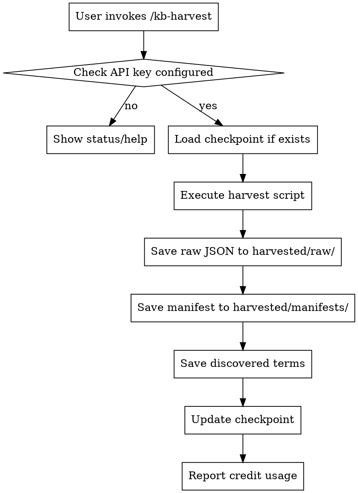
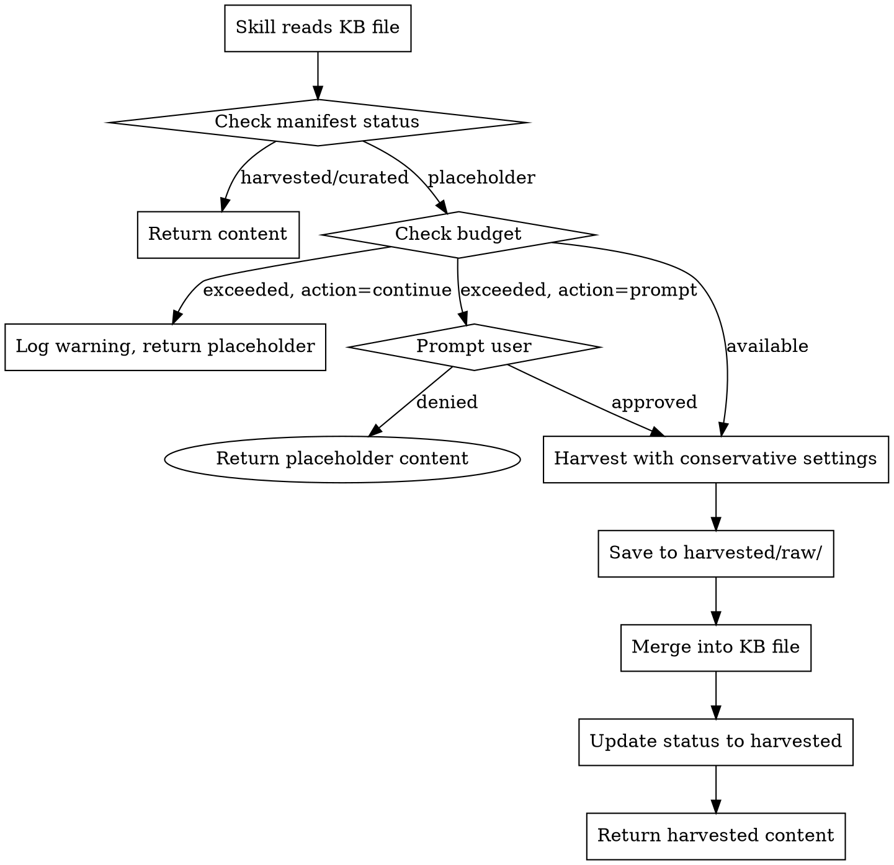

# KB Harvesting Skills Design

**Date:** 2026-03-30
**Status:** Draft
**Author:** Claude (from brainstorming session)

## Overview

Two complementary skills for harvesting content into the Knowledge Base system:

1. **`kb-harvest`** - Manual, user-facing harvesting with full control
2. **`kb-autofill`** - Automatic, skill-facing harvesting triggered by placeholder detection

---

## Architecture

```
┌─────────────────────────────────────────────────────────────────┐
│                     User Commands                                │
│                                                                  │
│   /kb-harvest --phase 1      /kb-harvest --credits             │
│   /kb-harvest --kb dsp-kb    /kb-harvest --status              │
│                                                                  │
└──────────────────────────┬──────────────────────────────────────┘
                           │
                           ▼
┌─────────────────────────────────────────────────────────────────┐
│                      kb-harvest skill                            │
│                                                                  │
│  - Phase-based harvesting                                        │
│  - Manual file/topic selection                                  │
│  - Credit tracking and reporting                                │
│  - Checkpoint management                                        │
│  - Progress monitoring                                          │
└──────────────────────────┬──────────────────────────────────────┘
                           │
                           │ calls
                           ▼
┌─────────────────────────────────────────────────────────────────┐
│                    Harvest Scripts                              │
│                                                                 │
│  playbookdata/scripts/harvest-deep.py                           │
│  playbookdata/scripts/harvest-batch.sh                          │
│                                                                 │
│  Output: harvested/raw/*.json                                   │
│          harvested/manifests/*.json                              │
│          harvested/discovered-terms/*.json                        │
└──────────────────────────┬──────────────────────────────────────┘
                           │
                           │ merges
                           ▼
┌─────────────────────────────────────────────────────────────────┐
│                    kb-autofill skill                             │
│                                                                 │
│  - Detects placeholder content in KB files                       │
│  - Called by other skills (juce-dsp-implementation, etc.)         │
│  - Conservative harvesting with budget                           │
│  - Merges harvested content into KB files                        │
└──────────────────────────┬──────────────────────────────────────┘
                           │
                           │ updates
                           ▼
┌─────────────────────────────────────────────────────────────────┐
│                   Knowledge Base Files                            │
│                                                                 │
│  dsp-kb/reverb/algorithmic-reverb.json                          │
│  midi-kb/protocol/midi-basics.json                               │
│  ...                                                              │
│                                                                 │
│  Status: "placeholder" → "harvested" → "curated"                  │
└─────────────────────────────────────────────────────────────────┘
```

---

## Skill 1: kb-harvest (Manual Harvesting)

### Purpose

User-facing skill for deliberate, controlled harvesting operations with full visibility into credit usage and progress.

### Invocation

```
/kb-harvest                              # Show status and help
/kb-harvest --phase 1                    # Harvest phase 1 (DSP core)
/kb-harvest --phase 2                    # Harvest phase 2 (JUCE real-time)
/kb-harvest --kb dsp-kb --topic reverb   # Harvest entire topic
/kb-harvest --kb dsp-kb --topic reverb --file algorithmic-reverb.json
/kb-harvest --credits                    # Show credit usage summary
/kb-harvest --status                     # Show KB fill status
/kb-harvest --clean --kb dsp-kb          # Clean checkpoints
/kb-harvest --merge                      # Merge harvested content into KB files
```

### Features

**Phase-Based Harvesting:**
- Phase 1: DSP core (reverb, dynamics) - highest impact
- Phase 2: JUCE real-time safety
- Phase 3: Testing foundation
- Phase 4: MIDI fundamentals

**Credit Tracking:**
- Per-operation credit accounting
- Session and cumulative totals
- Warn when approaching budget threshold

**Checkpoint Management:**
- Resume from interruption
- Clean checkpoints for fresh start
- Progress persistence

**Status Reporting:**
```markdown
KB Fill Status:
┌────────────────┬─────────┬──────────┬───────────┐
│ KB             │ Total   │ Harvested│ Status    │
├────────────────┼─────────┼──────────┼───────────┤
│ dsp-kb         │ 53      │ 28       │ 53%       │
│ juce-kb        │ 183     │ 12       │ 7%        │
│ testing-kb     │ 12      │ 0        │ pending   │
│ midi-kb        │ 18      │ 0        │ pending   │
│ sound-design-kb│ 25      │ 0        │ pending   │
└────────────────┴─────────┴──────────┴───────────┘

Credits: 18,750 / 20,500 remaining (91.5%)
```

### Workflow



---

## Skill 2: kb-autofill (Auto-Harvesting)

### Purpose

Background skill that fills KB placeholders automatically when other skills need content.

### Invocation

**Automatic (placeholder detection):**
```markdown
# When juce-dsp-implementation skill accesses dsp-kb/reverb/algorithmic-reverb.json:

1. Read KB file
2. Check status field in manifest
3. If status == "placeholder":
   a. Log: "Placeholder detected in dsp-kb/reverb/algorithmic-reverb.json"
   b. Invoke kb-autofill with conservative settings
   c. Wait for completion (or prompt if budget exceeded)
   d. Re-read KB file
4. Use harvested content
```

**Explicit (skill call):**
```markdown
# Another skill can call:

Use the Agent tool to invoke kb-autofill:
- subagent_type: "kb-autofill"
- prompt: "Harvest dsp-kb/reverb/algorithmic-reverb.json with budget 50 credits"
```

### Features

**Placeholder Detection:**
- Check `manifest.json` for `"status": "placeholder"`
- Fallback: Check file content for `[Content to be harvested]`

**Conservative Harvesting:**
- Max 3 search queries (vs 5 for manual)
- No deep crawl by default
- Prioritize domains from placeholder's `sources` field

**Budget Management:**
- Default session budget: 100 credits
- Configurable via `~/.claude/kb-harvest-config.json`
- Prompt when exceeded: "Budget exceeded. Continue? [y/n]"

**Content Merge:**
- After harvest, read raw JSON from `harvested/raw/`
- Extract markdown content
- Update KB file's `markdown` field
- Update status to `"harvested"`
- Keep `harvested_at` timestamp

### Budget Configuration

File: `~/.claude/kb-harvest-config.json`

```json
{
  "session_budget": 100,
  "budget_exceeded_action": "prompt",
  "auto_harvest_enabled": true,
  "default_sources_priority": {
    "CCRMA": 10,
    "JUCE forum": 9,
    "EarLevel blog": 9,
    "musicdsp.org": 8,
    "default": 5
  },
  "merge_after_harvest": true,
  "quality_check": false
}
```

**Budget Actions:**
- `prompt`: Ask user before continuing (default)
- `continue`: Log warning and continue anyway
- `stop`: Stop harvesting, return what's collected

### Workflow



---

## Content Merge Process

### Problem

Harvest scripts save raw JSON to `harvested/raw/` but never update the actual KB placeholder file.

### Solution

**Merge Script:** `scripts/merge-harvested.py`

```python
def merge_harvested_content(kb: str, topic: str, filename: str):
    """
    Merge harvested content into KB placeholder file.

    1. Read harvested/raw/dsp-kb_reverb_algorithmic-reverb.json
    2. Extract markdown from best result
    3. Read KB file: dsp-kb/reverb/algorithmic-reverb.json
    4. Replace markdown field
    5. Update status to "harvested"
    6. Write back to KB file
    """
```

**Merge Criteria:**
- Select result with longest markdown content
- Prefer results from prioritized domains
- Fall back to concatenating top 3 results if single result is short

### Integration

**kb-harvest:** `--merge` flag merges after harvest
**kb-autofill:** Automatically merges after harvest

---

## Placeholder Status System

### Manifest Updates

Each KB has a `manifest.json` with file statuses:

```json
{
  "kb_name": "dsp-kb",
  "phases": [
    {
      "name": "reverb",
      "files": {
        "algorithmic-reverb.json": {
          "status": "harvested",
          "harvested_at": "2026-03-30T12:00:00Z",
          "credits_used": 45,
          "sources": ["ccrma.stanford.edu", "earlevel.com"]
        },
        "convolution-reverb.json": {
          "status": "placeholder"
        }
      }
    }
  ]
}
```

**Status Values:**
- `placeholder` - File created but not harvested
- `harvested` - Content harvested but not reviewed
- `curated` - Content reviewed and approved
- `failed` - Harvest failed, needs retry

---

## Skill-to-Skill Communication

### Problem

No documented mechanism for skills to invoke each other.

### Solution

**Pattern: Check-and-Call**

When a skill needs KB content:

```markdown
## In skill definition (SKILL.md):

### KB Dependency

This skill requires content from the Knowledge Base. Before using KB content:

1. Check if file exists and has harvested content:
   - Read manifest: `{kb}/manifest.json`
   - Check file status: `status != "placeholder"`

2. If placeholder:
   - Log: "Placeholder detected, invoking kb-autofill"
   - Use Agent tool to invoke kb-autofill
   - Wait for completion

3. Read KB file and use content
```

### Agent Tool Invocation

```markdown
**From any skill:**

Use the Agent tool:
```
Agent(
  subagent_type="kb-autofill",
  prompt="Harvest dsp-kb/reverb/algorithmic-reverb.json with budget 50 credits"
)
```

Wait for result, then continue.
```

---

## Error Handling

### Firecrawl API Down

```markdown
kb-harvest:
- Log error with timestamp
- Save checkpoint for resume
- Report to user: "Firecrawl API unavailable. Harvest paused."
- Exit with non-zero status

kb-autofill:
- Log warning
- Return placeholder content with notice
- Allow calling skill to continue with degraded content
```

### Rate Limited

```markdown
Both skills:
- Check Retry-After header
- Wait and retry up to 3 times
- After 3 failures, prompt user or fail gracefully
```

### Content Quality Issues

```markdown
Optional quality check (disabled by default):

quality_check:
  - Verify markdown length > 500 chars
  - Verify title matches file topic
  - Verify at least 2 sources returned
  - If fail: log warning, continue anyway
```

---

## Concurrent Access

### Problem

Multiple processes accessing same KB file or checkpoint.

### Solution

**File Locking:**
```python
import fcntl

def acquire_lock(filepath):
    lock_file = filepath + ".lock"
    fd = open(lock_file, 'w')
    fcntl.flock(fd, fcntl.LOCK_EX)
    return fd

def release_lock(fd):
    fcntl.flock(fd, fcntl.LOCK_UN)
    fd.close()
```

**Checkpoint Versioning:**
- Include timestamp in checkpoint filename
- On conflict, use most recent checkpoint
- Log warning about concurrent access

---

## File Structure After Implementation

```
playbookdata/
├── dsp-kb/
│   ├── reverb/
│   │   ├── algorithmic-reverb.json    # status: harvested
│   │   └── convolution-reverb.json     # status: placeholder
│   └── manifest.json                   # includes file statuses
├── harvested/
│   ├── raw/                            # Firecrawl JSON responses
│   ├── manifests/                      # Harvest summaries
│   ├── discovered-terms/                # Extracted terms
│   ├── processed/                      # Merged content (optional)
│   └── checkpoints/                    # Resume state
├── scripts/
│   ├── harvest-deep.py                 # Main harvester
│   ├── harvest-batch.sh                # Batch runner
│   ├── merge-harvested.py               # Merge script
│   └── validate-kb-structure.py        # Validation
└── .harvest-config.json                 # Session config (created at runtime)

~/.claude/
└── kb-harvest-config.json              # User preferences
```

---

## Implementation Order

| Phase | Task | Effort |
|-------|------|--------|
| 1 | Create `kb-harvest` skill (manual) | Medium |
| 2 | Add content merge script | Small |
| 3 | Add placeholder status to manifest | Small |
| 4 | Create `kb-autofill` skill | Medium |
| 5 | Add budget configuration | Small |
| 6 | Add concurrent access locking | Small |
| 7 | Update existing skills to call `kb-autofill` | Medium |

---

## Success Criteria

- [ ] `kb-harvest` can harvest phases with credit tracking
- [ ] `kb-harvest --merge` updates KB files with harvested content
- [ ] Manifest includes file-level status
- [ ] `kb-autofill` detects placeholders automatically
- [ ] `kb-autofill` respects session budget
- [ ] Other skills can invoke `kb-autofill` via Agent tool
- [ ] Error handling for API failures
- [ ] Checkpoint resume works after interruption
- [ ] Concurrent access doesn't corrupt files

---

## Questions for User

Before implementation:

1. **Default budget:** Is 100 credits per session appropriate for auto-harvest?
2. **Merge behavior:** Should merge be automatic after harvest, or require `--merge` flag?
3. **Existing skills:** Should I update all existing JUCE skills to call `kb-autofill`, or start with just the most common ones?