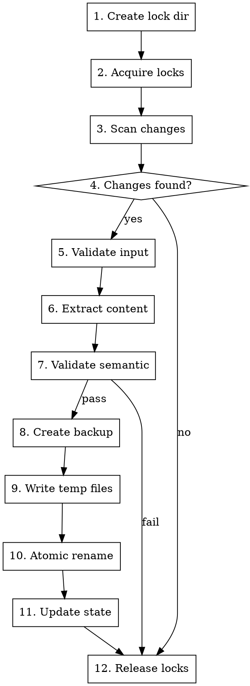

# KB Sync Skill Design

**Date:** 2026-03-30
**Status:** Approved
**Author:** Claude (from brainstorming session)

## Overview

A skill that keeps all Knowledge Base indexes synchronized after content changes. Runs as a scheduled task to ensure the KB system stays up to date without performance issues.

---

## Architecture

```
┌─────────────────────────────────────────────────────────────────┐
│                     Scheduled Task (CronCreate)                 │
│                                                                  │
│   Runs every 5 minutes: check for pending sync, execute if found │
│                                                                  │
└──────────────────────────┬──────────────────────────────────────┘
                           │
                           ▼
┌─────────────────────────────────────────────────────────────────┐
│                      kb-sync skill                               │
│                                                                  │
│  - Scan for unsynced content (harvested/raw/, manifest status)  │
│  - Acquire file locks before sync                                │
│  - Extract semantic content (preserve code exactly)              │
│  - Update KB files with semantic fields                          │
│  - Update all indexes (per-KB, master, cross-refs)              │
│  - Validate and release locks                                    │
└──────────────────────────┬──────────────────────────────────────┘
                           │
                           │ updates
                           ▼
┌─────────────────────────────────────────────────────────────────┐
│                   Knowledge Base Files                            │
│                                                                  │
│  master-index.json      - Central registry with metadata        │
│  dsp-kb/index.json      - Per-KB topic-to-file mappings         │
│  dsp-kb/manifest.json    - Sync status tracking                 │
│  dsp-kb/reverb/*.json    - KB content files (semantic fields)   │
└─────────────────────────────────────────────────────────────────┘
```

---

## Core Components

**Skill Directory:** `~/.claude/skills/kb-sync/`

| File | Purpose |
|------|---------|
| `SKILL.md` | Skill definition and command interface |
| `sync-engine.py` | Main orchestration script |
| `extract-structure.py` | Extract semantic fields from harvested content |
| `update-indexes.py` | Update per-KB and master indexes |
| `update-cross-refs.py` | Extract and update cross-references |
| `validate-sync.py` | Pre-write validation and post-sync checks |
| `migrate-content.py` | One-time migration for existing markdown content |
| `sync-lock.py` | File locking for concurrent access |
| `sync-state.py` | Persistent sync state and error recovery |

---

## Sync Workflow

**12-Step Process:**



**Step Details:**

1. **Create lock dir** - Ensure `harvested/locks/` exists (`os.makedirs(exist_ok=True)`)
2. **Acquire locks** - Get exclusive locks on KB and harvest directories (atomic acquisition)
3. **Scan changes** - Read manifest status files, find `harvested` entries without `synced_timestamp`
4. **Changes found?** - If none, release locks and exit
5. **Validate input** - Check harvested JSON is complete (not partial write)
6. **Extract content** - Parse harvested JSON, extract semantic fields (preserve code exactly)
7. **Validate semantic** - Verify extracted content has required fields (non-empty summary, valid code_blocks)
8. **Create backup** - Copy original KB file to `.backup` before modification
9. **Write temp files** - Write all updates to temp files first
10. **Atomic rename** - Rename all temp files in sequence (fast operation, minimal crash window)
11. **Update state** - Update `sync-state.json` with sync history, clear retry count
12. **Release locks** - Remove lock files

---

## Data Structures

### Manifest with Sync Tracking

```json
{
  "kb_name": "dsp-kb",
  "topics": [
    {
      "name": "reverb",
      "files": {
        "algorithmic-reverb.json": {
          "status": "synced",
          "harvested_at": "2026-03-30T12:00:00Z",
          "synced_at": "2026-03-30T12:05:00Z",
          "synced_timestamp": 1743338700,
          "credits_used": 45,
          "sources": ["ccrma.stanford.edu", "earlevel.com"],
          "retry_count": 0,
          "last_error": null
        },
        "convolution-reverb.json": {
          "status": "harvested",
          "harvested_at": "2026-03-30T12:10:00Z",
          "credits_used": 38,
          "retry_count": 0,
          "last_error": null
        },
        "plate-reverb.json": {
          "status": "failed",
          "harvested_at": "2026-03-30T11:00:00Z",
          "retry_count": 3,
          "last_error": "Empty semantic extraction: summary is empty"
        }
      }
    }
  ],
  "last_sync": "2026-03-30T12:05:00Z"
}
```

**Status Values:**
- `placeholder` - File created but not harvested
- `harvested` - Content harvested but not synced
- `synced` - Content synced to KB file
- `curated` - Content reviewed and approved
- `failed` - Sync failed after max retries, needs manual intervention

### Sync State File

```json
{
  "last_run": "2026-03-30T12:05:00Z",
  "files_processed": 15,
  "files_succeeded": 14,
  "files_failed": 1,
  "errors": [
    {
      "file": "dsp-kb/reverb/plate-reverb.json",
      "error": "Empty semantic extraction",
      "timestamp": "2026-03-30T12:05:30Z"
    }
  ],
  "total_syncs": 45,
  "total_credits_saved": 1250
}
```

### Semantic KB File Structure

```json
{
  "id": "dsp-kb_reverb_algorithmic-reverb",
  "kb": "dsp-kb",
  "topic": "reverb",
  "status": "synced",
  "version": "2.0.0",

  "summary": "Algorithmic reverb uses delay networks to simulate acoustic spaces...",

  "concepts": [
    {
      "name": "Freeverb Algorithm",
      "description": "Open-source reverb using parallel comb filters...",
      "related": ["schroeder-reverb", "plate-reverb"]
    }
  ],

  "code_blocks": [
    {
      "language": "cpp",
      "description": "Basic Freeverb comb filter implementation",
      "code": "class CombFilter {\npublic:\n    float process(float input) {\n        // Preserved exactly - whitespace intact\n        float output = buffer[readPos];\n        buffer[writePos] = input + output * feedback;\n        return output;\n    }\n};",
      "source": "earlevel.com",
      "preserved": true
    }
  ],

  "references": [
    {
      "title": "Freeverb Algorithm",
      "url": "https://ccrma.stanford.edu/~jos/pasp/Freeverb.html",
      "domain": "ccrma.stanford.edu"
    }
  ],

  "original_markdown": "...",  // Preserved during migration, removed after curation

  "metadata": {
    "harvested_at": "2026-03-30T12:00:00Z",
    "synced_at": "2026-03-30T12:05:00Z",
    "word_count": 2500,
    "code_count": 3
  }
}
```

### Cross-Reference Format

```json
{
  "cross_references": {
    "reverb": {
      "dsp-kb": ["reverb"],
      "sound-design-kb": ["reverb-characteristics"],
      "juce-kb": ["reverb-component"]
    },
    "dsp-kb:reverb": {
      "related_topics": ["juce-kb:realtime:audio-thread-safety"],
      "extracted_from": ["harvested/raw/dsp-kb_reverb_*.json"],
      "confidence": 0.95,
      "manual": false
    }
  },
  "_metadata": {
    "max_per_topic": 50,
    "last_pruned": "2026-03-30T10:00:00Z",
    "total_count": 127
  }
}
```

---

## Synchronization Infrastructure

### File Locking Mechanism

**Lock Directory:** `playbookdata/harvested/locks/`

```
locks/
├── master-index.lock      # PID file for master index sync
├── dsp-kb.lock           # Per-KB lock during sync
├── juce-kb.lock
├── harvest.lock          # Lock for harvest scripts writing to raw/
└── ...
```

**Lock Acquisition (sync-lock.py):**

```python
import os
import fcntl
import time
from pathlib import Path

LOCKS_DIR = Path("harvested/locks")
LOCKS_DIR.mkdir(parents=True, exist_ok=True)  # Step 1: ensure dir exists

class SyncLock:
    """Atomic file lock using fcntl for POSIX systems."""

    def __init__(self, name: str, timeout: int = 30):
        self.lock_path = LOCKS_DIR / f"{name}.lock"
        self.timeout = timeout
        self.fd = None

    def acquire(self) -> bool:
        """Atomically acquire lock. Raises LockTimeoutError on timeout."""
        self.fd = open(self.lock_path, 'w')
        start = time.time()

        while time.time() - start < self.timeout:
            try:
                fcntl.flock(self.fd.fileno(), fcntl.LOCK_EX | fcntl.LOCK_NB)
                self.fd.write(f"{os.getpid()}\n")
                self.fd.flush()
                return True
            except (IOError, OSError):
                time.sleep(0.1)

        self.fd.close()
        raise LockTimeoutError(f"Could not acquire lock: {self.lock_path}")

    def release(self):
        """Release lock."""
        if self.fd:
            fcntl.flock(self.fd.fileno(), fcntl.LOCK_UN)
            self.fd.close()
            self.fd = None

    def __enter__(self):
        self.acquire()
        return self

    def __exit__(self, *args):
        self.release()


def is_process_alive(pid: int) -> bool:
    """Check if process is running. Platform-specific."""
    if os.name == 'posix':
        # Linux: check /proc/{pid}
        if os.path.exists('/proc'):
            return os.path.exists(f'/proc/{pid}')
        # macOS/BSD: use kill(pid, 0)
        try:
            os.kill(pid, 0)
            return True
        except OSError:
            return False
    else:
        # Windows: not supported, assume alive
        return True


def acquire_kb_lock(kb: str, timeout: int = 30) -> SyncLock:
    """Acquire lock for KB sync. Also acquires harvest lock."""
    harvest_lock = SyncLock("harvest", timeout)
    harvest_lock.acquire()  # Prevent concurrent harvest writes

    kb_lock = SyncLock(kb, timeout)
    kb_lock.acquire()

    return MultiLock([harvest_lock, kb_lock])


class MultiLock:
    """Acquire multiple locks atomically."""

    def __init__(self, locks: list[SyncLock]):
        self.locks = locks

    def release(self):
        for lock in reversed(self.locks):
            lock.release()
```

### Scheduled Task Configuration

**Claude Code Remote-Trigger:**

```json
// Created via CronCreate tool
{
  "cron": "*/5 * * * *",
  "prompt": "Check all KB manifest.json files for entries with status='harvested' and no synced_timestamp. If any found, invoke kb-sync skill with --run flag.",
  "recurring": true,
  "durable": true
}
```

**Trigger Conditions:**
- New files in `harvested/raw/` with no corresponding manifest entry
- Manifest entries with status `harvested` but no `synced_timestamp`
- Manifest entries with `status=failed` and `retry_count < 3`
- Manual invocation via `/kb-sync` skill command
- Scheduled check (every 5 minutes)

---

## Migration & Skill Interface

### Content Migration

**One-time migration for existing KB files:**

```python
# migrate-content.py

def migrate_kb_file(kb: str, topic: str, filename: str):
    """
    Migrate existing markdown-based KB file to semantic structure.

    1. Read KB file with markdown field
    2. Validate markdown exists
    3. Extract semantic fields from markdown
    4. Preserve code blocks exactly (whitespace intact)
    5. Keep original_markdown field for rollback
    6. Transform structure
    7. Write to temp file, then atomic rename
    8. Update manifest with migration metadata
    """
    old_path = Path(f"{kb}/{topic}/{filename}")
    content = json.load(open(old_path))

    if 'markdown' not in content:
        return  # Already migrated

    # Backup original
    backup_path = old_path.with_suffix('.json.backup')
    shutil.copy(old_path, backup_path)

    try:
        semantic = extract_semantic_fields(content['markdown'])

        # Validate extraction
        if not semantic.get('summary'):
            raise MigrationError(f"Empty summary for {filename}")
        if not semantic.get('concepts'):
            raise MigrationError(f"No concepts extracted for {filename}")

        new_content = {
            "id": f"{kb}_{topic}_{filename.replace('.json', '')}",
            "kb": kb,
            "topic": topic,
            "status": "synced",
            "version": "2.0.0",
            **semantic,
            "original_markdown": content['markdown'],  # Keep for rollback
            "metadata": {
                "migrated_from": "markdown",
                "migrated_at": datetime.utcnow().isoformat()
            }
        }

        # Atomic write
        temp_path = old_path.with_suffix('.json.tmp')
        json.dump(new_content, open(temp_path, 'w'), indent=2)
        os.rename(temp_path, old_path)

    except Exception as e:
        # Restore backup on failure
        shutil.copy(backup_path, old_path)
        raise MigrationError(f"Migration failed for {filename}: {e}")
```

### Skill Command Interface

```
/kb-sync                              # Show status and pending changes
/kb-sync --run                        # Execute sync now
/kb-sync --kb dsp-kb                  # Sync specific KB only
/kb-sync --full                       # Full sync (all indexes, all KBs)
/kb-sync --status                     # Show sync status report
/kb-sync --dry-run                    # Show what would sync without executing
/kb-sync --migrate                    # Run content migration for existing files
/kb-sync --retry-failed               # Retry failed entries (reset retry_count)
/kb-sync --schedule "*/5 * * * *"     # Set up scheduled sync
/kb-sync --clean-backups              # Remove .backup files older than 30 days
```

### Status Report Output

```
KB Sync Status:
┌────────────┬─────────┬──────────┬─────────────┬─────────────┬─────────┐
│ KB         │ Files   │ Synced   │ Pending     │ Failed      │ Last   │
├────────────┼─────────┼──────────┼─────────────┼─────────────┼─────────┤
│ dsp-kb     │ 53      │ 28       │ 3           │ 1           │ 2 min  │
│ juce-kb    │ 183     │ 12       │ 5           │ 0           │ 5 min  │
│ testing-kb │ 12      │ 0        │ 0           │ 0           │ never  │
│ midi-kb    │ 18      │ 0        │ 2           │ 0           │ 10 min │
└────────────┴─────────┴──────────┴─────────────┴─────────────┴─────────┘

Sync State:
  Last run: 2026-03-30T12:05:00Z
  Files processed: 15 (14 succeeded, 1 failed)
  Total syncs: 45
  Credits saved: 1250

Cross-references: 127 total, 12 pending validation, max 50/topic
Next scheduled sync: in 3 minutes

Failed entries (run /kb-sync --retry-failed to retry):
  - dsp-kb/reverb/plate-reverb.json: Empty semantic extraction
```

---

## Cross-Reference Extraction

### Auto-Extraction from Harvested Content

```python
# update-cross-refs.py

GENERIC_TERMS = {'audio', 'sound', 'plugin', 'music', 'digital', 'signal', 'process'}
MAX_CROSS_REFS_PER_TOPIC = 50
MIN_CONFIDENCE = 0.6

def extract_topics(title: str, content: str = None) -> list[str]:
    """
    Extract topic keywords from title and optional content.

    Rules:
    - Extract nouns and technical terms
    - Filter out generic terms
    - Limit to top 5 topics per source
    """
    # Use simple regex-based extraction
    # Implementation depends on content format
    words = re.findall(r'\b[A-Z][a-z]+\b', title)  # Capitalized words
    words += re.findall(r'\b\w{4,}\b', title.lower())  # Words 4+ chars

    topics = []
    for word in words:
        if word.lower() not in GENERIC_TERMS:
            topics.append(word)

    return list(set(topics))[:5]


def extract_cross_references(harvested_content: dict, existing_refs: dict) -> list[dict]:
    """
    Extract cross-references from harvested content.

    Rules:
    - Only extract from domains in priority list
    - Filter out generic terms
    - Deduplicate with existing cross-refs
    - Preserve manual entries
    - Apply relevance scoring
    - Prune to MAX_CROSS_REFS_PER_TOPIC
    """
    references = []
    priority_domains = {
        "ccrma.stanford.edu": 0.9,
        "forum.juce.com": 0.85,
        "earlevel.com": 0.8,
        "musicdsp.org": 0.75
    }

    for ref in harvested_content.get('references', []):
        domain = ref.get('domain', '')
        if domain not in priority_domains:
            continue

        topics = extract_topics(ref['title'], ref.get('content'))
        for topic in topics:
            if topic.lower() not in GENERIC_TERMS:
                confidence = priority_domains[domain]

                # Bonus for code example mentions
                if ref.get('has_code'):
                    confidence += 0.1

                references.append({
                    'topic': topic,
                    'source': ref['url'],
                    'confidence': min(confidence, 1.0),
                    'manual': False
                })

    return deduplicate_and_prune(references, existing_refs)


def deduplicate_and_prune(new_refs: list, existing_refs: dict) -> list:
    """
    Deduplicate new refs against existing, prune to max per topic.
    Preserve entries with manual: true.
    """
    # Filter out entries already in existing_refs
    seen = set()
    for topic_data in existing_refs.values():
        if isinstance(topic_data, dict):
            seen.update(topic_data.get('related_topics', []))

    unique = [r for r in new_refs if r['topic'] not in seen]

    # Sort by confidence, keep top MAX_CROSS_REFS_PER_TOPIC
    unique.sort(key=lambda x: x['confidence'], reverse=True)

    # Group by topic and prune
    by_topic = {}
    for ref in unique:
        topic = ref['topic']
        if topic not in by_topic:
            by_topic[topic] = []
        if len(by_topic[topic]) < MAX_CROSS_REFS_PER_TOPIC:
            by_topic[topic].append(ref)

    result = []
    for refs in by_topic.values():
        result.extend(refs)

    return result
```

### Cross-Reference Quality

**Filtering Rules:**
- Exclude generic terms: `audio`, `sound`, `plugin`, `music`, `digital`, `signal`, `process`
- Minimum confidence threshold: 0.6
- Maximum cross-refs per topic: 50
- Deduplicate by topic + source KB
- Preserve manual entries with `manual: true` flag

**Relevance Scoring:**
- Source domain priority (CCRMA = 0.9, JUCE forum = 0.85, EarLevel = 0.8, musicdsp = 0.75)
- Context relevance (mentioned in code example = +0.1)
- Cross-KB linking bonus (+0.1 for linking different KBs)

---

## Error Handling

### Partial Sync Recovery

```python
class SyncEngine:
    """Main sync orchestration with transaction support."""

    def sync_file(self, kb: str, topic: str, filename: str):
        """Sync single KB file with backup and recovery."""
        kb_path = Path(f"{kb}/{topic}/{filename}")
        index_path = Path(f"{kb}/index.json")
        manifest_path = Path(f"{kb}/manifest.json")

        # Backup originals
        backup_kb = kb_path.with_suffix('.json.backup')
        backup_index = index_path.with_suffix('.json.backup')
        backup_manifest = manifest_path.with_suffix('.json.backup')

        shutil.copy(kb_path, backup_kb)
        shutil.copy(index_path, backup_index)
        shutil.copy(manifest_path, backup_manifest)

        temp_files = []

        try:
            # Write all to temp files
            temp_kb = self.write_kb_file(kb_path)
            temp_index = self.write_index(index_path)
            temp_manifest = self.write_manifest(manifest_path)
            temp_files = [temp_kb, temp_index, temp_manifest]

            # Atomic rename (minimal crash window)
            for temp, final in zip(temp_files, [kb_path, index_path, manifest_path]):
                os.rename(temp, final)

            # Clean backups on success
            for backup in [backup_kb, backup_index, backup_manifest]:
                backup.unlink()

        except Exception as e:
            # Restore from backups on failure
            shutil.copy(backup_kb, kb_path)
            shutil.copy(backup_index, index_path)
            shutil.copy(backup_manifest, manifest_path)

            # Clean temp and backup files
            for temp in temp_files:
                Path(temp).unlink(missing_ok=True)
            for backup in [backup_kb, backup_index, backup_manifest]:
                backup.unlink(missing_ok=True)

            raise SyncError(f"Sync failed, rolled back: {e}")

    def write_kb_file(self, path: Path) -> str:
        """Write KB content to temp file, return path."""
        temp = path.with_suffix('.json.tmp')
        # ... write content ...
        return str(temp)
```

### Input Validation

```python
# validate-sync.py

def validate_harvested_input(data: dict) -> tuple[bool, str]:
    """
    Validate harvested JSON before sync.

    Returns (is_valid, error_message).
    """
    if not data:
        return False, "Empty harvested content"

    if 'content' not in data and 'markdown' not in data:
        return False, "No content field in harvested JSON"

    # Check for partial write (incomplete JSON)
    if data.get('_incomplete'):
        return False, "Harvested JSON marked as incomplete"

    # Verify file has corresponding manifest entry
    manifest = load_manifest(data['kb'])
    if data['file'] not in manifest['topics'][data['topic']]['files']:
        return False, f"No manifest entry for {data['file']}"

    return True, ""


def validate_semantic_content(semantic: dict) -> tuple[bool, str]:
    """
    Validate extracted semantic content.

    Returns (is_valid, error_message).
    """
    if not semantic.get('summary'):
        return False, "Empty summary in semantic extraction"

    if not semantic.get('concepts'):
        return False, "No concepts extracted"

    # Verify code blocks are preserved
    for block in semantic.get('code_blocks', []):
        if not block.get('code'):
            return False, "Empty code block found"
        if not block.get('language'):
            return False, "Code block missing language"

    return True, ""
```

### Retry Logic

```python
MAX_RETRIES = 3

def sync_with_retry(kb: str, topic: str, filename: str, manifest: dict):
    """
    Sync with retry tracking in manifest.
    """
    entry = manifest['topics'][topic]['files'][filename]
    retry_count = entry.get('retry_count', 0)

    try:
        sync_file(kb, topic, filename)
        entry['status'] = 'synced'
        entry['synced_at'] = datetime.utcnow().isoformat()
        entry['retry_count'] = 0
        entry['last_error'] = None

    except Exception as e:
        entry['retry_count'] = retry_count + 1
        entry['last_error'] = str(e)

        if entry['retry_count'] >= MAX_RETRIES:
            entry['status'] = 'failed'
            log_error(f"Sync failed after {MAX_RETRIES} retries: {filename}")
        else:
            log_warning(f"Sync failed, retry {entry['retry_count']}/{MAX_RETRIES}: {filename}")
```

---

## File Structure After Implementation

```
~/.claude/skills/kb-sync/
├── SKILL.md                    # Skill definition
├── sync-engine.py              # Main orchestration
├── extract-structure.py        # Semantic extraction
├── update-indexes.py           # Index updates
├── update-cross-refs.py        # Cross-reference extraction
├── validate-sync.py            # Pre-write validation
├── migrate-content.py          # Content migration
├── sync-lock.py                # File locking (fcntl-based)
└── sync-state.py               # Persistent sync state

playbookdata/
├── master-index.json           # Central registry
├── dsp-kb/
│   ├── index.json              # Per-KB topic mappings
│   ├── manifest.json           # Sync status tracking
│   └── reverb/
│       ├── algorithmic-reverb.json  # Semantic KB file
│       └── algorithmic-reverb.json.backup  # Backup before sync
├── harvested/
│   ├── raw/                    # Firecrawl JSON responses
│   ├── manifests/               # Harvest summaries
│   ├── discovered-terms/        # Extracted terms
│   ├── locks/                   # Sync lock files
│   └── sync-state.json          # Sync history
└── scripts/
    └── (existing harvest scripts)
```

---

## Implementation Order

| Phase | Task | Effort |
|-------|------|--------|
| 1 | Create `kb-sync` skill directory and SKILL.md | Small |
| 2 | Implement `sync-lock.py` with fcntl atomic locking | Small |
| 3 | Implement `sync-state.py` for persistent state | Small |
| 4 | Implement `validate-sync.py` for input/semantic validation | Small |
| 5 | Implement `extract-structure.py` for semantic extraction | Medium |
| 6 | Implement `update-indexes.py` for per-KB and master indexes | Medium |
| 7 | Implement `update-cross-refs.py` for cross-reference extraction | Medium |
| 8 | Implement `sync-engine.py` main orchestration with transactions | Medium |
| 9 | Implement `migrate-content.py` for existing content | Medium |
| 10 | Set up scheduled task via CronCreate | Small |
| 11 | Integration testing with harvest scripts | Medium |

---

## Success Criteria

- [ ] `kb-sync` can detect pending content from manifest status
- [ ] Lock directory created on first run
- [ ] File locking uses fcntl for atomic acquisition (no TOCTOU bug)
- [ ] Input validation catches incomplete harvested JSON
- [ ] Semantic extraction validates required fields (non-empty summary, valid code_blocks)
- [ ] Backup files created before modification
- [ ] All indexes updated with transaction support (atomic or rollback)
- [ ] Cross-references extracted with quality filtering and max limits
- [ ] Manifest status updated correctly (`harvested` → `synced` or `failed`)
- [ ] Retry count tracked, max 3 retries before marking failed
- [ ] Scheduled task runs every 5 minutes with specific prompt
- [ ] Partial failure rolls back to backup
- [ ] Lock timeout prevents indefinite blocking
- [ ] Content migration preserves original_markdown field
- [ ] Status report shows accurate sync state with failed entries

---

## Dependencies

- **kb-harvest skill** - Produces harvested content in `harvested/raw/`
- **kb-autofill skill** - May trigger sync after auto-harvest
- **Claude Code scheduled tasks** - CronCreate for periodic sync
- **fcntl module** - POSIX file locking (Linux/macOS)