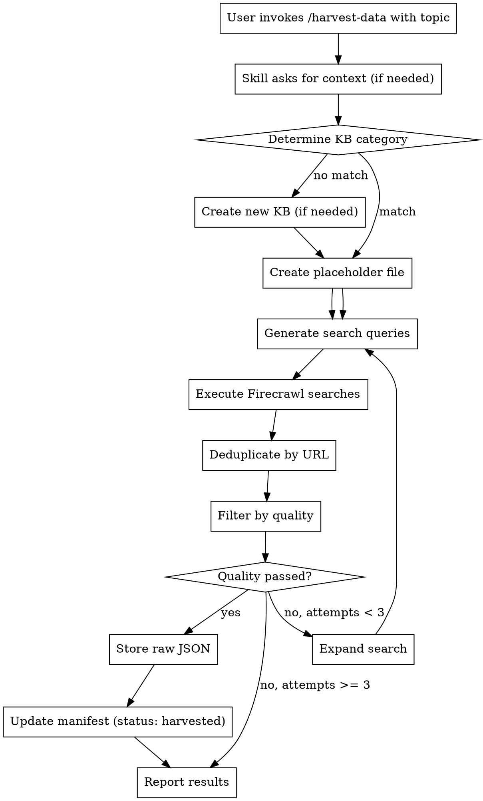

# Harvest Data Skill Design

> **For agentic workers:** REQUIRED SUB-SKILL: Use superpowers:subagent-driven-development (recommended) or superpowers:executing-plans to implement this plan task-by-task. Steps use checkbox (`- [ ]`) syntax for tracking.

**Goal:** Create a new `harvest-data` skill for ad-hoc harvesting of web content with quality filtering, automatic KB categorization, and code formatting preservation.

**Architecture:** Standalone skill that uses Firecrawl API v1 to search for high-quality sources (academic, expert blogs, documentation), filters results by quality metrics, and stores raw JSON to the harvested/raw directory. Integrates with existing `kb-harvest` for merging and `kb-sync` for indexing.

**Tech Stack:** Python 3, Firecrawl API v1, JSON storage, existing KB infrastructure

**Relationship to existing scripts:** This skill extends `harvest-deep.py` by importing its `FirecrawlClient` class rather than reimplementing. The skill adds quality filtering, KB routing, and manifest integration on top of the existing API client.

---

## Overview

The `harvest-data` skill provides ad-hoc web content harvesting with:
- Automatic KB categorization (or new KB creation)
- Quality filtering before storage
- Code formatting preservation
- Multi-query search expansion
- Staged integration (harvest → merge → sync)

## Invocation

```bash
/harvest-data                                    # Show help
/harvest-data --topic "convolution reverb"       # Basic ad-hoc harvest
/harvest-data --topic "FFT windowing" --kb dsp-kb  # Specify KB explicitly
/harvest-data --topic "OpenGL audio viz" --new-kb audio-graphics-kb  # Create new KB
/harvest-data --context "Implementing IR loading in JUCE" --topic "convolution"
/harvest-data --dry-run --topic "reverb"         # Preview queries without executing
```

## Workflow



## Search Query Generation

### Primary and Expanded Queries

```python
# Primary query from topic
primary_query = user_topic  # "convolution reverb"

# Auto-generated quality expansions
expansions = [
    f"{topic} academic site:edu",
    f"{topic} research paper",
    f"{topic} tutorial expert blog",
    f"{topic} implementation guide",
    f"{topic} open source code",
    f"{topic} JUCE implementation",  # Domain-specific when relevant
]

# Creative variations for hidden sources
variations = [
    f"{topic} algorithm",
    f"{topic} mathematics",
    f"{topic} signal processing",
    f"how does {topic} work",
    f"{topic} practical implementation",
]
```

### Source Prioritization

| Priority | Source Type | Query Pattern |
|----------|-------------|---------------|
| 1 | Academic | `site:edu`, `research paper`, `pdf` |
| 2 | Professional | `expert blog`, `tutorial`, `implementation guide` |
| 3 | Reference | `documentation`, `api reference` |
| 4 | Community | `stack overflow`, `forum discussion` |
| 5 | Code | `github`, `open source`, `source code` |

### Source Domain Weighting

```python
SOURCE_WEIGHTS = {
    # Academic domains get relevance boost
    ".edu": 1.3,
    "scholar.google.com": 1.5,
    "arxiv.org": 1.4,
    "acm.org": 1.4,
    "ieee.org": 1.4,

    # High-quality technical sources
    "github.com": 1.2,
    "stackoverflow.com": 1.0,
    "docs.**": 1.1,  # Documentation sites

    # JUCE-specific
    "juce.com": 1.3,
    "forum.juce.com": 1.2,

    # Lower weight for generic content
    "medium.com": 0.9,
    "blogspot.com": 0.8,
}

def apply_source_weight(relevance_score: float, url: str) -> float:
    """Apply source domain weighting to relevance score."""
    for domain, weight in SOURCE_WEIGHTS.items():
        if domain in url:
            return relevance_score * weight
    return relevance_score
```

### Firecrawl Request Format (v1 API)

```python
# NOTE: Firecrawl v1 API has limited parameters
search_payload = {
    "query": query,
    "limit": 15,  # Max results per query
    "scrapeOptions": {
        "formats": ["markdown"],  # Only format supported
        "onlyMainContent": False,  # Keep all content including code blocks
    }
}

# IMPORTANT: v1 does NOT support:
# - includeTags (not available)
# - sources (not available)
# - domain filtering in search (use query terms instead)
```

**Max results:** 15 per query type (configurable via `--max-results`)

## KB Categorization

### Existing KB Categories

```
dsp-kb        → DSP algorithms, audio processing, filters, reverb
juce-kb       → JUCE framework, real-time audio, threading
midi-kb       → MIDI protocol, controllers, MPE
testing-kb    → Unit testing, validation, TDD
sound-design-kb → Sound design, synthesis, presets
ui-kb         → UI components, LookAndFeel, widgets
cmake-kb      → Build systems, CMake configuration
cpp-kb        → C++ patterns, best practices
```

### Categorization Logic

```python
KB_KEYWORDS = {
    "dsp-kb": ["reverb", "filter", "delay", "fft", "dsp", "audio",
               "convolution", "oscillator", "envelope", "dynamics",
               "compressor", "limiter", "eq", "equalizer", "mixing",
               "sampling", "interpolation", "wavetable", "synthesis"],
    "juce-kb": ["juce", "audioprocessor", "editor", "component",
                "realtime", "thread", "midiinput", "audiobuffer",
                "plugin", "vst", "au", "standalone"],
    "midi-kb": ["midi", "note", "controller", "mpe", "cc", "sysex",
                "pitchbend", "aftertouch", "clock", "sync"],
    "testing-kb": ["test", "mock", "assert", "tdd", "unit test",
                   "integration test", "catch2", "googletest"],
    "sound-design-kb": ["synthesis", "preset", "sound design", "timbre",
                        "waveform", "modulation", "lfo", "adsr"],
    "ui-kb": ["ui", "gui", "widget", "lookandfeel", "component",
              "slider", "button", "combobox", "editor"],
    "cmake-kb": ["cmake", "build", "makefile", "target", "fetchcontent",
                 "findpackage", "toolchain"],
    "cpp-kb": ["c++", "template", "lambda", "smart pointer", "move",
               "constexpr", "raii", "stl", "memory"],
}

def determine_kb(topic: str, context: str = "") -> str:
    """Find best-matching KB or suggest new one."""
    topic_lower = topic.lower()
    context_lower = context.lower()

    best_match = None
    best_score = 0

    for kb, keywords in KB_KEYWORDS.items():
        score = sum(1 for kw in keywords if kw in topic_lower or kw in context_lower)
        if score > best_score:
            best_score = score
            best_match = kb

    if best_score >= 2:
        return best_match

    # No good match - suggest new KB name
    return suggest_new_kb_name(topic)


def suggest_new_kb_name(topic: str) -> str:
    """Generate a KB name from topic."""
    # Remove common words
    stop_words = {"how", "to", "do", "the", "a", "an", "in", "for", "with", "using"}
    words = [w for w in topic.lower().split() if w not in stop_words]

    # Take first significant word as KB name
    if words:
        return f"{words[0]}-kb"

    # Fallback to hash-based name
    import hashlib
    hash_val = hashlib.md5(topic.encode()).hexdigest()[:6]
    return f"topic-{hash_val}-kb"
```

### Auto-Creation Process

When new KB needed:
1. Create directory: `{kb_name}/`
2. Create subdirectory: `{kb_name}/{topic}/`
3. Create placeholder file: `{kb_name}/{topic}/{filename}.json`
4. Create manifest: `{kb_name}/manifest.json`
5. Create index: `{kb_name}/index.json`
6. Update `master-index.json`

### Placeholder File Template

```python
def create_placeholder(kb: str, topic: str, filename: str) -> dict:
    """Create a placeholder KB file ready for harvested content."""
    return {
        "kb_type": kb,
        "topic": topic,
        "filename": filename,
        "status": "placeholder",
        "created_at": datetime.now(timezone.utc).isoformat(),
        "title": filename.replace("-", " ").replace(".json", "").title(),
        "summary": "",
        "concepts": [],
        "code_blocks": [],
        "references": []
    }
```

### New KB Naming Convention

- Derive from topic: "convolution reverb" → `convolution-kb` or `impulse-kb`
- Remove common words: "how to do X" → `x-kb`
- Ask if name is ambiguous

## Quality Filtering

### Quality Thresholds

```python
QUALITY_THRESHOLDS = {
    "min_content_length": 500,      # Minimum characters
    "min_relevance_score": 0.3,     # Topic relevance (0-1)
    "max_noise_ratio": 0.5,         # Navigation/ads vs content
}

# Configurable via command line
DEFAULT_THRESHOLDS = QUALITY_THRESHOLDS.copy()
```

### Quality Assessment

```python
def assess_quality(result: dict, topic: str) -> tuple[bool, dict]:
    """Assess if result meets quality standards.

    Returns: (passed, quality_report)
    """
    markdown = result.get("markdown", "")
    url = result.get("url", "")
    title = result.get("title", "")

    # Apply source weight to relevance
    base_relevance = calculate_relevance(markdown, topic)
    weighted_relevance = apply_source_weight(base_relevance, url)

    report = {
        "url": url,
        "title": title,
        "content_length": len(markdown),
        "has_code": "```" in markdown,
        "code_blocks": markdown.count("```"),
        "relevance_score": weighted_relevance,
        "noise_ratio": estimate_noise(markdown),
        "passed": False,
        "rejection_reason": None
    }

    # Check minimum content
    if report["content_length"] < QUALITY_THRESHOLDS["min_content_length"]:
        report["rejection_reason"] = "content_too_short"
        return False, report

    # Check relevance
    if report["relevance_score"] < QUALITY_THRESHOLDS["min_relevance_score"]:
        report["rejection_reason"] = "not_relevant"
        return False, report

    # Check noise ratio (too much navigation/ads)
    if report["noise_ratio"] > QUALITY_THRESHOLDS["max_noise_ratio"]:
        report["rejection_reason"] = "too_much_noise"
        return False, report

    report["passed"] = True
    return True, report
```

### Relevance Scoring

```python
# Complete domain terms mapping
DOMAIN_TERMS = {
    # DSP topics
    "reverb": ["audio", "signal", "processing", "impulse", "response",
               "convolution", "reflection", "decay", "room"],
    "filter": ["cutoff", "resonance", "frequency", "iir", "fir",
               "biquad", "lowpass", "highpass", "bandpass"],
    "delay": ["echo", "feedback", "modulation", "flanger", "chorus"],
    "compressor": ["threshold", "ratio", "attack", "release", "gain",
                   "dynamics", "limiter"],
    "oscillator": ["waveform", "frequency", "phase", "sine", "sawtooth",
                   "square", "noise"],
    "envelope": ["adsr", "attack", "decay", "sustain", "release"],

    # JUCE topics
    "juce": ["plugin", "processor", "editor", "audio", "audiobuffer",
             "audioprocessor", "component", "realtime", "thread"],
    "plugin": ["vst", "au", "audiounit", "vst3", "standalone", "wrapper"],

    # MIDI topics
    "midi": ["note", "controller", "cc", "channel", "sysex",
             "pitchbend", "aftertouch", "clock"],
    "mpe": ["multidimensional", "polyphonic", "expression", "slide",
            "press", "glide"],

    # Testing topics
    "test": ["mock", "assert", "unit", "integration", "fixture",
             "coverage", "catch2"],

    # Sound design topics
    "synthesis": ["waveform", "modulation", "lfo", "envelope",
                  "oscillator", "filter", "amplifier"],
    "preset": ["patch", "sound", "program", "bank", "factory"],

    # UI topics
    "ui": ["component", "widget", "slider", "button", "combobox",
           "lookandfeel", "editor"],
    "gui": ["widget", "window", "dialog", "menu", "layout"],

    # Build topics
    "cmake": ["target", "build", "makefile", "fetchcontent",
              "findpackage", "toolchain", "install"],

    # C++ topics
    "c++": ["template", "lambda", "smart pointer", "move",
            "constexpr", "raii", "stl", "memory"],
}


def calculate_relevance(markdown: str, topic: str) -> float:
    """Score how relevant content is to topic."""
    topic_terms = set(topic.lower().split())

    # Expand terms using domain knowledge
    for term in topic_terms:
        if term in DOMAIN_TERMS:
            topic_terms.update(DOMAIN_TERMS[term])

    # Count occurrences
    markdown_lower = markdown.lower()
    matches = sum(1 for term in topic_terms if term in markdown_lower)

    # Normalize by content length (per 1000 chars)
    density = matches / max(len(markdown) / 1000, 0.1)
    return min(1.0, density / 5)  # Scale to 0-1
```

### Noise Estimation

```python
NOISE_PATTERNS = [
    # Navigation elements
    "skip to content",
    "navigation menu",
    "main menu",
    "breadcrumb",

    # Promotional elements
    "subscribe to newsletter",
    "sign up for",
    "subscribe now",

    # Cookie/legal notices
    "cookie policy",
    "accept cookies",
    "privacy policy",

    # Authentication prompts
    "log in",
    "sign in",
    "create account",
    "register",

    # Advertisement markers
    "advertisement",
    "sponsored",
    "ad",

    # Common footers
    "all rights reserved",
    "copyright ©",
]

def estimate_noise(markdown: str) -> float:
    """Estimate ratio of navigation/boilerplate content."""
    lines = markdown.lower().split("\n")
    noise_lines = 0

    for line in lines:
        line = line.strip()
        if not line:
            continue
        for pattern in NOISE_PATTERNS:
            if pattern in line:
                noise_lines += 1
                break

    return noise_lines / max(len(lines), 1)
```

### Quality Report Output

```
Harvest complete for "convolution reverb":
  ✓ Stored: 8 results (quality passed)
  ✗ Rejected: 7 results
    - 3: content_too_short (< 500 chars)
    - 2: not_relevant (score < 0.3)
    - 2: too_much_noise (navigation/ads > 50%)

  Total credits used: 45
```

## URL Deduplication

```python
def deduplicate_results(results: list) -> list:
    """Remove duplicate URLs across different query results."""
    seen_urls = set()
    unique_results = []

    for result in results:
        url = result.get("url", "")
        if url and url not in seen_urls:
            seen_urls.add(url)
            unique_results.append(result)

    return unique_results
```

## Storage Structure

```
playbookdata/
├── harvested/
│   ├── raw/                          # Full Firecrawl responses
│   │   ├── dsp-kb_reverb_algorithmic_reverb_design_20260330-133421.json
│   │   ├── dsp-kb_reverb_Freeverb_20260330-133423.json
│   │   └── ...
│   ├── manifests/                     # Harvest summaries
│   │   └── dsp-kb_reverb_algorithmic-reverb.json
│   └── discovered-terms/              # Extracted terms
│       └── dsp-kb_reverb_terms.json
├── dsp-kb/                           # KB content
│   ├── reverb/
│   │   └── algorithmic-reverb.json   # Placeholder → harvested → synced
│   ├── manifest.json
│   └── index.json
└── master-index.json                  # Cross-KB index
```

**File naming convention:**
- Raw: `{kb}_{topic}_{query_slug}_{timestamp}.json`
- Manifest: `{kb}_{topic}_{filename}.json`
- Query slug: URL-safe version of first search query

## Raw JSON Format

```json
{
  "harvest_metadata": {
    "kb_type": "dsp-kb",
    "topic": "reverb",
    "filename": "algorithmic-reverb.json",
    "harvested_at": "2026-03-30T12:00:00Z",
    "search_queries": [
      "convolution reverb",
      "convolution reverb academic site:edu"
    ],
    "credits_used": 45,
    "quality_filter": {
      "passed": 8,
      "rejected": 7,
      "thresholds": {
        "min_content_length": 500,
        "min_relevance_score": 0.3,
        "max_noise_ratio": 0.5
      }
    },
    "source_weights": {
      ".edu": 1.3,
      "github.com": 1.2
    }
  },
  "result": {
    "data": [
      {
        "url": "https://example.edu/reverb/convolution",
        "title": "Convolution Reverb: A Mathematical Approach",
        "markdown": "# Introduction\n\nConvolution reverb uses...\n\n```cpp\n// Preserved code formatting\nvoid processBlock(AudioBuffer<float>& buffer) {\n    // Exact spacing maintained\n}\n```\n",
        "quality_report": {
          "content_length": 5000,
          "relevance_score": 0.8,
          "weighted_score": 1.04,
          "noise_ratio": 0.1,
          "passed": true
        }
      }
    ]
  }
}
```

## Integration with Existing KB Systems

### Staged Workflow

```
Stage 1: Harvest (this skill)
┌─────────────────────────────────────────────────────┐
│ /harvest-data --topic "convolution reverb"          │
│ ↓                                                   │
│ Firecrawl search → Dedupe → Quality filter           │
│ ↓                                                   │
│ Store raw JSON → harvested/raw/                     │
│ ↓                                                   │
│ Manifest created (status: harvested)                 │
└─────────────────────────────────────────────────────┘

Stage 2: Merge & Sync (existing skills)
┌─────────────────────────────────────────────────────┐
│ /kb-harvest --merge --kb dsp-kb --topic reverb      │
│ ↓                                                   │
│ Merge content → KB file                              │
│ ↓                                                   │
│ /kb-sync --run                                      │
│ ↓                                                   │
│ Extract semantic → Update indexes → Cross-refs      │
│ ↓                                                   │
│ Status: synced                                      │
└─────────────────────────────────────────────────────┘
```

### Status Progression (Uses Existing Status Values)

```
placeholder → harvested → synced
     ↑            ↑          ↑
   (initial)  (harvest-data) (sync)
```

**IMPORTANT:** The skill uses `status: "harvested"` (existing value) to be compatible with:
- `merge-harvested.py` - looks for harvested content
- `sync_engine.py` - syncs harvested content with no synced_timestamp

### Manifest Compatibility

```json
{
  "kb_name": "dsp-kb",
  "topic": "reverb",
  "filename": "algorithmic-reverb.json",
  "status": "harvested",
  "harvested_at": "2026-03-30T12:00:00Z",
  "sources": 8,
  "rejected": 7,
  "credits_used": 45,
  "search_queries": [
    "convolution reverb",
    "convolution reverb academic site:edu"
  ],
  "quality_thresholds": {
    "min_content_length": 500,
    "min_relevance_score": 0.3,
    "max_noise_ratio": 0.5
  },
  "notes": "Auto-harvested via harvest-data skill"
}
```

## Error Handling

### Error Categories

```python
ERROR_HANDLING = {
    "api_error": {
        "retry": True,
        "max_retries": 3,
        "backoff": "exponential",
        "message": "Firecrawl API error. Retrying..."
    },
    "rate_limit": {
        "retry": True,
        "max_retries": 5,
        "backoff": "wait_for_header",
        "message": "Rate limited. Waiting for Retry-After..."
    },
    "no_results": {
        "retry": False,
        "action": "ask_for_context",
        "message": "No results found. Provide more context for better search terms."
    },
    "all_rejected": {
        "retry": True,
        "action": "expand_search",
        "message": "All results rejected. Expanding search with new terms...",
        "max_expansions": 3
    },
    "api_key_missing": {
        "retry": False,
        "action": "fail",
        "message": "FIRECRAWL_API_KEY not set. Export it first."
    }
}
```

### Partial Failure Handling

```python
def handle_partial_success(results: dict) -> dict:
    """Handle cases where some queries succeed and others fail."""
    successful = results.get("successful", [])
    failed = results.get("failed", [])

    if successful and not failed:
        return {"status": "success", "stored": len(successful)}

    if successful and failed:
        # Store successful results, report failures
        return {
            "status": "partial",
            "stored": len(successful),
            "failed": len(failed),
            "failed_queries": [f["query"] for f in failed],
            "message": f"Stored {len(successful)} results. {len(failed)} queries failed."
        }

    return {"status": "failed", "message": "All queries failed."}
```

### Retry with Search Expansion

```python
def generate_queries(topic: str, context: str, expansion_level: int = 0) -> list:
    """Generate search queries based on topic and expansion level.

    Args:
        topic: The main topic to search for
        context: Additional context for better results
        expansion_level: 0=primary, 1=expanded, 2=creative variations

    Returns:
        List of search query strings
    """
    # Combine topic and context
    base = f"{topic} {context}".strip()

    if expansion_level == 0:
        # Primary queries
        return [
            base,
            f"{topic} tutorial",
            f"{topic} implementation",
            f"{topic} guide",
        ]
    elif expansion_level == 1:
        # Expanded with quality sources
        return [
            f"{topic} academic site:edu",
            f"{topic} research paper",
            f"{topic} algorithm explanation",
            f"{topic} documentation",
        ]
    else:
        # Creative variations
        return [
            f"{topic} mathematics theory",
            f"{topic} practical implementation",
            f"how does {topic} work",
            f"{topic} open source code",
            f"{topic} JUCE implementation",
        ]


def store_results(results: list, topic: str, kb: str, output_dir: Path) -> dict:
    """Store quality-filtered results to harvested/raw/.

    Args:
        results: List of quality-filtered results
        topic: Topic for metadata
        kb: KB name for metadata
        output_dir: Directory for harvested files

    Returns:
        Dict with stored count and rejected count
    """
    from datetime import datetime, timezone
    from pathlib import Path

    stored = 0
    rejected = 0
    stored_results = []

    for result in results:
        # Apply quality filter
        passed, report = assess_quality(result, topic)

        if passed:
            stored += 1
            stored_results.append({
                "url": result.get("url", ""),
                "title": result.get("title", ""),
                "markdown": result.get("markdown", ""),
                "quality_report": report
            })
        else:
            rejected += 1

    # Generate filename
    timestamp = datetime.now(timezone.utc).strftime("%Y%m%d-%H%M%S")
    safe_topic = topic.replace(" ", "_").replace("/", "_")
    filename = f"{kb}_{safe_topic}_{timestamp}.json"

    # Write to file
    output_path = output_dir / filename
    output_path.write_text(json.dumps({
        "harvest_metadata": {
            "kb_type": kb,
            "topic": topic,
            "harvested_at": datetime.now(timezone.utc).isoformat(),
            "quality_filter": {
                "passed": stored,
                "rejected": rejected
            }
        },
        "result": {
            "data": stored_results
        }
    }, indent=2))

    return {
        "stored": stored,
        "rejected": rejected,
        "output_file": str(output_path)
    }


def harvest_with_retry(topic: str, context: str, max_expansions: int = 3) -> dict:
    """Harvest with automatic search expansion if quality is low."""

    for attempt in range(max_expansions):
        # Generate queries for this attempt
        queries = generate_queries(topic, context, expansion_level=attempt)

        # Execute searches
        results = execute_searches(queries)

        # Deduplicate by URL
        results = deduplicate_results(results)

        # Filter by quality
        stored = store_results(results, topic, kb, output_dir)

        if stored["stored"] > 0:
            return {
                "success": True,
                "stored_count": stored["stored"],
                "rejected_count": stored["rejected"],
                "attempts": attempt + 1
            }

        # All rejected - expand search
        if attempt < max_expansions - 1:
            print(f"All results rejected. Expanding search (attempt {attempt + 2})...")
            new_context, prompt_message = expand_context(topic, context)

            # If prompt_message is non-empty, need user input
            if prompt_message:
                return {
                    "success": False,
                    "error": "need_context",
                    "message": prompt_message
                }

            context = new_context

    return {
        "success": False,
        "error": "all_rejected",
        "message": "No quality results found after expansions. Provide more context."
    }


def execute_searches(queries: list) -> list:
    """Execute multiple Firecrawl searches and combine results.

    Uses FirecrawlClient from existing harvest-deep.py module.
    """
    # Get API key and URL
    key = get_api_key()
    if not key:
        raise ValueError("FIRECRAWL_API_KEY not set")

    api_url = os.environ.get("FIRECRAWL_API_URL", "https://api.firecrawl.dev")
    client = FirecrawlClient(key, api_url)
    all_results = []
    seen_urls = set()

    for query in queries:
        try:
            response = client.search(query, limit=15)
            for item in response.get("data", []):
                url = item.get("url", "")
                if url not in seen_urls:
                    seen_urls.add(url)
                    all_results.append(item)
        except Exception as e:
            # Log error but continue with other queries
            print(f"Query '{query}' failed: {e}")
            continue

    return all_results


def expand_context(topic: str, current_context: str) -> tuple[str, str]:
    """Generate expanded context for better search terms.

    Returns: (new_context, prompt_message)
    - new_context: Expanded context for next search
    - prompt_message: If non-empty, ask user for more input (non-blocking)
    """
    # Try related concepts from domain terms
    topic_lower = topic.lower()

    if topic_lower in DOMAIN_TERMS:
        related = DOMAIN_TERMS[topic_lower]
        new_context = f"{current_context} {' '.join(related[:5])}".strip()
        return new_context, ""

    # No domain terms - return prompt message for user
    prompt = (
        f"No quality results found for '{topic}'.\n"
        f"Current context: {current_context or 'none'}\n"
        f"Provide more specific context (or 'skip' to give up): "
    )
    return current_context, prompt


# Exception definitions
class InsufficientCreditsError(Exception):
    """Raised when credit budget is exhausted."""
    pass
```

### Credit Tracking

```python
def track_credits(used: int, budget: int = 2000) -> dict:
    """Track and warn about credit usage.

    Default budget: 2000 credits (enough for ~20 queries with results)
    """
    remaining = budget - used

    if remaining < 1000:
        print(f"⚠️ Warning: Low credits remaining ({remaining})")

    if remaining < 100:
        raise InsufficientCreditsError(f"Only {remaining} credits remaining")

    return {
        "used": used,
        "remaining": remaining,
        "percentage_used": round(used / budget * 100, 1)
    }
```

## File Structure

```
~/.claude/skills/harvest-data/
├── SKILL.md                    # Skill definition and documentation
└── scripts/
    └── harvest-data.py         # Main implementation script (single file)

Implementation note: The script imports from existing playbookdata/scripts/:
- harvest_deep.FirecrawlClient - API client
- harvest_deep.get_api_key - Key retrieval
```

## Imports Required

```python
#!/usr/bin/env python3
"""Harvest data into KB with quality filtering."""

import argparse
import importlib.util
import json
import os
import sys
from datetime import datetime, timezone
from pathlib import Path

# Import from existing harvest-deep.py (hyphenated filename requires importlib)
PLAYBOOKDATA = Path(__file__).parent.parent.parent / "playbookdata"
HARVEST_DEEP = PLAYBOOKDATA / "scripts" / "harvest-deep.py"

spec = importlib.util.spec_from_file_location("harvest_deep", HARVEST_DEEP)
harvest_deep = importlib.util.module_from_spec(spec)
spec.loader.exec_module(harvest_deep)

# Access exports
FirecrawlClient = harvest_deep.FirecrawlClient
get_api_key = harvest_deep.get_api_key
```

## Command Line Arguments

```python
def parse_args():
    parser = argparse.ArgumentParser(
        description="Harvest web data into KB",
        formatter_class=argparse.RawDescriptionHelpFormatter
    )

    parser.add_argument("--topic", help="Topic to harvest (required for harvest, optional for --dry-run)")
    parser.add_argument("--context", default="", help="Additional context for search")
    parser.add_argument("--kb", help="Force specific KB (auto-detect if not specified)")
    parser.add_argument("--new-kb", help="Create new KB with this name")
    parser.add_argument("--dry-run", action="store_true", help="Show queries without executing")
    parser.add_argument("--max-results", type=int, default=15, help="Max results per query")
    parser.add_argument("--min-length", type=int, default=500, help="Minimum content length")
    parser.add_argument("--min-relevance", type=float, default=0.3, help="Minimum relevance score")
    parser.add_argument("--max-noise", type=float, default=0.5, help="Maximum noise ratio")
    parser.add_argument("--credits-budget", type=int, default=2000, help="Credit limit")
    parser.add_argument("--phase", type=int, help="Harvest phase (for batch mode)")

    args = parser.parse_args()

    # Show help if no topic provided and not dry-run
    if not args.topic and not args.dry_run:
        parser.print_help()
        sys.exit(0)

    # Topic required for actual harvest
    if not args.topic and args.dry_run:
        parser.error("--topic is required for dry-run")

    return args
```

## SKILL.md Template

```markdown
---
name: harvest-data
description: Ad-hoc harvesting of web data with quality filtering.
             Auto-categorizes to KB, preserves code formatting.
             Integrates with kb-harvest and kb-sync.
---

# Harvest Data

Harvest web content into the knowledge base with automatic quality filtering
and KB categorization.

## Invocation

/harvest-data --topic "TOPIC" [options]

## Options

--topic "..."          Required. Topic to harvest
--context "..."        Additional context for better search terms
--kb KB_NAME           Force specific KB (auto-detect if not specified)
--new-kb KB_NAME       Create new KB with this name
--dry-run              Show queries without executing
--max-results N        Max results per query type (default: 15)
--min-length N         Minimum content length (default: 500)
--min-relevance N     Minimum relevance score (default: 0.3)
--max-noise N          Maximum noise ratio (default: 0.5)
--credits-budget N     Credit limit for this harvest (default: 2000)

## Workflow

1. Determine KB category (or create new)
2. Create placeholder file if needed
3. Generate search queries
4. Execute Firecrawl searches
5. Deduplicate results by URL
6. Filter results by quality
7. Store raw JSON with metadata
8. Report results and credit usage

## Quality Filtering

Results must pass quality checks:
- Minimum content length: 500 characters (configurable)
- Relevance score >= 0.3 (configurable, weighted by source domain)
- Noise ratio <= 0.5 (navigation/ads)

## Integration

After harvest:
1. Review stored content in harvested/raw/
2. Run /kb-harvest --merge to merge into KB files
3. Run /kb-sync --run to sync indexes

## Examples

# Basic harvest
/harvest-data --topic "convolution reverb"

# With context for better results
/harvest-data --topic "FFT" --context "Implementing fast Fourier transform in JUCE audio plugin"

# Force specific KB
/harvest-data --topic "OpenGL" --kb ui-kb

# Create new KB
/harvest-data --topic "Faust DSP" --new-kb faust-kb

# Preview without executing
/harvest-data --topic "reverb" --dry-run
```

## Implementation Tasks

### Task 1: Create Skill Directory Structure
- [ ] Create `~/.claude/skills/harvest-data/`
- [ ] Create `SKILL.md` with skill definition
- [ ] Create `scripts/` subdirectory

### Task 2: Implement Firecrawl Client
- [ ] Create `scripts/harvest-data.py` or `lib/firecrawl_client.py`
- [ ] Implement search with v1 API parameters only
- [ ] Add retry logic with exponential backoff
- [ ] Handle rate limiting with Retry-After header
- [ ] Track credits per request

### Task 3: Implement Quality Filter
- [ ] Implement `assess_quality()` function
- [ ] Implement `calculate_relevance()` with complete DOMAIN_TERMS
- [ ] Implement `estimate_noise()` with comprehensive patterns
- [ ] Implement `apply_source_weight()` for domain weighting

### Task 4: Implement KB Router
- [ ] Implement `determine_kb()` function
- [ ] Implement `suggest_new_kb_name()` function
- [ ] Add complete KB_KEYWORDS mapping
- [ ] Implement `create_placeholder()` for new files

### Task 5: Implement Query Generator
- [ ] Implement `generate_queries()` function
- [ ] Add expansion variations
- [ ] Add source prioritization patterns
- [ ] Implement `expand_context()` function

### Task 6: Implement Storage
- [ ] Implement `store_results()` function
- [ ] Implement `deduplicate_results()` function
- [ ] Use correct file naming convention
- [ ] Create manifest with `status: "harvested"`

### Task 7: Implement Main Script
- [ ] Integrate all modules
- [ ] Add command-line argument parsing
- [ ] Add credit tracking with 2000 default
- [ ] Implement `execute_searches()` function

### Task 8: Write Tests
- [ ] Create `tests/test_harvest_data.py`
- [ ] Test quality filtering thresholds
- [ ] Test KB categorization with all topics
- [ ] Test query generation
- [ ] Test storage format compatibility
- [ ] Test deduplication

### Task 9: Integration Testing
- [ ] Test with existing kb-harvest merge workflow
- [ ] Test with kb-sync workflow
- [ ] Verify manifest compatibility (status: "harvested")
- [ ] Verify placeholder file creation
- [ ] Test with existing file naming conventions

### Task 10: Documentation
- [ ] Update SKILL.md with examples
- [ ] Add troubleshooting section
- [ ] Add credit tracking documentation
- [ ] Document Firecrawl v1 API limitations