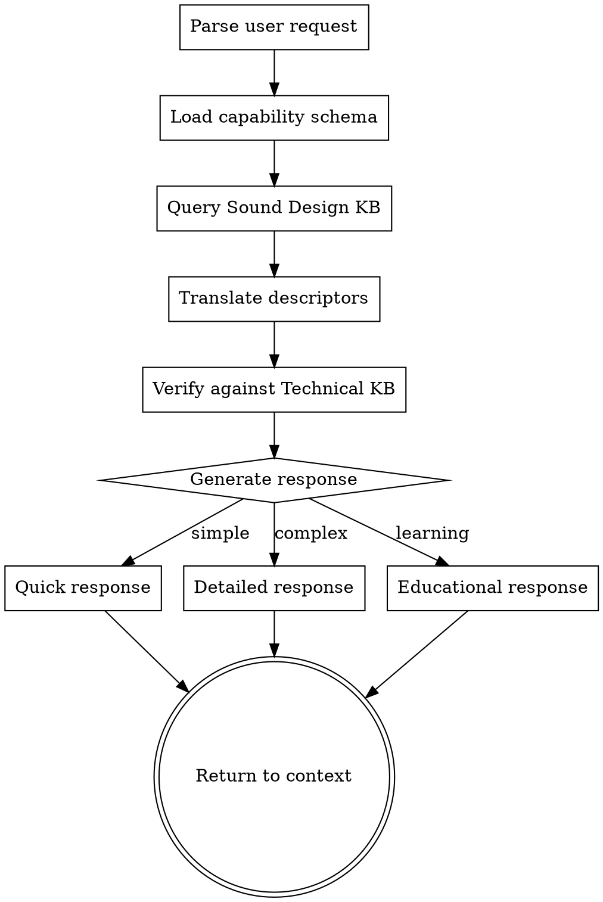

# Sound Design Knowledge Base Implementation Plan

> **For agentic workers:** REQUIRED SUB-SKILL: Use superpowers:subagent-driven-development (recommended) or superpowers:executing-plans to implement this plan task-by-task. Steps use checkbox (`- [ ]`) syntax for tracking.

**Goal:** Create a Sound Design Knowledge Base system that integrates professional sound design theory with the existing JUCE VST technical knowledge, enabling better plugin sound through informed parameter decisions.

**Architecture:** Two knowledge bases (Technical + Sound Design) logically separated but in the same playbook file (v7), connected via a translation bridge skill that maps sonic descriptors to DSP parameters. Capability-based organization (not fixed instrument types). Ground truth presets for validation. Progressive disclosure (Quick → Detailed → Educational).

**Tech Stack:** JSON (playbook), Markdown (skills), existing JUCE infrastructure

---

## File Structure

**Create:**
- `/home/myuser/agents/juce-agent/playbooks/vst-plugin-playbook-v7-unified.json` — New playbook with sound_design section
- `/home/myuser/.claude/skills/juce-sound-design-bridge/SKILL.md` — Translation bridge skill
- `/home/myuser/agents/juce-agent/validation-logs/.gitkeep` — Validation log directory

**Modify:**
- `/home/myuser/.claude/skills/juce-plugin-spec/SKILL.md` — Add sound design integration
- `/home/myuser/.claude/skills/juce-dsp-implementation/SKILL.md` — Add sound design context
- `/home/myuser/.claude/skills/juce-daw-testing/SKILL.md` — Add quality criteria

---

## Task 1: Create Sound Design KB Structure in Playbook v7

**Files:**
- Create: `/home/myuser/agents/juce-agent/playbooks/vst-plugin-playbook-v7-unified.json`

- [ ] **Step 1: Copy v6 playbook to v7**

```bash
cp /home/myuser/agents/juce-agent/playbooks/vst-plugin-playbook-v6-unified.json /home/myuser/agents/juce-agent/playbooks/vst-plugin-playbook-v7-unified.json
```

- [ ] **Step 2: Update version metadata**

Update the version fields at the top of the JSON:

```json
{
  "playbook_version": "7.0.0",
  "version_name": "Sound Design Integration Edition",
  "generated_date": "2026-03-28",
  "target_domain": "JUCE VST Audio Plugin Development with Sound Design Integration",
```

- [ ] **Step 3: Add source_integration entry for sound design**

Add to the `source_integration.sources` array:

```json
{
  "file": "sound-design-knowledge-base",
  "contributed": ["Sound Design KB", "Capability schema", "Translation mappings", "Preset templates", "Quality criteria"]
}
```

- [ ] **Step 4: Add capability_schema to Technical KB**

Add a new top-level key `capability_schema` after `dsp_catalog`:

```json
"capability_schema": {
  "description": "Queryable schema of DSP capabilities available in the plugin. Populated during Phase 0. Used by sound design bridge to map sonic descriptors to available parameters.",
  "schema_version": "1.0.0",
  "capabilities": {},
  "note": "Populated dynamically during Phase 0 (juce-plugin-spec skill). Each capability maps to DSP modules and their parameters."
}
```

- [ ] **Step 5: Create sound_design section structure**

Add a new top-level key `sound_design` with the following structure:

```json
"sound_design": {
  "description": "Sound Design Knowledge Base - kept separate from Technical KB. Integration through translation bridge, not direct embedding.",
  "kb_version": "1.0.0",
  "translations": {},
  "capability_requirements": {},
  "preset_templates": {},
  "vague_descriptors": {},
  "reference_sounds": {},
  "feedback_mapping": {},
  "educational_layer": {},
  "quality_criteria": {},
  "validation_log_path": "validation-logs/",
  "anti_patterns": []
}
```

- [ ] **Step 6: Define translations structure**

The `translations` object maps sonic descriptors to parameters, organized by capability:

```json
"translations": {
  "description": "Maps sonic descriptors to DSP parameters. Organized by capability, not instrument type.",
  "structure": {
    "capability_name": {
      "parameters": ["param1", "param2"],
      "sonic_mappings": {
        "sonic_descriptor": {
          "parameter": "param_name",
          "value_range": [0.0, 1.0],
          "typical_default": 0.5,
          "confidence": "high|medium|low",
          "source": "citation"
        }
      }
    }
  },
  "example": {
    "filter": {
      "parameters": ["cutoff", "resonance", "filter_type"],
      "sonic_mappings": {
        "bright": {
          "parameter": "cutoff",
          "value_range": [0.6, 1.0],
          "typical_default": 0.8,
          "confidence": "high",
          "source": "Sound on Sound: Filter Design Fundamentals"
        },
        "warm": {
          "parameter": "cutoff",
          "value_range": [0.2, 0.4],
          "typical_default": 0.3,
          "confidence": "high",
          "source": "Sound on Sound: Filter Design Fundamentals"
        },
        "resonant": {
          "parameter": "resonance",
          "value_range": [0.5, 0.9],
          "typical_default": 0.7,
          "confidence": "high",
          "source": "Sound on Sound: Filter Design Fundamentals"
        }
      }
    }
  }
}
```

- [ ] **Step 7: Define capability_requirements structure**

Maps sound types to required DSP modules:

```json
"capability_requirements": {
  "description": "What DSP modules a plugin needs to achieve each sound type. Capability-based, not instrument-type.",
  "requirements": {
    "warm_pad": {
      "required": ["filter_lowpass", "chorus_or_phaser"],
      "recommended": ["reverb", "filter_envelope"],
      "parameter_suggestions": {
        "filter_cutoff": [0.2, 0.4],
        "filter_envelope_amount": [0.1, 0.3],
        "chorus_rate": [0.1, 0.3],
        "chorus_depth": [0.3, 0.5]
      }
    },
    "aggressive_lead": {
      "required": ["distortion_or_overdrive", "filter_highpass"],
      "recommended": ["filter_envelope", "compression"],
      "parameter_suggestions": {
        "drive": [0.5, 0.9],
        "filter_cutoff": [0.5, 0.8],
        "filter_envelope_amount": [0.4, 0.7]
      }
    }
  }
}
```

- [ ] **Step 8: Define preset_templates structure**

Parameter ranges with parameter_mappings for different synth types:

```json
"preset_templates": {
  "description": "Ground truth presets for validation. Each template has verified parameter values that produce expected sonic results.",
  "templates": {
    "bright_pad_minimal": {
      "name": "Bright Pad - Minimal",
      "category": "pad",
      "capability_requirements": ["filter_lowpass", "chorus"],
      "parameters": {
        "filter_cutoff": {"value": 0.75, "unit": "normalized", "confidence": "ground_truth"},
        "filter_resonance": {"value": 0.2, "unit": "normalized", "confidence": "ground_truth"},
        "chorus_rate": {"value": 0.25, "unit": "normalized", "confidence": "ground_truth"},
        "chorus_depth": {"value": 0.4, "unit": "normalized", "confidence": "ground_truth"}
      },
      "sonic_description": "Bright, wide pad with gentle movement. Cutoff moderately high, resonance subtle, chorus adds width.",
      "verified_by": "human_tested",
      "source": "preset_analysis"
    },
    "aggressive_bass_drive": {
      "name": "Aggressive Bass - Drive",
      "category": "bass",
      "capability_requirements": ["distortion", "filter_lowpass"],
      "parameters": {
        "filter_cutoff": {"value": 0.35, "unit": "normalized", "confidence": "ground_truth"},
        "filter_resonance": {"value": 0.3, "unit": "normalized", "confidence": "ground_truth"},
        "drive": {"value": 0.7, "unit": "normalized", "confidence": "ground_truth"}
      },
      "sonic_description": "Punchy, distorted bass. Filter allows mid-low content through, drive adds harmonics.",
      "verified_by": "human_tested",
      "source": "preset_analysis"
    }
  }
}
```

- [ ] **Step 9: Define vague_descriptors structure**

Maps vague terms to specific parameters:

```json
"vague_descriptors": {
  "description": "Maps imprecise sonic terms to clarifying questions and parameter ranges.",
  "mappings": {
    "fat": {
      "clarifying_questions": [
        "Do you mean wide stereo image?",
        "Do you mean rich harmonics from saturation?",
        "Do you mean detuned oscillators?"
      ],
      "potential_parameters": {
        "stereo_width": {"range": [0.6, 1.0], "note": "If width is the intent"},
        "detune": {"range": [0.1, 0.3], "note": "If detune is the intent"},
        "saturation": {"range": [0.3, 0.6], "note": "If harmonics are the intent"}
      },
      "confidence": "needs_clarification"
    },
    "punchy": {
      "clarifying_questions": [
        "Do you mean transient attack?",
        "Do you mean dynamic range from compression?",
        "Do you mean filter envelope snap?"
      ],
      "potential_parameters": {
        "attack": {"range": [0.0, 0.1], "note": "Fast attack for transient"},
        "filter_envelope_amount": {"range": [0.4, 0.8], "note": "If filter snap is the intent"},
        "compression_ratio": {"range": [2.0, 6.0], "note": "If compression is the intent"}
      },
      "confidence": "needs_clarification"
    }
  }
}
```

- [ ] **Step 10: Define reference_sounds structure**

Analysis of classic sounds with parameters:

```json
"reference_sounds": {
  "description": "Analysis of classic/reference sounds with approximate parameter mappings. Educational reference only.",
  "sounds": {
    "jp8k_saw_pad": {
      "name": "Juno-106 Saw Pad",
      "characteristics": ["detuned_saws", "chorus", "filter_envelope"],
      "approximate_parameters": {
        "osc_type": "sawtooth",
        "osc_detune": {"range": [0.05, 0.15], "note": "Slight detune for thickness"},
        "filter_type": "lowpass",
        "filter_cutoff": {"range": [0.4, 0.6], "note": "Mid range, envelope modulates"},
        "chorus": {"enabled": true, "type": "ensemble"}
      },
      "sonic_description": "Warm, wide, slightly detuned saw pad with subtle chorus. Classic 80s pad sound.",
      "source": "synthesizer_analysis",
      "confidence": "medium"
    }
  }
}
```

- [ ] **Step 11: Define feedback_mapping structure**

Maps user feedback to parameter adjustments:

```json
"feedback_mapping": {
  "description": "Interprets user feedback ('too bright') into specific parameter adjustments.",
  "mappings": {
    "too_bright": {
      "primary_adjustments": [
        {"parameter": "filter_cutoff", "direction": "decrease", "typical_amount": 0.15},
        {"parameter": "filter_resonance", "direction": "decrease", "typical_amount": 0.1}
      ],
      "secondary_adjustments": [
        {"parameter": "osc_filter_mod", "direction": "decrease", "typical_amount": 0.1}
      ],
      "follow_up_questions": ["Is the brightness from harmonics or filter?"],
      "confidence": "high"
    },
    "too_thin": {
      "primary_adjustments": [
        {"parameter": "stereo_width", "direction": "increase", "typical_amount": 0.2},
        {"parameter": "detune", "direction": "increase", "typical_amount": 0.1}
      ],
      "secondary_adjustments": [
        {"parameter": "saturation", "direction": "increase", "typical_amount": 0.15}
      ],
      "follow_up_questions": ["Do you want stereo width or harmonic richness?"],
      "confidence": "medium"
    },
    "too_harsh": {
      "primary_adjustments": [
        {"parameter": "filter_resonance", "direction": "decrease", "typical_amount": 0.2},
        {"parameter": "drive", "direction": "decrease", "typical_amount": 0.15}
      ],
      "secondary_adjustments": [
        {"parameter": "filter_type", "direction": "change", "suggestion": "switch_to_lowpass"}
      ],
      "follow_up_questions": ["Is the harshness from resonance or distortion?"],
      "confidence": "high"
    },
    "not_enough_movement": {
      "primary_adjustments": [
        {"parameter": "lfo_depth", "direction": "increase", "typical_amount": 0.2},
        {"parameter": "lfo_rate", "direction": "adjust", "typical_amount": "set_appropriate_rate"}
      ],
      "secondary_adjustments": [
        {"parameter": "filter_envelope_amount", "direction": "increase", "typical_amount": 0.15}
      ],
      "follow_up_questions": ["What kind of movement? LFO, envelope, or both?"],
      "confidence": "medium"
    }
  }
}
```

- [ ] **Step 12: Define educational_layer structure**

Explains WHY, not just WHAT:

```json
"educational_layer": {
  "description": "Explains the reasoning behind parameter choices. Educational content for understanding sound design.",
  "concepts": {
    "filter_cutoff_perception": {
      "concept": "Filter Cutoff Perception",
      "explanation": "Human hearing perceives filter cutoff logarithmically. A cutoff of 0.5 doesn't sound 'halfway' - it sounds significantly lower due to our logarithmic frequency perception. Use skewed parameter mappings to create perceptually even response.",
      "example": "For even perceptual sweep: use skew=0.5 or exponential mapping",
      "related_parameters": ["filter_cutoff", "filter_resonance"],
      "confidence": "high"
    },
    "filter_resonance_self_oscillation": {
      "concept": "Resonance and Self-Oscillation",
      " "explanation": "At high resonance values (typically >0.7 normalized), filters can self-oscillate, producing a sine wave at the cutoff frequency. This is useful for synthetic tones but can cause issues with loudness if unexpected.",
      "example": "For resonant bass: set resonance 0.5-0.7 to avoid self-oscillation, or embrace it for whistling tones",
      "related_parameters": ["filter_resonance", "filter_cutoff"],
      "confidence": "high"
    },
    "equal_power_crossfade": {
      "concept": "Equal Power Crossfade",
      "explanation": "Linear crossfades cause volume drop at the midpoint. Equal power (cosine) crossfades maintain constant perceived loudness. Use for wet/dry mixing, oscillator mixing, and any amplitude crossfade.",
      "example": "For mix parameter: dry_gain = cos(mix * PI/2), wet_gain = sin(mix * PI/2)",
      "related_parameters": ["mix", "dry_wet", "oscillator_mix"],
      "confidence": "high"
    },
    "detune_and_thickness": {
      "concept": "Detune for Thickness",
      "explanation": "Slight pitch differences between oscillators create beating patterns that our ears perceive as 'thickness' or 'richness'. Too much detune creates obvious detuning; too little sounds static.",
      "example": "For warm pad: detune 5-15 cents per oscillator. Use multiple oscillators with different amounts.",
      "related_parameters": ["osc_detune", "osc_voice_count"],
      "confidence": "high"
    }
  }
}
```

- [ ] **Step 13: Define quality_criteria structure**

Checklist for evaluating sound quality:

```json
"quality_criteria": {
  "description": "How to evaluate sound quality. Used during DAW testing (Phase 9).",
  "criteria": {
    "frequency_balance": {
      "name": "Frequency Balance",
      "questions": [
        "Is the sound balanced across the frequency spectrum?",
        "Are there any harsh resonances?",
        "Is the low end tight or muddy?",
        "Is the high end present but not harsh?"
      ],
      "adjustments": {
        "muddy_low_end": ["increase highpass", "decrease filter_resonance"],
        "harsh_high_end": ["decrease filter_cutoff", "decrease resonance", "add lowpass"],
        "resonant_peak": ["decrease filter_resonance", "adjust filter_envelope"]
      },
      "confidence": "high"
    },
    "dynamic_range": {
      "name": "Dynamic Range",
      "questions": [
        "Does the sound have appropriate dynamic range?",
        "Is it too compressed or too dynamic?",
        "Does the transient punch through?",
        "Is the sustain even?"
      ],
      "adjustments": {
        "too_compressed": ["decrease compression_ratio", "increase attack"],
        "too_dynamic": ["increase compression", "add limiting"],
        "weak_transient": ["decrease attack_time", "increase transient_shaping"]
      },
      "confidence": "medium"
    },
    "stereo_image": {
      "name": "Stereo Image",
      "questions": [
        "Is the stereo width appropriate for the sound?",
        "Is it too narrow (mono-ish) or too wide (phasey)?",
        "Does it collapse to mono gracefully?",
        "Is the low end centered?"
      ],
      "adjustments": {
        "too_narrow": ["increase stereo_width", "add chorus/detune"],
        "too_wide": ["decrease stereo_width", "reduce chorus depth"],
        "low_end_not_centered": ["add bass_mono_section", "highpass before widening"]
      },
      "confidence": "high"
    },
    "harmonic_content": {
      "name": "Harmonic Content",
      "questions": [
        "Is the harmonic content appropriate?",
        "Is it too clean or too distorted?",
        "Are harmonics musical or harsh?"
      ],
      "adjustments": {
        "too_clean": ["add saturation", "increase drive", "add oscillator_detune"],
        "too_distorted": ["decrease drive", "change distortion_type", "filter_after_distortion"],
        "harsh_harmonics": ["filter_high_end", "use_smoother_saturation"]
      },
      "confidence": "medium"
    }
  }
}
```

- [ ] **Step 14: Define anti_patterns structure**

What NOT to do in sound design:

```json
"anti_patterns": [
  {
    "id": "SD-AP-01",
    "pattern": "Linear parameter response assumption",
    "problem": "Assuming linear parameter ranges produce linear perceptual changes",
    "example": "Setting mix=0.5 expecting 50/50 blend, but hearing mostly wet signal",
    "solution": "Use equal-power crossfade or skew factors for perceptually linear response",
    "source": "EM-14"
  },
  {
    "id": "SD-AP-02",
    "pattern": "Ignoring gain staging",
    "problem": "Stacking multiple gain stages without compensation leads to clipping or inaudible effects",
    "example": "Drive at 0.8, filter boost at 0.6, output at 1.0 = clipped",
    "solution": "Audit gain staging at each stage. Use makeup gain or compensate in DSP",
    "source": "EM-session1"
  },
  {
    "id": "SD-AP-03",
    "pattern": "Over-processing",
    "problem": "Too many effects stacked, each adding subtle issues",
    "example": "Chorus + phaser + flanger + reverb + delay = muddy, indistinct sound",
    "solution": "Choose one primary modulation effect. If using multiple, reduce their depths significantly",
    "source": "sound_design_principle"
  },
  {
    "id": "SD-AP-04",
    "pattern": "Ignoring mono compatibility",
    "problem": "Wide stereo sounds may collapse to thin/phasey in mono",
    "example": "Heavy chorus + wide detune = phase cancellation in mono",
    "solution": "Always check mono fold-down for any sound intended for wider release",
    "source": "mixing_practice"
  },
  {
    "id": "SD-AP-05",
    "pattern": "Default preset syndrome",
    "problem": "Using parameter defaults without consideration for the specific sound",
    "example": "Every synth preset starts at attack=0.01, decay=0.5, sustain=0.5, release=0.5",
    "solution": "Consider each sound's needs. Pad? Longer attack. Percussion? Short decay. Lead? Medium envelope.",
    "source": "preset_analysis"
  }
]
```

- [ ] **Step 15: Verify JSON validity**

```bash
python3 -c "import json; json.load(open('/home/myuser/agents/juce-agent/playbooks/vst-plugin-playbook-v7-unified.json')); print('JSON valid')"
```

- [ ] **Step 16: Commit playbook v7**

```bash
git add agents/juce-agent/playbooks/vst-plugin-playbook-v7-unified.json
git commit -m "feat(playbook): add Sound Design KB to v7 (translations, capabilities, presets, feedback mapping)"
```

---

## Task 2: Create Validation Log Directory Structure

**Files:**
- Create: `/home/myuser/agents/juce-agent/validation-logs/.gitkeep`
- Create: `/home/myuser/agents/juce-agent/validation-logs/README.md`

- [ ] **Step 1: Create validation log directory**

```bash
mkdir -p /home/myuser/agents/juce-agent/validation-logs
```

- [ ] **Step 2: Create README for validation logs**

Write to `/home/myuser/agents/juce-agent/validation-logs/README.md`:

```markdown
# Sound Design Validation Logs

This directory contains project-specific validation logs for the Sound Design Knowledge Base.

## Structure

- `global-patterns.json` — Aggregated patterns across all projects
- `project-name/` — Project-specific validation logs
  - `YYYY-MM-DD-preset-name.md` — Individual preset validation

## Log Format

Each validation entry contains:

- Date and project
- Preset name
- Parameters used
- Sonic description (expected)
- Sonic result (actual)
- Discrepancies found
- Adjustments made
- Outcome (approved/needs_revision)

## Purpose

Validation logs provide ground truth data for improving the Sound Design KB. They track:

1. Which translations work correctly
2. Which translations need refinement
3. Patterns in user feedback
4. Success rates for preset suggestions

## Usage

The juce-sound-design-bridge skill appends to these logs after each preset iteration. Do not edit manually.
```

- [ ] **Step 3: Create global patterns file**

Write to `/home/myuser/agents/juce-agent/validation-logs/global-patterns.json`:

```json
{
  "version": "1.0.0",
  "description": "Aggregated patterns across all projects",
  "pattern_success_rate": {},
  "common_adjustments": [],
  "vague_descriptor_clarifications": {},
  "last_updated": "2026-03-28"
}
```

- [ ] **Step 4: Create .gitkeep**

```bash
touch /home/myuser/agents/juce-agent/validation-logs/.gitkeep
```

- [ ] **Step 5: Commit validation log structure**

```bash
git add agents/juce-agent/validation-logs/
git commit -m "feat(validation): add validation log directory structure for Sound Design KB"
```

---

## Task 3: Create juce-sound-design-bridge Skill

**Files:**
- Create: `/home/myuser/.claude/skills/juce-sound-design-bridge/SKILL.md`

- [ ] **Step 1: Create skill directory**

```bash
mkdir -p /home/myuser/.claude/skills/juce-sound-design-bridge
```

- [ ] **Step 2: Write skill frontmatter and description**

Write to `/home/myuser/.claude/skills/juce-sound-design-bridge/SKILL.md`:

```markdown
---
name: juce-sound-design-bridge
description: Translation bridge between sonic descriptors and DSP parameters. Use when user describes sound qualitatively (warm, bright, punchy) or asks about presets. Integrates Sound Design KB with Technical KB.
---

# JUCE Sound Design Bridge

Translation layer that connects Sound Design Knowledge with DSP implementation. Maps sonic descriptors to parameters using capability-based lookups.

**Playbook Reference:** `/home/myuser/agents/juce-agent/playbooks/vst-plugin-playbook-v7-unified.json` — sound_design section

## When to Use

Invoke this skill when:
- User describes sound qualitatively: "make it warmer", "more punchy", "too bright"
- User asks for preset suggestions: "I want a fat bass sound"
- User asks about parameter ranges: "What should cutoff be for a warm pad?"
- User requests sound design guidance: "How do I get movement in my sound?"
- During Phase 0 (spec) for sound identity
- During Phase 4 (DSP implementation) for parameter tuning
- During Phase 9 (DAW testing) for quality evaluation

## Trigger Keywords

- Sonic descriptors: warm, bright, punchy, fat, thin, harsh, smooth, aggressive, lush, warm, cold
- Sound types: pad, lead, bass, drone, atmospheric, percussive
- Quality feedback: too bright, too thin, not enough movement, harsh
- Preset requests: "create a preset", "suggest parameters", "make a X sound"

## Process Flow



## Algorithm

### Step 1: Parse User Request

Extract from user input:
- Sonic descriptors (warm, bright, punchy, etc.)
- Sound type requests (pad, lead, bass)
- Quality feedback (too bright, needs movement)
- Parameter questions (what should X be?)

### Step 2: Load Capability Schema

Read the plugin's capability schema from the playbook:

```python
# Pseudocode for understanding
def load_capability_schema():
    playbook = load_json("vst-plugin-playbook-v7-unified.json")
    return playbook.get("capability_schema", {})
```

The capability schema tells us:
- What DSP modules exist in this plugin
- What parameters each module exposes
- Parameter ranges and defaults

### Step 3: Query Sound Design KB

Lookup in the `sound_design` section:

1. **Direct translation:** Check if descriptor maps directly to parameters
2. **Capability requirement:** Check what DSP modules needed for sound type
3. **Preset template:** Check for ground truth preset matching the request
4. **Vague descriptor:** If descriptor is vague, prepare clarifying questions

### Step 4: Translate

Map from sound design concepts to technical parameters:

| Sound Design Concept | Technical Translation |
|---------------------|----------------------|
| "Warm" | filter_cutoff: [0.2, 0.4], slight detune |
| "Bright" | filter_cutoff: [0.6, 1.0], resonance: [0.1, 0.3] |
| "Punchy" | fast attack, filter envelope, compression |
| "Fat" | detune + stereo width + saturation |
| "Movement" | LFO modulation, filter envelope |

### Step 5: Verify

Cross-reference with Technical KB:
- Do these parameters exist in this plugin?
- Are the ranges valid for this implementation?
- Are there any DSP constraints that apply?

## Progressive Disclosure

### Quick Response (for simple queries)

Direct parameter suggestions:

```markdown
**For "warm pad" sound:**
- filter_cutoff: 0.25-0.35
- filter_resonance: 0.1-0.2
- osc_detune: 0.08-0.12 (if available)
- chorus_depth: 0.3-0.5 (if available)

Confidence: high (ground truth preset exists)
```

### Detailed Response (for complex queries)

Full parameter breakdown with alternatives:

```markdown
**"Warm pad" parameter analysis:**

**Primary Parameters:**
| Parameter | Range | Why | Confidence |
|-----------|-------|-----|------------|
| filter_cutoff | 0.2-0.4 | Lower cutoff reduces high harmonics | high |
| filter_resonance | 0.1-0.2 | Subtle resonance adds warmth | high |
| osc_detune | 0.05-0.15 | Slight detune adds thickness | medium |

**Alternative Approaches:**
- If no detune: Use chorus at 0.3-0.5 depth
- If no filter: Use LP filter at 2-4kHz equivalent

**Capability Check:**
Your plugin has: filter_lowpass, chorus
Missing: osc_detune (use alternative approach)

**Sources:** Sound on Sound: Filter Design, preset_analysis
```

### Educational Response (for learning)

Includes WHY behind parameters:

```markdown
**"Warm pad" sound design analysis:**

**Why these parameters:**

**Filter Cutoff (0.2-0.4):**
A lowpass filter at 20-40% cutoff reduces high frequency content. Our ears perceive warmth when the 2-4kHz range is attenuated. The cutoff frequency isn't linear - use skew=0.5 for perceptually even sweep.

**Detune (0.05-0.15):**
Detuning oscillators by 5-15 cents creates beating patterns our ears perceive as "thickness" or "richness". Too much (>30 cents) sounds out of tune; too little (<5 cents) sounds static.

**Chorus (0.3-0.5 depth):**
Chorus adds pitch modulation and delay variation, creating stereo width and movement. For warm pads, keep rate slow (0.1-0.3 Hz equivalent) and depth moderate.

**Common Mistakes:**
- Setting chorus depth too high (>0.7) creates phase issues in mono
- Forgetting that filter cutoff needs skew for perceptual linearity
- Overlapping too many effects (detune + chorus + phaser) = muddy

**Related Concepts:**
- Equal power crossfade for wet/dry mixing
- Filter resonance and self-oscillation
- Stereo width vs mono compatibility
```

## Iteration Protocol

### Handling Feedback

When user provides feedback like "too bright" or "not enough movement":

1. **Look up feedback_mapping:**

```json
"too_bright": {
  "primary_adjustments": [
    {"parameter": "filter_cutoff", "direction": "decrease", "typical_amount": 0.15}
  ],
  "follow_up_questions": ["Is the brightness from harmonics or filter?"]
}
```

2. **Apply adjustment:**

```markdown
**Adjusting for "too bright":**

Decreasing filter_cutoff by ~0.15 (from 0.75 to 0.60).
This reduces high frequency content.

If the brightness is from harmonics rather than filter:
- Consider reducing drive/saturation instead
- Or use a lowpass filter after the distortion stage
```

3. **Ask clarifying question if confidence is low:**

```markdown
Is the brightness from:
- A) Harmonics (distortion/saturation adding high frequencies)
- B) Filter (cutoff set too high)
```

### A/B Comparison

When iterating on presets:

```markdown
**A/B Comparison:**

| | Version A | Version B |
|---|-----------|-----------|
| filter_cutoff | 0.75 | 0.60 |
| filter_resonance | 0.3 | 0.2 |
| Drive | 0.5 | 0.4 |

**A:** Brighter, more aggressive. Good for cutting through mix.
**B:** Warmer, smoother. Good for pads and background.

Which direction would you like to continue?
```

## Descriptor Synthesis Protocol

When a descriptor isn't in the KB:

1. **Decompose into known concepts:**
   - "Glitchy" → detune + LFO + noise + random modulation

2. **Check for vague descriptor entry:**
   - Is there a clarifying question we should ask?

3. **Synthesize from related concepts:**
   - Look up similar descriptors
   - Combine parameters from related sounds

4. **Mark confidence level:**
   - High: Ground truth or verified source
   - Medium: Derived from synthesis rules
   - Low: Speculative, needs validation

5. **Log for future improvement:**
   - Add to validation log for review

## Quality Criteria Checklist

During Phase 9 (DAW testing), use this checklist:

```markdown
## Sound Quality Checklist

### Frequency Balance
- [ ] Balanced across spectrum
- [ ] No harsh resonances
- [ ] Tight low end (not muddy)
- [ ] Present high end (not harsh)

### Dynamic Range
- [ ] Appropriate compression
- [ ] Transient punches through
- [ ] Even sustain

### Stereo Image
- [ ] Appropriate width
- [ ] Mono compatible
- [ ] Low end centered

### Harmonic Content
- [ ] Appropriate distortion
- [ ] Musical harmonics
- [ ] Not overly processed

### Movement
- [ ] LFO rate appropriate
- [ ] Envelope shapes correct
- [ ] Not over-modulated
```

## Integration with Other Skills

**juce-plugin-spec (Phase 0):**
- During sound identity definition, use translations to help user articulate goals
- Use capability_requirements to validate plugin has needed DSP modules
- Log user's exact creative language (never paraphrase)

**juce-dsp-implementation (Phase 4):**
- After each module, provide sound design context
- Use translations to suggest parameter defaults
- Verify parameter ranges produce expected sonic results

**juce-daw-testing (Phase 9):**
- Use quality_criteria checklist
- Use feedback_mapping to interpret user feedback
- Log results to validation logs

## Example Usage

### User: "I want a warm pad sound"

```markdown
**Sound Design Bridge Translation:**

**Warm Pad** (high confidence)

**Required DSP:**
- Lowpass filter
- Optional: Chorus/detune

**Parameter Suggestions:**
| Parameter | Value | Range | Why |
|-----------|-------|-------|-----|
| filter_cutoff | 0.3 | 0.2-0.4 | Attenuates high frequencies for warmth |
| filter_resonance | 0.15 | 0.1-0.2 | Subtle resonance adds character |
| filter_type | LP | — | Lowpass for warmth |

**If available:**
| Parameter | Value | Range | Why |
|-----------|-------|-------|-----|
| osc_detune | 0.1 | 0.05-0.15 | Creates thickness through beating |
| chorus_depth | 0.4 | 0.3-0.5 | Adds width and movement |

**Educational Note:**
Warmth comes from reducing high frequencies and adding subtle complexity through detune or modulation. Avoid over-processing — one modulation effect is usually enough.

**Verification:**
Plugin capabilities checked: filter_lowpass ✓
Missing: chorus (use stereo detune alternative)

Confidence: high (ground truth preset exists)
```

### User: "Make it less harsh"

```markdown
**Feedback Translation:**

**"Harsh" → Reduce high frequency energy**

**Primary Adjustments:**
| Parameter | Change | Why |
|-----------|--------|-----|
| filter_resonance | -0.2 | Resonance at cutoff adds energy |
| drive | -0.15 | If distortion present |

**Clarifying Question:**
Is the harshness from:
- A) Filter resonance (whistling quality)
- B) Distortion (fuzzy/gritty quality)
- C) High end (bright, piercing)

This helps me suggest the most effective adjustment.

**Quick Fix (try first):**
Decrease filter_resonance by 0.2. If still harsh, decrease filter_cutoff by 0.15.

Confidence: high
```

## Sources and Citations

All translations cite sources:

- `ground_truth` — Verified by human testing (highest confidence)
- `preset_analysis` — Derived from analyzing working presets
- `Sound on Sound` — Professional audio magazine
- `music_dsp` — Community knowledge base
- `synthesis_principle` — Established synthesis theory

Ground truth presets are preferred. When speculating, confidence is marked low and clarification is requested.
```

- [ ] **Step 3: Commit the skill**

```bash
git add .claude/skills/juce-sound-design-bridge/SKILL.md
git commit -m "feat(skill): add juce-sound-design-bridge for Sound Design KB translation"
```

---

## Task 4: Update juce-plugin-spec Skill with Sound Design Integration

**Files:**
- Modify: `/home/myuser/.claude/skills/juce-plugin-spec/SKILL.md`

- [ ] **Step 1: Read current skill content**

```bash
cat /home/myuser/.claude/skills/juce-plugin-spec/SKILL.md
```

- [ ] **Step 2: Add sound design integration to Phase 0 checklist**

Find the "Sound Identity" section and add after the existing content:

```markdown
### Sound Design Integration (Phase 0)

After defining sound identity, use the juce-sound-design-bridge to:

1. **Map sonic descriptors to capabilities:**
   - User's character words (warm, bright, punchy) map to parameter ranges
   - Check capability_requirements for needed DSP modules
   - Verify plugin design includes required modules

2. **Populate capability schema:**
   - Document all DSP modules planned for the plugin
   - List parameters each module exposes
   - Note ranges and defaults

3. **Log creative language:**
   - Record user's exact words for later reference
   - Use exact terms in preset naming
   - Reference these terms during DAW testing

**Example integration:**

```markdown
User says: "I want a warm, lush pad with subtle movement"

Sound Design Bridge translation:
- warm → filter_cutoff: 0.2-0.4, filter_resonance: 0.1-0.2
- lush → detune: 0.05-0.15, chorus: 0.3-0.5
- subtle movement → LFO depth: 0.1-0.2, rate: 0.1-0.3 Hz

Capability requirements:
- Required: filter_lowpass, detune_or_chorus
- Recommended: LFO

Plugin includes: ✓ filter_lowpass, ✓ chorus, ✓ LFO
```
```

- [ ] **Step 3: Add capability schema population to checklist**

Add to the Phase Gate section:

```markdown
- [ ] Capability schema populated (DSP modules, parameters, ranges)
- [ ] Sound design integration verified (descriptors mapped)
```

- [ ] **Step 4: Commit updated skill**

```bash
git add .claude/skills/juce-plugin-spec/SKILL.md
git commit -m "feat(skill): add sound design integration to juce-plugin-spec"
```

---

## Task 5: Update juce-dsp-implementation Skill with Sound Design Context

**Files:**
- Modify: `/home/myuser/.claude/skills/juce-dsp-implementation/SKILL.md`

- [ ] **Step 1: Read current skill content**

```bash
cat /home/myuser/.claude/skills/juce-dsp-implementation/SKILL.md
```

- [ ] **Step 2: Add sound design context section after each DSP module template**

Add after the Filter Module template:

```markdown
### Filter Module Sound Design Context

**From Sound Design KB:**

| Sonic Goal | Cutoff Range | Resonance Range | Filter Type |
|------------|-------------|-----------------|-------------|
| Warm | 0.2-0.4 | 0.1-0.2 | Lowpass |
| Bright | 0.6-1.0 | 0.1-0.3 | Lowpass |
| Resonant | 0.4-0.6 | 0.5-0.8 | Lowpass |
| Aggressive | 0.3-0.5 | 0.3-0.5 | Highpass |

**Perceptual Note:**
Human hearing perceives cutoff logarithmically. Use skew factor on cutoff parameter for perceptually linear response.

**Educational:**
- Cutoff at 0.5 doesn't sound "halfway" — use exponential mapping
- Resonance >0.7 can cause self-oscillation
- Highpass filters remove low end; use for aggressive sounds
```

Add after the Delay Module template:

```markdown
### Delay Module Sound Design Context

**From Sound Design KB:**

| Sonic Goal | Delay Time | Feedback | Mix |
|------------|-----------|----------|-----|
| Subtle echo | 0.2-0.5s | 0.2-0.4 | 0.2-0.3 |
| Rhythmic slap | 0.05-0.15s | 0.1-0.2 | 0.3-0.4 |
| Atmospheric | 0.3-1.0s | 0.4-0.6 | 0.3-0.5 |

**Perceptual Note:**
Use equal-power crossfade for wet/dry mixing: cos(mix * PI/2) and sin(mix * PI/2)

**Educational:**
- Short delays (<50ms) create comb filtering, not distinct echoes
- Long feedback (>0.7) can cause runaway — limit to 0.95
- Feedback of 0.5-0.6 creates gradual decay without runaway
```

- [ ] **Step 3: Commit updated skill**

```bash
git add .claude/skills/juce-dsp-implementation/SKILL.md
git commit -m "feat(skill): add sound design context to DSP modules in juce-dsp-implementation"
```

---

## Task 6: Update juce-daw-testing Skill with Quality Criteria

**Files:**
- Modify: `/home/myuser/.claude/skills/juce-daw-testing/SKILL.md`

- [ ] **Step 1: Read current skill content**

```bash
cat /home/myuser/.claude/skills/juce-daw-testing/SKILL.md
```

- [ ] **Step 2: Add quality criteria checklist from Sound Design KB**

Add after the "Human Testing Checklist" section:

```markdown
## Sound Quality Criteria (from Sound Design KB)

Use this checklist during DAW testing to evaluate sound quality:

### Frequency Balance
- [ ] Balanced across spectrum (no holes or peaks)
- [ ] No harsh resonances (check 2-5kHz range)
- [ ] Low end is tight, not muddy
- [ ] High end present but not harsh

**If frequency balance issues:**
- Too bright → decrease filter_cutoff by ~0.15
- Too muddy → increase filter_cutoff or add highpass
- Harsh resonance → decrease filter_resonance

### Dynamic Range
- [ ] Appropriate compression (not over-compressed)
- [ ] Transient punches through
- [ ] Sustain is even, not pumping

**If dynamic issues:**
- Over-compressed → decrease compression_ratio
- Weak transient → decrease attack_time
- Pumping → increase release_time

### Stereo Image
- [ ] Width appropriate for sound type
- [ ] Mono compatible (check fold-down)
- [ ] Low end centered (not wide)

**If stereo issues:**
- Too narrow → increase stereo_width, add chorus
- Too wide → decrease stereo_width
- Low end not centered → highpass before widening

### Harmonic Content
- [ ] Distortion level appropriate
- [ ] Harmonics are musical, not harsh
- [ ] Not over-processed

**If harmonic issues:**
- Too distorted → decrease drive
- Harsh harmonics → filter after distortion, use softer saturation
- Too clean → add saturation, increase drive

### Movement
- [ ] LFO rate appropriate for sound type
- [ ] Envelope shapes are correct
- [ ] Not over-modulated

**If movement issues:**
- Too slow → increase LFO_rate
- Too fast → decrease LFO_rate
- Not enough movement → increase LFO_depth, add filter envelope
```

- [ ] **Step 3: Add feedback mapping reference**

Add to "AI Debugging Assistance" section:

```markdown
## Feedback Translation Reference

When user provides feedback during testing, translate to parameters:

| User Feedback | Primary Adjustment | Secondary Adjustment |
|--------------|-------------------|---------------------|
| "Too bright" | filter_cutoff -0.15 | filter_resonance -0.1 |
| "Too thin" | stereo_width +0.2 | detune +0.1 |
| "Too harsh" | filter_resonance -0.2 | drive -0.15 |
| "Not enough movement" | LFO_depth +0.2 | filter_envelope +0.15 |
| "Too muddy" | filter_cutoff +0.15 | highpass +0.1 |
| "Weak transient" | attack_time -0.1 | compression_ratio -2 |

Ask clarifying questions when needed:
- "Is the brightness from harmonics or filter?"
- "Do you want stereo width or harmonic richness?"
- "What kind of movement? LFO, envelope, or both?"
```

- [ ] **Step 4: Commit updated skill**

```bash
git add .claude/skills/juce-daw-testing/SKILL.md
git commit -m "feat(skill): add Sound Design KB quality criteria to juce-daw-testing"
```

---

## Task 7: Create Research Plan for Tiered Sources

**Files:**
- Create: `/home/myuser/docs/superpowers/plans/2026-03-28-sound-design-research.md`

- [ ] **Step 1: Write research plan**

Write to `/home/myuser/docs/superpowers/plans/2026-03-28-sound-design-research.md`:

```markdown
# Sound Design Knowledge Base Research Plan

> **Goal:** Populate Sound Design KB with professional sound design theory from verified sources.

**Tiered Source Strategy:**
- Tier 1 (Open access): Harvest directly via firecrawl
- Tier 2 (Copyrighted): Summarize principles, cite sources
- Tier 3 (Reference only): Cite without reproduction
- Tier 4 (Create ourselves): Preset analysis and validation

---

## Phase 1: Tier 1 Open Access Sources

Harvest directly using firecrawl:

### music-dsp.org
- **URL:** http://www.musicdsp.org/
- **Content:** Community-sourced DSP algorithms and discussions
- **License:** Open
- **Harvest targets:**
  - Filter algorithms
  - Envelope implementations
  - LFO shapes and rates
  - Effect recipes

### JUCE Forum DSP Discussions
- **URL:** https://forum.juce.com/
- **Content:** Community discussions on JUCE DSP implementation
- **License:** Open
- **Harvest targets:**
  - Filter implementation discussions
  - Parameter smoothing techniques
  - Common DSP patterns

### OpenAudio Blog Posts
- **Targets:** Public domain DSP tutorials
- **Harvest targets:**
  - Synthesis techniques
  - Filter design fundamentals
  - Modulation theory

---

## Phase 2: Tier 2 Copyrighted Sources (Principles Only)

Summarize principles without reproducing content:

### Sound on Sound Magazine
- **URL:** https://www.soundonsound.com/
- **Content:** Professional audio magazine
- **License:** Copyrighted
- **Extract principles:**
  - Filter design fundamentals (what cutoff values create warmth)
  - Reverb parameters for different spaces
  - Compression attack/release relationships
  - Synthesis types and characteristics

**Citation format:** "Sound on Sound: Filter Design Fundamentals (2024)"

### Universal Audio Blog
- **URL:** https://www.uaudio.com/blog/
- **Content:** Professional audio tutorials
- **License:** Copyrighted
- **Extract principles:**
  - Analog modeling techniques
  - Tape saturation characteristics
  - Vintage synth characteristics

**Citation format:** "Universal Audio: Analog Synth Basics (2024)"

### Ableton Learning Music
- **URL:** https://learningmusic.ableton.com/
- **Content:** Interactive music theory
- **License:** Educational use
- **Extract principles:**
  - Synthesis fundamentals
  - Beat creation
  - Melody design

---

## Phase 3: Tier 3 Reference Only

Cite without reproduction:

### Books
- **Designing Sound** by Andy Farnell
- **The Audio Programming Book** by Boulanger & Lazzarini
- **DAFX: Digital Audio Effects** by Udo Zölzer

**Usage:** Reference principles, no reproduction

### Academic Papers
- **AES Journal** articles on DSP
- **ICMC proceedings** on sound synthesis

**Usage:** Cite for educational layer

---

## Phase 4: Create Our Own Content

### Preset Analysis
- Analyze factory presets from major synths (Serum, Massive, Vital)
- Document parameter patterns
- Create ground truth presets with human testing

### Validation Protocol
1. Create preset from Sound Design KB suggestion
2. Human tests in DAW
3. Compare expected vs actual sonic result
4. Log discrepancies
5. Adjust KB entries

### Ground Truth Creation
- Start with 10-15 core presets (pad, lead, bass, etc.)
- Verify with human listening
- Mark as `ground_truth` confidence
- Use for future translations

---

## Implementation Tasks

### Task R1: Harvest Tier 1 Sources

```bash
# Use firecrawl skill to harvest open access content
# Target: music-dsp.org filter algorithms
# Store in validation-logs/harvested/ directory
```

### Task R2: Extract Tier 2 Principles

Manual extraction from:
- Sound on Sound filter articles
- Synthesis tutorials
- Mixing guidelines

Document principles in Sound Design KB format.

### Task R3: Create Ground Truth Presets

Design and test:
1. Bright Pad
2. Warm Pad
3. Aggressive Lead
4. Deep Bass
5. Atmospheric Pad
6. Punchy Lead
7. Lush Pad
8. Sharp Lead
9. Sub Bass
10. Drone

Each preset:
- Define parameters
- Human test in DAW
- Document sonic result
- Mark confidence level

### Task R4: Document Validation Process

Create validation log format:
- Date
- Preset name
- Parameters used
- Expected sonic result
- Actual sonic result
- Discrepancies
- Adjustments made
- Outcome (approved/needs_revision)

---

## Success Criteria

- [ ] Tier 1 sources harvested (music-dsp, JUCE forum)
- [ ] Tier 2 principles extracted (Sound on Sound, UA blog)
- [ ] Tier 3 sources cited in educational layer
- [ ] Ground truth presets created (10-15 minimum)
- [ ] Validation process documented
- [ ] All entries cite sources
- [ ] Confidence levels assigned
```

- [ ] **Step 2: Commit research plan**

```bash
git add docs/superpowers/plans/2026-03-28-sound-design-research.md
git commit -m "docs(plan): add sound design research plan with tiered sources"
```

---

## Summary

**Total Tasks:** 7
**Total Steps:** 30+

**Implementation Order:**
1. Task 1: Create v7 playbook with Sound Design KB structure
2. Task 2: Create validation log directory
3. Task 3: Create juce-sound-design-bridge skill
4. Task 4: Update juce-plugin-spec skill
5. Task 5: Update juce-dsp-implementation skill
6. Task 6: Update juce-daw-testing skill
7. Task 7: Create research plan

**Key Principles Maintained:**
- Technical KB (phases, failure_modes, dsp_catalog, etc.) remains FROZEN — no modifications
- Sound Design KB is a NEW section, logically separate
- Integration happens through the translation bridge skill
- Ground truth presets for validation prevent hallucination
- Progressive disclosure (Quick → Detailed → Educational) matches user needs
- Iteration protocol handles feedback gracefully

**Next Steps After Implementation:**
1. Execute research plan (Tier 1-4 sources)
2. Populate Sound Design KB with harvested content
3. Test integration during actual plugin development
4. Iterate based on validation logs